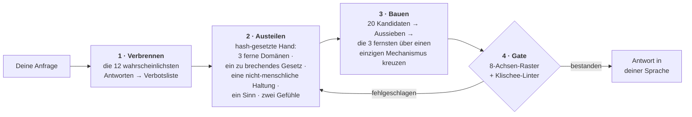

<div align="center">

# Imagination Engine

**Fremdheit durch Subtraktion.**

Ein Agenten-Skill, der eine KI wirklich fremdartige Ideen hervorbringen lässt — nicht indem er mehr Fantasie verlangt,<br>sondern indem er *die Wege zur naheliegenden Antwort entfernt*.

[](https://github.com/djfksjd/imagination-engine-skill/actions/workflows/tests.yml)
[](#installation)
[](#installation)
[](#unter-der-haube)
[](LICENSE)

[English](README.md) · [한국어](README.ko.md) · [日本語](README.ja.md) · [简体中文](README.zh-CN.md) · [Español](README.es.md) · [Français](README.fr.md) · **Deutsch** · [Português](README.pt-BR.md)

</div>

---

> [!CAUTION]
> ## Zweimal blind beurteilt geprüft. Beide Male verloren.
>
> Die zentrale Behauptung dieser Fähigkeit — dass das Entfernen der Wege zur naheliegenden Antwort bessere Ideen liefert als ein gewöhnlicher Prompt — wurde nun zweimal gegen eine Kontrolle mit gewöhnlichem Prompt gemessen und beide Male deutlich geschlagen. Die zweite Prüfung wurde vollständig präregistriert, bevor auch nur ein Datenpunkt existierte, und lief auf dem aktuellen Stand, in der aktuellen Voreinstellung (`alien-physics` allein, Anker 1) und mit der bereits aus dem Gatter entfernten selbstvergebenen Schwelle. Keine der beiden Änderungen holte den Abstand auf.
>
> Sechs Aufträge, je fünf Durchläufe der Maschine und fünf der Kontrolle, pro Auftrag fünf blinde Beurteilende, denen nie gesagt wurde, dass zwei Bedingungen existieren. Maschine minus Kontrolle, Median der fünf Beurteilenden, Skalen von 1 bis 7, gleichgewichteter Mittelwert über die sechs Aufträge:
>
> | | WANT | FIT | CRAFT |
> |---|---|---|---|
> | Maschine − Kontrolle | **−2,83** | **−3,03** | **−1,67** |
>
> Jeder Auftrag ist auf jedem Maß negativ. Die Kontrolle liegt in **30 von 30** Zellen Auftrag × Beurteilende vor der Maschine und belegt **90 von 90** Plätzen in den ersten drei. Zusammengefasst: WANT 5,76 → 2,98; FIT 6,35 → 3,33; CRAFT 5,88 → 4,23.
>
> Die Konvergenz — genau das Problem, für das diese Fähigkeit gebaut wurde — wurde nicht messbar verringert: `g_CORE` +0,10 und `g_SKELETON` −0,22 gegen die von der Regel verlangten +0,30. Krippendorffs ordinales α unter den Kodierenden lag bei 0,786 und 0,673 und damit unter der präregistrierten Untergrenze von 0,80. **Dieses Maß ist deshalb unentschieden, nicht günstig** — es ist kein Beleg für die Fähigkeit, und es zählt auch nicht gegen sie.
>
> Die Maschine kostete **das 48-Fache der Kontrolle pro Ausgabe**.
>
> Die präregistrierte Regel ergibt **FAIL**, und sie hatte „zu geringe Teststärke", „fast bestanden", „der Abstand war knapp" und „auf den zurückgehaltenen Aufträgen gewonnen" im Voraus als FAIL festgeschrieben, genau damit niemand später danach greift. Nach dieser Regel wird die Kontrolle mit gewöhnlichem Prompt zur empfohlenen Voreinstellung, und ein neuer Prüfstand wird entworfen.
>
> **Eine kausale Behauptung dieser Seite wird zurückgezogen.** Sie sagte, der Modus `nonhuman` habe den Einbruch der Auftragspassung verursacht. Hat er nicht: `nonhuman` aus der Voreinstellung zu nehmen bewegte den gepoolten FIT nur von 3,27 auf 3,33, gegen eine Kontrolle bei 6,35. Der Einbruch überstand die Entfernung nahezu unverändert. Die Warnung dieses Modus — dass er jeden Auftrag mit einem Menschen darin auflöst — gilt weiter als Entwurfshinweis, war aber nicht die Ursache des gemessenen Verlusts.
>
> **Getrennt davon, und weiterhin belegt.** Der Befund des ersten Experiments, dass ein Modell ohne Hilfe bei einem Auftrag mit naheliegender Antwort tatsächlich zusammenfällt, ist ein echtes Ergebnis: beim Ästuar-Auftrag lieferten sechs unabhängige Durchläufe mit gewöhnlichem Prompt denselben Organismus. Das Problem, für das diese Fähigkeit gebaut wurde, ist real. Widerlegt ist, dass diese Pipeline es löst.

---

> Einem Modell zu sagen, es solle „kreativ sein", lässt es die wahrscheinlichsten Fortsetzungen des Wortes *kreativ* ziehen. Deshalb konvergieren die Ergebnisse: schon wieder Pilzgeflechte, schon wieder die regennasse Neonstadt, schon wieder die Maschine, die am Ende Gefühle hat.
>
> **Nachdrücklicher anweisen verschiebt die Verteilung nicht. Optionen entfernen schon.**

## Funktionsweise



|  | Was passiert | Warum es wirkt |
|---|---|---|
| **1** | **Verbrennt die ersten Reflexe.** Vor jeder Generierung schreibt das Modell die zwölf Antworten auf, die es am wahrscheinlichsten geben würde; sie werden zur Verbotsliste, die maschinell gegen den Entwurf geprüft wird. | Es benennt außerdem das *Skelett*, das sie teilen (im Beispiel: ein Apparat, ein Bediener, eine gespeicherte Substanz). Das Skelett ist das eigentliche Ziel — jede umlackierte Variante fällt mit dem Original. |
| **2** | **Teilt eine Hand aus, die das Modell nicht gewählt hat.** Ein hash-gesetzter Zug liefert drei Begriffsdomänen aus garantiert disjunkten Kategorien, ein zu brechendes Naturgesetz, eine nicht-menschliche Haltung, einen zu erfindenden Sinn und zwei Gefühle, die koexistieren müssen. | Sich selbst überlassen, assoziiert ein Modell zu seinen Lieblingen. Der Zug kommt von außen, ist reproduzierbar, und ein neuer Zug gibt *neue* Karten. |
| **3** | **Verlangt Ersatz für das gebrochene Gesetz.** Jede Streichung installiert ein neues Gesetz, und dieses muss etwas verbieten, das die gewöhnliche Welt erlaubt. | Eine Welt, in der eine Regel bloß fehlt, ist nicht fremd, sondern leer. Erst die Einschränkung macht die Erfindung lesbar. |
| **4** | **Schickt die Ausgabe durch Gates.** Ein Raster mit acht Achsen und ein Formulierungs-Linter laufen, bevor die Nutzerin irgendetwas sieht. | Ein nicht bestandenes Gate bedeutet neu generieren — nicht mit aufgerundeten Noten erneut einreichen. |

## Installation

Läuft in **Claude Code** und **Codex**. Nur Python-3-Standardbibliothek: nichts zu installieren, kein API-Schlüssel, kein Netzzugriff.

```bash
curl -fsSL https://raw.githubusercontent.com/djfksjd/imagination-engine-skill/main/install.sh | bash
```

<details>
<summary><b>Manuelle Installation</b></summary>

```bash
# Claude Code
claude plugin marketplace add djfksjd/imagination-engine-skill
claude plugin install imagination-engine@djfksjd

# Codex
codex plugin marketplace add djfksjd/imagination-engine-skill
codex plugin add imagination-engine@djfksjd
```

Ein Baum bedient beide Hosts: der Skill-Körper liegt unter `skills/imagination-engine/`, und `AGENTS.md` wird als gemeinsamer Kontext geladen.
</details>

## Verwendung

Beschreibe einfach, was du willst. Der Skill greift bei Wünschen nach etwas Fremdartigem oder bei der Klage, die bisherigen Ideen seien generisch. Prompts funktionieren in jeder Sprache, die Antwort kommt in deiner.

```text
Nimm die Imagination Engine für: eine Maschine, die Gefühl von Stimme trennt.
Baby-, Nicht-Mensch- und Affekt-Modus. Kein Neuroscan, keine Gefühle als Farben.
```

```text
Entwirf für mein Spiel ein Wesen, das nichts im Genre ähnelt.
Extremal-Modus, Anker 2 — ich muss es tatsächlich bauen können.
```

### Modi · bis zu drei kombinierbar

| Modus | Was er entfernt |
|---|---|
| `baby` | Gelernte Funktion, richtige Namen, die Reihenfolge von Ursache und Wirkung. Säuglingslogik, erwachsene Ausführung — ein niedliches Ergebnis ist ein gescheitertes. |
| `nonhuman` | Den Nutzen für Menschen. Hier existiert nichts für irgendwen; ist das Ergebnis ein Produkt, ist es disqualifiziert. **Zerstört jeden Auftrag, in dem ein Mensch vorkommt** — siehe die Warnung unten. |
| `alien-physics` | Das Aussehen als Ort des Neuen. Stattdessen ändern sich Physik, Zeit oder Selbst. |
| `affect` | Die fünf Sinne und die benannten Gefühle. Verlangt einen erfundenen, vollständig spezifizierten Sinn — samt der neuen Ungerechtigkeit, die er schafft. |
| `extremal` | Jeden sicheren Kandidaten. Verbreitert die Hand, teilt zwei zu brechende Regeln aus und hebt die Verwerfungsschwelle. |
| `grounded` | Nichts. Fügt einen Weg zu etwas Realem hinzu, ohne das Prinzip zu ändern, und ersetzt die Rubrik-Achse `non_anthropocentrism` durch `translation_integrity`. |

**Die Voreinstellung ist `alien-physics` bei Anker 1, und `nonhuman` gehört nicht mehr dazu.** Früher schon. Diese Seite behauptete, ein kontrolliertes Experiment habe gemessen, was `nonhuman` kostet: halbierte Passung zum Auftrag und 0 von 24 angenommenen Maschinenausgaben bei blinden Beurteilenden. **Diese kausale Zuschreibung wird zurückgezogen.** Die präregistrierte Wiederholung lief mit `alien-physics` allein, und der gepoolte FIT bewegte sich nur von 3,27 auf 3,33, gegen eine Kontrolle bei 6,35: Der Einbruch der Passung wurde nicht von `nonhuman` verursacht und verschwand auch nicht mit ihm. Der Rest der Warnung trägt sich als Entwurfshinweis selbst — `nonhuman` entfernt den menschlichen Nutzen konstruktionsbedingt, und genau das darf man keinem Auftrag antun, für den es niemand gewählt hat. **Kommt in Ihrem Auftrag ein Mensch vor — eine Spielerin, ein Leser, eine Gemeinde, eine Kundin — fügen Sie `nonhuman` nicht hinzu.** Er wird sie entfernen.

### Anker · wie erreichbar das Ergebnis bleiben muss

| | Stufe | Anforderung |
|---|---|---|
| `0` | **Ungebunden** | Innere Stimmigkeit ist die einzige Pflicht |
| `1` | **Erklärbar** | In drei Sätzen erklärbar, ohne Analogie zu einem bekannten Werk |
| `2` | **Inszenierbar** | Eine konkrete Szene oder ein Objekt, das ein Team produzieren könnte |
| `3` | **Betreibbar** | Ein realer Weg zum Prototyp, mit benannten Verlusten dieser Übersetzung |

### Eine Sitzung führen

Die Stufen fährt die Fähigkeit, nicht Sie. Was Sie steuern, sind die vier Dinge unten — und jedes davon verändert das Ergebnis stärker als jedes Adjektiv.

| Was Sie sagen | Was sich ändert |
|---|---|
| **das Thema** | der Startwert des ganzen Zugs: die Hand ergibt sich aus seinem Hash, eine Umformulierung teilt also andere Karten aus |
| **wofür es ist** | Erzählung · Welt · Spielmechanik · Objekt · Concept-Art-Briefing · nichts. „Nichts" ist eine echte Antwort und liefert meist die fremdesten Ergebnisse |
| **Modi und Anker** | welche Wege entfernt werden und wie erreichbar das Ergebnis bleiben muss |
| **Ihre eigene Verbotsliste** | die wertvollste verfügbare Eingabe. Siehe unten |

**Geben Sie ihr Ihre Verbotsliste.** Die Fähigkeit verbrennt ihre eigenen zwölf ersten Reflexe, bevor sie irgendetwas erzeugt — aber sie kann nicht wissen, was *Sie* nicht mehr sehen können. Ein Satz — *„kein Myzelnetzwerk mehr, und nichts, das sich am Ende als lebendig herausstellt"* — entfernt mehr Wahrscheinlichkeitsmasse als ein Absatz Ermutigung. Bieten Sie keine an, fragt die Fähigkeit vor dem Austeilen danach.

**Modi wählen:**

| Wenn Sie wollen | Versuchen Sie |
|---|---|
| ein Wesen, das kein Genre-Mobiliar ist | `nonhuman, alien-physics` · Anker 1 |
| eine Weltregel statt eines Monsters | `alien-physics` · Anker 0 |
| etwas, das ein Team wirklich inszenieren oder drehen kann | `alien-physics, grounded` · Anker 2 |
| eine Mechanik, die diesen Monat prototypisierbar ist | `grounded` · Anker 3 |
| einen Sinn, ein Gefühl, einen inneren Zustand | `affect` · Anker 1 |
| Logik vor der erlernten Funktion | `baby, nonhuman` · Anker 0 |
| Sie haben schon zwei Runden abgelehnt | `extremal` ergänzen |

Anker und Modi sind unabhängig. `grounded` mit Anker 0 ist zulässig und ergibt etwas Baubares, das niemand um Verständlichkeit gebeten hat; `extremal` mit Anker 3 ist die härteste Einstellung der Fähigkeit. `grounded` lässt sich nicht mit `nonhuman` stapeln: Die Achse, die es ersetzt, ist genau die, die jener Modus durchsetzen soll — das Gatter verweigert die Kombination.

### Das Gespräch in der Praxis

**Anfangen.** Sagen Sie in beliebiger Sprache, was Sie wollen. Die Fähigkeit antwortet in Ihrer Sprache und denkt intern auf Englisch.

```text
Nutze die Imagination Engine für: was auf einem Treppenabsatz zwischen zwei Etagen geschieht.
Modi nonhuman und alien-physics, Anker 1. Keine Geistergeschichte, keine Liminal-Space-Ästhetik.
```

**Wenn es zu brav zurückkommt.** Sagen Sie nicht „mach es seltsamer" — genau diese Anweisung versagt. Die Fähigkeit hat stattdessen eine definierte Antwort:

```text
Immer noch brav. Regeneriere.
```

Sie teilt aus einem neuen Zug neu aus, nimmt *jedes Element der vorigen Antwort* in die Verbotsliste auf und löscht eine weitere der Prämissen, die sie bis dahin geschützt hat — und sagt Ihnen, welche. Diese letzte Zeile ist meist das Interessante am ganzen Austausch. Im dritten Durchgang schaltet sie auf `extremal`.

**Wenn es unbrauchbar zurückkommt.** Heben Sie den Anker, statt die Anfrage aufzuweichen:

```text
Anker 3 — ich brauche einen realen Weg, den ich bauen kann, und will wissen, was das Prinzip unterwegs verliert.
```

**Wenn Sie die Arbeit sehen wollen.** Die inneren Stufen sind absichtlich verborgen. Fragen Sie, und sie öffnen sich:

```text
Zeig mir die zwölf verbrannten Reflexe und die Hand, die du gezogen hast.
```

### Die Pipeline von Hand fahren

Außer Python 3.11 und dem Repository ist nichts zu installieren. **Alle Befehle unten laufen aus dem Verzeichnis der Fähigkeit**, und Arbeitsdateien gehen in ein Scratch-Verzeichnis, nie in den Ordner der Fähigkeit:

```bash
cd skills/imagination-engine
mkdir -p /tmp/work
```

Zwei der fünf Eingaben erzeugt kein Skript, die schreiben Sie selbst. Von beiden liegt eine ausgefüllte Fassung im Repository, Sie können sie also kopieren und ändern, statt vor einer leeren Datei zu sitzen.

```bash
# 1 · die naheliegenden Antworten in eine prüfbare Verbotsliste verbrennen.
#     obvious.txt schreiben Sie: die zwölf Antworten, die Ihnen zuerst
#     einfallen, eine pro Zeile. references/example-obvious.txt ist eine fertige.
cp references/example-obvious.txt /tmp/work/obvious.txt   # oder selbst schreiben
python3 scripts/banlist.py --topic "ein Treppenabsatz zwischen zwei Etagen" \
    --obvious /tmp/work/obvious.txt --extra "keine Geister,keine liminale Aesthetik" --out /tmp/work
#     Geben Sie Ihre eigenen Verbote so an --extra, wie Sie sie sagen würden —
#     auch wenn das mitgelieferte Deck eines davon schon nennt: die Datei hält
#     sie fest und das Gatter spielt sie nach, sodass „keine Drachen" eine
#     Deck-Warnung zum Verbot heraufstuft. Code 2 heißt, der Abwurf ist zu kurz
#     oder er ist eine Zeile mit geänderter Zahl — zwölf Varianten einer Vorlage
#     sind ein Instinkt, zwölfmal geschrieben. banlist.py kennt außerdem
#     --allow <Klischee-Id>, um eine Deck-Wendung freizugeben; lesen Sie vorher
#     die ehrliche Einschränkung weiter unten.

# 2 · die Hand austeilen (aus der Anfrage geseedet, also exakt wiederholbar)
python3 scripts/draw.py --topic "ein Treppenabsatz zwischen zwei Etagen" \
    --modes nonhuman,alien-physics --run 1 --anchor 1 --out /tmp/work

# 3 · das Ergebnis zweimal schreiben: candidate.json, damit das Gatter es
#     bewertet, und draft.md zum Lesen. Jeder bewertete Abschnitt steht im
#     Entwurf zwischen <!-- bind: sections.<id> --> ... <!-- /bind -->, wörtlich
#     wie im Kandidaten, sonst weist das Gatter den Entwurf ab.
#       Struktur → references/candidate.schema.json, references/output-template.md
#       Beispiel → references/example-candidate.json, references/example-draft.md
#     candidate.json braucht außerdem manual_checks_cleared: ein OBJEKT MIT DER
#     PRÜF-ID ALS SCHLÜSSEL — {"obvious-01": "...", "obvious-02": "..."} — mit
#     je einer schriftlichen Antwort pro manueller Prüfung der Verbotsliste. Ein
#     Erzähl-, Welt-, Ritual- oder Mechanik-Auftrag erzeugt meist zwölf davon,
#     ein Produktauftrag keine — darum löst das mitgelieferte Beispiel nur eine.

# 4 · beim Schreiben linten (Diagnose; bestanden heißt nicht freigegeben)
python3 scripts/cliche_lint.py --banlist /tmp/work/banlist.json --draft /tmp/work/draft.md

# 5 · das Gatter. Alle vier Artefakte, ein Urteil
python3 scripts/score_gate.py --candidate /tmp/work/candidate.json --draw /tmp/work/draw.json \
    --banlist /tmp/work/banlist.json --markdown /tmp/work/draft.md
```

Wer das Ganze erst einmal bestehen sehen will, richtet Schritt 5 auf die vier mitgelieferten Artefakte: `--candidate references/example-candidate.json --draw references/example-draw.json --banlist references/example-banlist.json --markdown references/example-draft.md`.

`draw.py --list-modes` gibt die Modi aus. `--run 2` teilt frisches, weiterhin disjunktes Material für eine Regeneration aus; `--salt` teilt denselben Zug neu aus, ohne ihn weiterzuzählen.

### Exit-Codes und was jeweils zu tun ist

| Code | Bedeutung | Der Fix |
|---|---|---|
| `0` | bestanden | — |
| `1` | Aufruf, fehlende Datei oder fehlerhaftes Deck | ein Tippfehler, kein Urteil |
| `2` | **Gatter gescheitert** — Abschnitt fehlt oder ist dünn, eine gezogene Karte blieb Dekoration, ein Artefakt gehört nicht zu den anderen | schreiben Sie die Idee neu. Es gibt keine Note zum Aufrunden: keine Zahl in diesem Gatter entscheidet etwas |
| `3` | **verbotenes Material** im Entwurf | schreiben Sie den Gedanken neu, nicht das Wort. Die markierte Wendung zu löschen und den Satz zu behalten ist kein Fix |

Scheitert dieselbe Prüfung zweimal, ist das Material falsch und nicht die Formulierung: neu austeilen mit `--run <n+1>`, statt zu redigieren.

Eine `2` stammt nicht von den Skripten: `No such file or directory` hinterlässt ebenfalls `2`, weil Python beendet, bevor das Skript startet. Das ist das falsche Arbeitsverzeichnis — zurück zu `cd skills/imagination-engine`. In den Skripten selbst ist ein Bedienfehler immer `1`, ein Tippfehler kann also nie als Urteil gemeldet werden.

> [!IMPORTANT]
> **Nur ein Befehl kann „bestanden" sagen, und der nimmt alles.** `score_gate.py` teilt die Hand aus den mitgelieferten Decks neu aus und vergleicht, bindet den Kandidaten Karte für Karte daran, verlangt für jede Achse der Rubrik eine Note samt Begründung, verlangt zu jedem nicht maschinell prüfbaren Verbot eine schriftliche Antwort und prüft, ob der gleich gezeigte Entwurf der bewertete ist. Es gibt kein `--extremal`, `--grounded`, `--min-mean`, `--min-axis`, `--rubric`: Eine zur Urteilszeit behauptete Schwelle behauptet die Partei, um die es im Urteil geht. **Und es gibt auch keine Notenschwelle.** Zwanzig gemessene Durchläufe benoteten sich allesamt in einem Band von einem Viertelpunkt Breite, unmittelbar über der alten Marke von 8,0 — darunter Durchläufe, die blinde Beurteilende auf den letzten Platz setzten. Eine Zahl ohne Varianz trennt nichts, also entscheidet sie hier nichts mehr. Die Achsen bleiben, weil ihre Beantwortung die Arbeit verändert. `cliche_lint.py` ist eine Schreibhilfe; sie zu bestehen ist keine Freigabe.

**`--allow` wird an einer Stelle beachtet und an der anderen nicht, mit Absicht.** `cliche_lint.py --allow <id>` gibt beim Schreiben eine Deck-Wendung frei. `score_gate.py` hat diesen Schalter nicht und ignoriert auch die in der Verbotsliste vermerkte Freigabe, denn diese Datei ist eines der Artefakte, die es prüft: sie dort zu beachten hieße, einen Durchlauf zur Urteilszeit seine eigenen Verbote aufheben zu lassen. Passt eine mitgelieferte Wendung wirklich nicht zu Ihrer Arbeit, ist der vorgesehene Weg ein Fork mit geänderter `references/decks/cliches.json`.

**Die Bannliste wird über ihren Inhalt durchgesetzt, nicht über ihre Ablage.** Fünf verschiedene Änderungen an `banlist.json` ließen einen geschützten Ausdruck offen im Dokument stehen und verhinderten trotzdem, dass er greift — `extra` leeren und die daraus gebaute Zeile behalten, diese Zeile auf `warn` herabstufen, sie mit einer mitgelieferten Klischee-Id umetikettieren, die Gruppe eines verbrannten Instinkts als `deck` eintragen oder ein Strukturmuster hinzufügen, dessen Regex nie fertig wird. `score_gate.py` bildet jetzt die Vereinigung aller Stellen, an denen ein verbrannter Instinkt oder eine deiner `--extra`-Ausschlüsse festgehalten ist, und lintet den Entwurf gegen diese Aussagen als Bann — ohne Id, ohne Stufe, ohne Gruppe, ohne Freigabe zu lesen; kompiliert werden nur die mitgelieferten Muster, ein übergebenes wird ignoriert statt ausgeführt. Die Grenze, genau gesagt: eine Aussage, die aus *jeder* sie festhaltenden Zeile gelöscht wurde, ist weg. Das Löschen einer einzelnen Zeile lässt `counts` dem Inhalt widersprechen, was die billige Änderung fängt und nicht die gründliche — das Gate besitzt keine Kopie der Bannliste, die der Lauf nicht selbst geschrieben hat.

**Nichts, was das Gate liest, wird stillschweigend verworfen.** Ein Muster, das du zu `structural_patterns` hinzufügst, wird *namentlich* zurückgewiesen — nicht kompiliert und auch nicht ignoriert: die erste Fassung dieser Korrektur ignorierte es, und `{"id": "mine", "regex": "\bcheese\b"}` mit „cheese“ im Entwurf druckte `PASSED` — genau das Versagen, gegen das die Hänger-Korrektur gedacht war, nur freundlicher verpackt. Leg es in ein geforktes `references/decks/cliches.json`, dann wird es wie jedes andere kompiliert. Eine Freigabe in `allowed` wird als Warnung mit Nennung der Ids gemeldet, auch auf dem Erfolgspfad; eine von der Deck-Fassung abweichende `forbidden_moves`-Liste wird als Prosa gemeldet, die nichts durchsetzt. Wer `affect` zieht, braucht jetzt `invented_sense` mit allen vier Feldern, wie `SKILL.md` es immer sagte, und jedes Feld von `draw.json` wird neu berechnet — `notes` und die selbst berichteten Zähler eingeschlossen. **`imagination-brainstorming` entscheidet dieses Feld andersherum**: dort werden übergebene Muster hinter einem Struktur-Scan und einem Timer akzeptiert. Der Unterschied ist gewollt — dieses Gate weist vom Lauf mitgelieferte Policy überall sonst zurück (`--rubric`, `--min-mean`, ein beachtetes `--allow`), und ein Timer macht davon abhängig, wie schnell deine Maschine ist, was tatsächlich geprüft wurde.

> [!NOTE]
> Das Gatter ist ein Boden, kein Richter. Ein Bestehen belegt, dass die verlangte Arbeit vorhanden ist und dass die vier Artefakte zueinander gehören: die Hand wurde von den Decks ausgeteilt und danach nicht bearbeitet, jede Karte wurde genutzt, die Verbotsliste ist die, die der eigene Abwurf dieses Durchlaufs impliziert, jeder lange Instinkt hat eine schriftliche Antwort, und der gleich gezeigte Entwurf ist der geprüfte Text. Ob die Idee gut ist, kann es nicht sagen, und es tut auch nicht mehr so, als könnte das eine Zahl. Lesen Sie das Ergebnis selbst.

## Was herauskommt

Acht feste Abschnitte, in deiner Sprache: der Name · eine einzeilige Definition ohne Vergleich · das Gesetz, nach dem es existiert · eine Szene der ersten Begegnung · seine fremdeste Eigenschaft · die widersprüchlichen Gefühle, die es erzeugt · was sich in der Welt durch seine Existenz ändert · und, verpflichtend, **welche vertrauten Fassungen verworfen wurden und welchem bekannten Werk das Ergebnis am nächsten kommt**. Ein neunter Abschnitt, **ein Weg zu etwas Echtem**, kommt hinzu, sobald der Lauf `grounded` ist oder der Anker `3` beträgt — das Gate verlangt ihn genau in diesen beiden Fällen, und keiner der anderen sieben Abschnitte entfällt dadurch.

<details open>
<summary>Aus dem durchgearbeiteten Beispiel — Thema: <i>„eine Maschine, die Gefühl von Stimme trennt"</i></summary>

> ### Flatting
>
> Ein Gefälle, das überall dort entsteht, wo ein Satz mehr als einmal gesagt wird: Es zieht die Ladung aus jeder früheren Äußerung und lässt sie auf den Oberflächen des Raumes zurück.
>
> […] Weil das Entziehen rückwärts läuft, bearbeitet es Geschehenes: ein an einem Dienstag wiederholtes Versprechen greift zurück und leert jede frühere Gelegenheit, bei der es gegeben wurde — auch die, auf die es ankam. Beruhigung durch Häufigkeit ist hier unmöglich.
>
> […] Begräbnisse haben sich umgekehrt — vorgelesen wird, was die verstorbene Person genau einmal gesagt hat, meist Beiläufiges, oft übers Wetter, weil nur diese Sätze noch etwas tragen.

</details>

Beachte, was *fehlt*: kein Apparat, kein leuchtendes Gerät, nichts, das ungewöhnlich aussieht. **Die Fremdheit liegt darin, was unmöglich geworden ist.** Der vollständige Durchlauf inklusive der verborgenen Stufen steht in [`worked-example.md`](skills/imagination-engine/references/worked-example.md).

## Was er nicht tut

> [!IMPORTANT]
> - **Behaupten, das habe noch nie jemand gedacht.** Das ist unüberprüfbar, deshalb ist es dem Skill untersagt. Stattdessen benennt er die nächstliegenden bekannten Werke und den Unterschied — jedes Mal, in der Ausgabe.
> - **Schock als Ersatz nutzen.** Grausamkeit, Gore, sexualisierte Gewalt und die Herabwürdigung realer Gruppen sind der billigste Weg zum Unbehagen und als Abkürzung verboten. Das Unbehagen muss aus der Prämisse kommen.
> - **So tun, als hieße ein bestandener Lint, die Idee sei gut.** Der Linter beweist nur die *Abwesenheit* bestimmter bekannter Züge. Das Raster ist Selbstbewertung, und der Skill sagt das. Was beide Gates wirklich erzwingen: dass die Arbeit nicht übersprungen wurde.
> - **Deine Anfrage stillschweigend verkleinern.** Brauchst du etwas Baubares, wird der Anker erhöht statt die Prämisse aufgeweicht. Und wenn die konventionelle Antwort die richtige ist, soll der Skill genau das sagen und normal antworten.

## Was gemessen wurde — und was nicht

Es gab zwei Experimente. Beide stehen hier vollständig, denn eine Fähigkeit, die ihre eigene Messung verbirgt, verlangt Vertrauen statt Lektüre.

### Experiment 1 — Juli 2026

Vier Aufträge aus vier zusammenhanglosen Bereichen, je fünf Durchläufe mit gewöhnlichem Prompt und fünf mit der vollen Pipeline, zwanzig überschneidungsfreie ausgeteilte Hände, blind kodiert und beurteilt von Agenten, denen nie gesagt wurde, dass zwei Bedingungen existieren.

**Bestätigt, mit einer Bedingung.** Ein gewöhnlicher Prompt konvergiert tatsächlich — aber nur, wenn der Auftrag eine naheliegende Antwort hat, zu der hin er konvergieren kann. Auf ein Ästuar-Lebewesen hin lieferten fünf unabhängige Durchläufe fünf Fassungen desselben Organismus, ein sechster lieferte ihn erneut. Auf eine Prämisse, die vollständig in einem Gebäude spielt, lieferten fünf Durchläufe fünf zusammenhanglose Ideen. Die Behauptung am Kopf dieser Seite beschreibt, was *manchen* Aufträgen widerfährt; ein Gesetz ist sie nicht.

**Nicht nachgewiesen: dass das Entfernen von Wegen wiederholte Antworten dekorreliert.** Zwanzig Maschinendurchläufe auf zwanzig disjunkten Händen konvergierten auf eine Gestalt — ein körperloser Vorgang statt eines Dings, eine meist als Schuld gefasste Verpflichtung, eine administrative Folge. Zusammengenommen ähnelten sie einander *stärker* als die des gewöhnlichen Prompts, nicht schwächer. Und die Karten waren keine Dekoration: die meisten hinterließen im Wortlaut überhaupt keine Spur, waren also wirklich aufgenommen worden — und die Ausgaben konvergierten trotzdem. Die ehrliche Lesart: das Entfernen des Attraktors erster Ordnung wirkt — diese Antworten ähneln denen eines gewöhnlichen Prompts wirklich nicht — aber das Entfernen verteilt den Rest nicht gleichmäßig. **Es verschiebt nur den Modus.**

Das ist nicht behoben, und diese Seite wird das Gegenteil nicht behaupten. Praktisch folgt daraus: Wer wirklich verschiedene Optionen braucht, gibt verschiedene Aufträge oder verschiedene Modi, statt denselben zweimal laufen zu lassen; und wenn Ihr Ergebnis ein körperloser Vorgang ist, der eine Verpflichtung auferlegt und Papierkram erzeugt, sind Sie dort angekommen, wo die letzten zwanzig Durchläufe ankamen — schicken Sie es zurück.

### Experiment 2 — die präregistrierte Wiederholung, auf dem aktuellen Stand

Experiment 1 hatte zwei Mängel, die sein eigener Bericht benannte: Der Pflichtabschnitt „Was dies nicht ist" erlaubte einem blinden Kodierer, die Trennung der Bedingungen zu rekonstruieren, und ein Kontrollagent fand die installierte Fähigkeit und ließ die Pipeline ungefragt laufen. Die Wiederholung schloss beides: Ein blinder Setzer überführte die Ausgaben beider Arme in ein einziges, identisches Vier-Abschnitt-Format, und jede Kontrollausgabe entstand in einem zustandslosen Aufruf ohne Werkzeuge und ohne Fähigkeiten, in dem es gar keinen Mechanismus zum Laden von irgendetwas gab. Entscheidungsregel, die sechs Aufträge, die Reihenfolge der Aggregation und jede Schwelle wurden schriftlich festgelegt, bevor Daten existierten.

Sechs Aufträge (vier übernommen, zwei vorab benannte Rückhalteaufträge), je fünf Durchläufe der Maschine und fünf der Kontrolle, pro Auftrag fünf blinde Beurteilende und fünf blinde Paarvergleichs-Kodierende. Die Maschine lief in der aktuellen Voreinstellung, `alien-physics` bei Anker 1, mit aus dem Gatter entfernter selbstvergebener Schwelle. Alle 30 Maschinendurchläufe passierten `score_gate.py` innerhalb der Obergrenze, 29 davon im ersten Anlauf — ein Ausführungsfehler war das also nicht.

| Maschine − Kontrolle, Median der Beurteilenden, gleiches Gewicht je Auftrag | WANT | FIT | CRAFT |
|---|---|---|---|
| Mittelwert | **−2,83** | **−3,03** | **−1,67** |

Alle sechs Aufträge sind auf allen drei Maßen negativ, die Rückhalteaufträge genau wie die übernommenen. Über 300 Bewertungen zusammengefasst: WANT 5,76 → 2,98; FIT 6,35 → 3,33; CRAFT 5,88 → 4,23. Die Kontrolle liegt in **30 von 30** Zellen Auftrag × Beurteilende vorn und nimmt **90 von 90** Plätzen in den ersten drei. Die Maschine kostete **das 48-Fache der Kontrolle pro Ausgabe** und das Zwölffache an Laufzeit.

Bei der Konvergenz — dem Grund, aus dem es diese Fähigkeit gibt — lag `g_CORE` bei +0,10 und `g_SKELETON` bei −0,22; positiv hieße, die Maschine konvergiert weniger, und die Regel verlangte +0,30. Krippendorffs ordinales α über die fünf Kodierenden betrug 0,786 für CORE und 0,673 für SKELETON, beide unter der präregistrierten Untergrenze von 0,80. Die Kodierenden wandten also kein einheitliches Konstrukt an, und **das Konvergenzergebnis ist unentschieden, nicht günstig**. Nachträgliches Neukodieren, Nachschärfen der Kriterien oder Schlichtung waren nicht zulässig und fanden nicht statt.

Fünfzehn der siebzehn Bedingungen der Entscheidungsregel sind verletzt, darunter das CRAFT-Veto, das das Ergebnis schon allein versenkt. Die Regel verlangte alle siebzehn und ergibt **FAIL**. Auch ihre Folge stand vorab fest: Die Kontrolle mit gewöhnlichem Prompt wird zur empfohlenen Voreinstellung, und ein neuer Prüfstand wird entworfen.

**Was das nicht erlaubt.** Es sagt nichts über `nonhuman` oder irgendeine andere nicht voreingestellte Konfiguration; die lagen außerhalb des Rahmens. Und da die Arme nicht rechenleistungsgleich sind, kann es auch nicht sagen, *welcher* Teil der Pipeline — die Bannliste, die ausgeteilten Karten, der starre Ausgabevertrag — den Verlust erzeugt hat. Was es sagt: `nonhuman` aus der Voreinstellung zu nehmen hat das gemessene Problem nicht behoben. Der gepoolte FIT ging von 3,27 auf 3,33, gegen eine Kontrolle bei 6,35.

## Unter der Haube

| Skript | Aufgabe | Exit ≠ 0 |
|---|---|---|
| `draw.py` | Teilt die Einschränkungshand aus sieben Decks aus | `1` Nutzungs- oder Deckfehler |
| `banlist.py` | Führt Reflex-Liste und Klischee-Deck zu einer prüfbaren Verbotsliste zusammen | `2` Liste zu kurz |
| `cliche_lint.py` | Markiert verbotene Wendungen, hohle Adjektive und Pitch-Sätze mit Zeilennummer | `3` verbotenes Material |
| `score_gate.py` | Prüft den Kandidaten gegen das Raster, fail-closed | `2` Gate nicht bestanden |

**Alles ist reproduzierbar.** Der Zug wird aus einem Hash des Themas gesetzt: dieselbe Anfrage teilt dieselbe Hand, und jedes Ergebnis lässt sich wiederholen und prüfen. `--run 2` teilt für eine Neugenerierung frisches, weiterhin disjunktes Material aus; `--salt` mischt denselben Durchgang neu.

```text
skills/imagination-engine/
├── SKILL.md                    # der maßgebliche Ablauf
├── references/
│   ├── output-template.md      # der Vertrag der gelieferten Abschnitte
│   ├── worked-example.md       # ein kompletter Durchlauf samt verborgener Stufen
│   ├── rubric.json             # die acht Achsen und die Mindestlängen (ohne Schwellen)
│   ├── candidate.schema.json   # was score_gate.py validiert
│   ├── example-obvious.txt     # ─┐ ein kompletter Durchlauf, mitgeliefert: die
│   ├── example-banlist.json    #  │ zwölf ersten Reflexe, die daraus gebaute
│   ├── example-draw.json       #  │ Verbotsliste, die Hand, der bewertete
│   ├── example-candidate.json  #  │ Kandidat, der gezeigte Entwurf. Die letzten
│   ├── example-draft.md        # ─┘ vier sind die Eingaben des Gatters
│   └── decks/                  # Domänen · Einschränkungen · Sinne · Perspektiven
│                               # Affekte · Modi · Klischees
└── scripts/                    # draw · banlist · cliche_lint · score_gate
```

## Tests

```bash
python3 -m pytest tests/ -q
```

Offline: Deck-Integrität, Determinismus und Disjunktheit des Zugs, beide Gates, und das mitgelieferte Beispiel, das seinen eigenen Lint besteht.

## Mitwirken

Am einfachsten hilft man bei den Decks — eine Domäne, die wirklich weit von den anderen entfernt ist, ein Naturgesetz, dessen Bruch sich lohnt, ein Sinn, den zu erfinden sich lohnt. Jeder Eintrag muss beantwortbar sein: eine Domäne braucht eine Prüffrage, die das Ergebnis beantworten muss, eine Einschränkung braucht ihre Ersatzgesetz-Anforderung. Vor dem PR bitte die Tests laufen lassen.

<div align="center">
<sub>MIT-Lizenz · gebaut für <a href="https://claude.com/claude-code">Claude Code</a> und Codex</sub>
</div>
