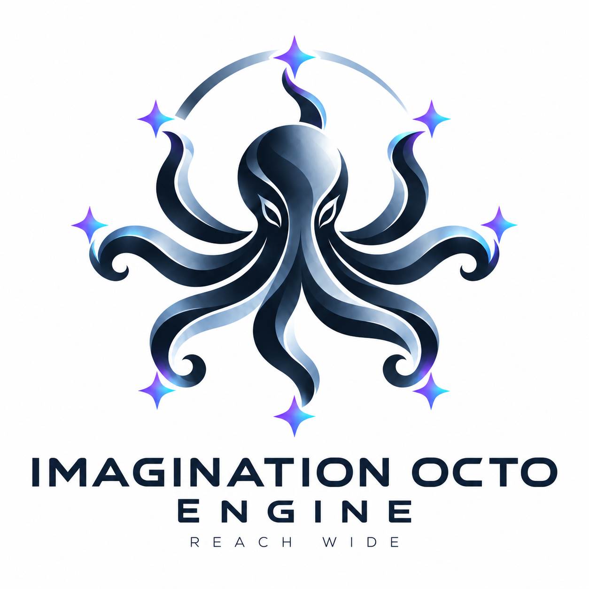

<div align="center">

<picture>
  <source media="(prefers-color-scheme: dark)" srcset="assets/brand/imagination-octo-engine-logo-dark.png" />
  
</picture>

# IMAGINATION OCTO ENGINE

**REACH WIDE**

### La mitad divergente de Imagination Octo —<br/>un pequeño portafolio de ideas con mecanismos distintos, donde el encaje es un veto

[English](README.md) · [한국어](README.ko.md) · [日本語](README.ja.md) · [简体中文](README.zh-CN.md) · [Español](README.es.md) · [Français](README.fr.md) · [Deutsch](README.de.md) · [Português (Brasil)](README.pt-BR.md)

[](https://github.com/djfksjd/imagination-octo-engine/actions/workflows/tests.yml)
[](LICENSE)

[](https://github.com/djfksjd/imagination-octo)


</div>

Imagination Octo Engine devuelve de tres a cinco ideas que difieren en su mecanismo causal, no en nombres ni en estética. Una idea inusual que debilita el brief no sobrevive, y el motor nunca elige una ganadora por ti.

> [!TIP]
> **A la mayoría le conviene instalar [Imagination Octo](https://github.com/djfksjd/imagination-octo).** Combina este motor con el taller de brainstorming y deja en tus manos la elección entre ambos.

**Esto es `v0.7.0`.** Cuando el host puede ejecutar subagentes, cada pasada de búsqueda se ejecuta ahora en su propio contexto nuevo, lo que cuesta entre tres y cuatro veces más tokens. Las mediciones de abajo provienen de comparaciones pequeñas juzgadas por IA y no afirman una creatividad universal. La invocación implícita sigue desactivada: llama a la skill por su nombre.

## Qué hace

| | |
|---|---|
| **Encuadre** | Extrae el resultado, la audiencia, el valor y lo innegociable. Hace como mucho una pregunta. |
| **Búsqueda** | Tres pasadas: respuestas directas, mecanismos tomados de dominios ajenos y una premisa oculta cambiada cada vez. |
| **Descarte** | Elimina las violaciones de restricciones, los clichés rebautizados y la novedad que desaparece al quitar los nombres. |
| **Comparación** | Por pares y en orden: encaje, mecanismo, sorpresa útil, diferencia con el resto del conjunto. |
| **Prueba** | Comprueba en privado, para cada superviviente, la evidencia de las restricciones, la cadena causal, el primer encuentro y la incertidumbre decisiva. |
| **Entrega** | De tres a cinco direcciones independientes y una pregunta que te ayuda a elegir. |

## Cómo funciona

```text
 your brief ──► ┌────────── search · three private passes ───────────┐
                │    direct · mechanism transfer · premise shift     │
                └──────────────────────────┬─────────────────────────┘
                                           ▼
                ┌────────────── cull · compare · prove ──────────────┐
                │        fit is a veto · pairwise comparison         │
                │        one private proof card per survivor         │
                └──────────────────────────┬─────────────────────────┘
                                           ▼
                              3–5 independent directions
                                           ▼
                                    ◆ YOU CHOOSE ◆        the engine never picks for you
```

- Cuando el host puede ejecutar subagentes, cada pasada va a un trabajador con un contexto nuevo, para que las candidatas no se anclen unas a otras. Si no, las pasadas se ejecutan una tras otra.
- La búsqueda y la prueba son privadas. Recibes las ideas, no un informe de que se ejecutó un pipeline.
- En tiempo de ejecución solo se carga un archivo Markdown: sin script, mazo aleatorio, autopuntuación ni compuerta.

## Pruébalo

```text
Usa $imagination-octo-engine para proponer varias mecánicas de negociación
realmente distintas, sin árboles de diálogo, dados ocultos ni estadística de persuasión.
```

Cada dirección indica su mecanismo, por qué encaja y su riesgo principal. La respuesta termina con una pregunta y espera.

## Mediciones

v0.5.3 frente a un prompt normal fuerte, prerregistrado y a ciegas: 10 briefs nuevos en inglés y coreano, 5 ejecuciones cada uno, 5 jueces (2026-07-30).

| Métrica | Motor menos prompt normal |
|---|---:|
| Preferido para continuar | **50–0 (100%)** |
| Sorpresa útil | **+0,97** |
| Diversidad del portafolio | **+0,66** |
| Encaje con el brief | **+0,60** |
| Oficio | **+0,56** |
| Tokens | `1,12×` |

Léelas con honestidad:

- **Un solo modelo generó y juzgó.** Solo `gpt-5.4`, con jueces de la misma familia. El intervalo de Wilson al 95% para la preferencia es 92,9–100,0%.
- **La v0.7.0 superó a la v0.5.3 en un experimento prerregistrado, con 3–4× los tokens.** En el [Experimento C](https://github.com/djfksjd/imagination-octo/blob/main/evals/results/2026-10-07-experiment-c.md) fue preferida en 11 de 12 briefs con `gpt-5.5` y en 10 de 12 con `claude-opus-5-5`, con la sorpresa útil subiendo +0,44 y +0.29. Según nuestra codificación sus mecanismos no fueron más raros que antes, así que la ganancia está en ideas mejor elegidas y mejor trabajadas, más que en ideas más extrañas. El experimento emuló los subagentes con llamadas separadas y lo juzgó la otra familia de modelos, no personas.
- **Existe un experimento entre modelos, y su resultado de preferencia está anulado por ahora.** En el [Experimento A](https://github.com/djfksjd/imagination-octo/blob/main/evals/results/2026-10-06-experiment-a.md) el motor fue preferido en 11 de 12 briefs con `gpt-5.5` y en 10 de 12 con `claude-opus-5-5`. Pero los jueces adivinaban qué lado usaba la skill, así que, según la regla fijada de antemano, esas cifras no cuentan hasta que se vuelvan a juzgar.
- **Debilidades conocidas.** Ejecuciones separadas siguen compartiendo cerca de la mitad de sus mecanismos (0,47 y 0,48 en el Experimento C), y con Claude devuelve algo menos de ideas que un prompt normal (4,3 frente a 4,6). Una regla de selección «atrevida» más estricta, probada junto a la v0.7.0, no superó su umbral y no se publicó.
- **Dos rediseños fallaron.** Una [candidata v0.6.0](https://github.com/djfksjd/imagination-octo/blob/main/evals/results/2026-10-06-experiment-b.md) no superó a la v0.5.3 con briefs nuevos y no se publicó. El pipeline anterior de mazos y compuertas (v0.4.0) perdió 0–30 frente a un prompt normal con 48× el coste; se conserva en [`legacy/v0.4.0/`](legacy/v0.4.0/) como registro y nunca se carga.

Protocolo, regla de decisión y resultados congelados: [`evals/`](evals/README.md).

## Cuándo usarlo y cuándo no

**Úsalo** para conceptos, premisas, mecánicas, productos, servicios, mundos y rituales cuando importa la novedad útil, o cuando las ideas anteriores resultaron genéricas.

**Usa otra cosa** para trabajo factual, tareas rutinarias con respuesta conocida o una idea que ya elegiste. Para este último caso usa [Imagination Octo Brainstorming](https://github.com/djfksjd/imagination-octo-brainstorming).

## Antes se llamaba `imagination-engine`

Hasta la v0.5.3 este repositorio era `imagination-engine-skill` y la skill era `$imagination-engine`. GitHub redirige la URL antigua, pero el plugin, el id del marketplace y el comando cambiaron: instala `imagination-octo-engine@imagination-octo-engine` e invoca `$imagination-octo-engine`.

## Instalación independiente

```bash
curl -fsSL https://raw.githubusercontent.com/djfksjd/imagination-octo-engine/main/install.sh | bash
```

Para actualizar, ejecuta el mismo comando otra vez. Si avisa de copias antiguas de estas skills instaladas por separado, termina el comando con `| bash -s -- --clean-legacy` para apartarlas; no se borra nada.

```bash
# Claude Code
claude plugin marketplace add djfksjd/imagination-octo-engine
claude plugin install imagination-octo-engine@imagination-octo-engine

# Codex
codex plugin marketplace add djfksjd/imagination-octo-engine
codex plugin add imagination-octo-engine@imagination-octo-engine
```

## Desarrollo

```bash
python3 -m pytest tests/ -q
python3 evals/harness.py --help
bash -n install.sh
```

## Licencia

[MIT](LICENSE).
