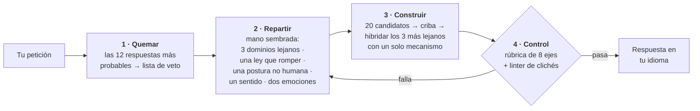

<div align="center">

# Imagination Engine

**Rareza por sustracción.**

Una skill de agente que hace que una IA produzca ideas realmente extrañas: no pidiéndole más imaginación,<br>sino *eliminando los caminos que llevan a la respuesta obvia*.

[](https://github.com/djfksjd/imagination-engine-skill/actions/workflows/tests.yml)
[](#instalación)
[](#instalación)
[](#por-dentro)
[](LICENSE)

[English](README.md) · [한국어](README.ko.md) · [日本語](README.ja.md) · [简体中文](README.zh-CN.md) · **Español** · [Français](README.fr.md) · [Deutsch](README.de.md) · [Português](README.pt-BR.md)

</div>

---

> Pedirle a un modelo que "sea creativo" hace que muestree las continuaciones más probables de la palabra *creativo*. Por eso los resultados convergen: otra vez las redes de micelio, otra vez la ciudad de neón bajo la lluvia, otra vez la máquina que resulta tener sentimientos.
>
> **Insistir más no mueve la distribución. Quitar opciones sí.**

## Cómo funciona



|  | Qué ocurre | Por qué funciona |
|---|---|---|
| **1** | **Quema los primeros impulsos.** Antes de generar nada, el modelo escribe las doce respuestas que con más probabilidad daría; esas pasan a ser una lista de prohibiciones cotejada mecánicamente con el borrador final. | Además nombra el *esqueleto* que comparten (en el ejemplo: un aparato, un operador, una sustancia almacenada). El esqueleto es el verdadero objetivo, así que toda variante con otra piel cae junto al original. |
| **2** | **Reparte una mano que el modelo no eligió.** Un sorteo sembrado por hash entrega tres dominios conceptuales de categorías disjuntas, una ley de la realidad que romper, una posición no humana, un sentido por inventar y dos emociones que deben coexistir. | Por su cuenta, un modelo asocia hacia sus propios favoritos. El sorteo es externo, reproducible, y repetirlo reparte cartas *nuevas*. |
| **3** | **Exige reemplazar la ley rota.** Cada supresión instala una ley nueva, y esa ley debe prohibir algo que el mundo ordinario permite. | Un mundo donde una regla simplemente falta no es extraño: está vacío. La restricción es lo que hace legible la invención. |
| **4** | **Somete la salida a controles.** Una rúbrica de ocho ejes y un linter de frases se ejecutan antes de que el usuario vea nada. | Un control fallido significa regenerar, no reenviar con las notas redondeadas hacia arriba. |

## Instalación

Funciona en **Claude Code** y **Codex**. Solo biblioteca estándar de Python 3: nada que instalar, sin clave de API y sin acceso a red.

```bash
curl -fsSL https://raw.githubusercontent.com/djfksjd/imagination-engine-skill/main/install.sh | bash
```

<details>
<summary><b>Instalación manual</b></summary>

```bash
# Claude Code
claude plugin marketplace add djfksjd/imagination-engine-skill
claude plugin install imagination-engine@djfksjd

# Codex
codex plugin marketplace add djfksjd/imagination-engine-skill
codex plugin add imagination-engine@djfksjd
```

Un mismo árbol sirve a ambos hosts: el cuerpo de la skill vive en `skills/imagination-engine/`, y `AGENTS.md` se carga como contexto compartido.
</details>

## Cómo usarla

Describe lo que quieres. La skill se activa cuando pides algo extraño o cuando dices que las ideas hasta ahora son genéricas. Funciona con prompts en cualquier idioma y responde en el que usaste.

```text
Usa el motor de imaginación con: una máquina que separa la emoción de la voz.
Modos bebé, no humano y afectivo. Nada de escaneo neuronal ni emociones como colores.
```

```text
Diseña una criatura para mi juego que no se parezca a nada del género.
Modo extremal, ancla 2: tengo que poder construirla de verdad.
```

> [!TIP]
> Lo más valioso que puedes añadir es **tu propia lista de prohibiciones**. "Otro X no, por favor" vale más que cualquier adjetivo — y si no la das, la skill te la pedirá.

### Modos · hasta tres apilados

| Modo | Qué elimina |
|---|---|
| `baby` | La función aprendida, los nombres correctos y el orden de causa y efecto. Lógica de infante, ejecución adulta: un resultado tierno es un fracaso. |
| `nonhuman` | La utilidad para las personas. Aquí nada existe para nadie; si el resultado es un producto, queda descalificado. |
| `alien-physics` | La apariencia como lugar de la novedad. Cambian la física, el tiempo o la identidad. |
| `affect` | Los cinco sentidos y las emociones con nombre. Exige inventar un sentido con sus cuatro campos, incluida la nueva injusticia que crea. |
| `extremal` | Todo candidato seguro. Los umbrales suben a media 9,0 y ningún eje por debajo de 8. |
| `grounded` | Nada. Añade una vía hacia algo real sin tocar el principio. |

### Anclas · cuánto debe seguir siendo alcanzable el resultado

| | Nivel | Requisito |
|---|---|---|
| `0` | **Sin ataduras** | La única obligación es la coherencia interna |
| `1` | **Legible** | Explicable en tres frases sin analogías con obras conocidas |
| `2` | **Escenificable** | Una escena u objeto concreto que un equipo podría producir |
| `3` | **Operable** | Una vía real hacia un prototipo, indicando qué se pierde en esa traducción |

## Qué produce

Ocho secciones fijas, en tu idioma: el nombre · una definición de una línea que no se apoya en comparaciones · la ley por la que existe · una escena de primer encuentro · su propiedad más extraña · los sentimientos en conflicto que provoca · lo que cambia en el mundo por su existencia · y, obligatorio, **qué versiones familiares se descartaron y a qué obra conocida se parece más**.

<details open>
<summary>Del ejemplo completo — tema: <i>"una máquina que separa la emoción de la voz"</i></summary>

> ### Flatting
>
> Una pendiente que se forma allí donde una frase se dice más de una vez, extrayendo la carga de cada enunciación anterior y depositándola en las superficies de la habitación.
>
> […] Como la extracción corre hacia atrás, edita lo que ya ocurrió: una promesa repetida un martes alcanza y vacía todas las ocasiones anteriores en que se hizo, incluida la que importaba. Aquí es imposible tranquilizar a alguien por repetición.
>
> […] Los funerales se han invertido: se leen las frases que la persona muerta dijo exactamente una vez, casi siempre triviales, casi siempre sobre el tiempo, porque son las únicas suyas que todavía llevan algo dentro.

</details>

Fíjate en lo que *no* hay: ningún aparato, ningún dispositivo luminoso, nada de aspecto raro. **La extrañeza está en lo que se ha vuelto imposible.** La ejecución completa, con las etapas ocultas, está en [`worked-example.md`](skills/imagination-engine/references/worked-example.md).

## Lo que no hará

> [!IMPORTANT]
> - **Afirmar que nadie ha pensado esto jamás.** Es inverificable, así que la skill tiene prohibido decirlo. En su lugar nombra las obras conocidas más cercanas y explica la diferencia, siempre dentro de la salida.
> - **Sustituir la extrañeza por el impacto.** La crueldad, el gore, la violencia sexual y la degradación de grupos reales son la vía más barata a la incomodidad y están prohibidas como atajo. La inquietud debe venir de la premisa.
> - **Fingir que pasar el linter significa que la idea es buena.** El linter demuestra que ciertos movimientos conocidos están *ausentes*; no puede demostrar que haya algo presente. La rúbrica es autoevaluada y la skill lo dice. Lo que ambos controles imponen de verdad es que el trabajo no se saltó.
> - **Reducir tu petición en silencio.** Si necesitas algo construible, se sube el ancla en lugar de ablandar la premisa. Y cuando la respuesta convencional es la correcta, la skill debe decírtelo y responder con normalidad.

## Por dentro

| Script | Función | Salida distinta de cero |
|---|---|---|
| `draw.py` | Reparte la mano de restricciones desde siete mazos | `1` error de uso o de mazo |
| `banlist.py` | Fusiona el volcado de impulsos con el mazo de clichés en una lista verificable | `2` volcado demasiado corto |
| `cliche_lint.py` | Señala frases prohibidas, adjetivos huecos y frases de folleto, con número de línea | `3` hay material prohibido |
| `score_gate.py` | Valida el candidato contra la rúbrica, fail-closed | `2` control no superado |

**Todo es reproducible.** El sorteo se siembra con un hash del tema, así que la misma petición reparte la misma mano y cualquier resultado puede reproducirse y auditarse. `--run 2` reparte material nuevo y todavía disjunto para una regeneración; `--salt` vuelve a repartir la misma tirada.

```text
skills/imagination-engine/
├── SKILL.md                    # el flujo de trabajo autoritativo
├── references/
│   ├── output-template.md      # el contrato de secciones entregadas
│   ├── worked-example.md       # una ejecución completa, con las etapas ocultas
│   ├── rubric.json             # ocho ejes · umbrales · mínimos por sección
│   ├── candidate.schema.json   # lo que valida score_gate.py
│   ├── example-candidate.json  # un candidato que pasa ambos controles (y sirve de fixture)
│   └── decks/                  # dominios · restricciones · sentidos · perspectivas
│                               # afectos · modos · clichés
└── scripts/                    # draw · banlist · cliche_lint · score_gate
```

## Pruebas

```bash
python3 -m pytest tests/ -q
```

Sin red: integridad de los mazos, determinismo y disyunción del sorteo, ambos controles y el ejemplo incluido pasando su propio linter.

## Contribuir

Los mazos son el punto más fácil por donde ayudar: un dominio realmente lejano a los demás, una ley de la realidad que valga la pena romper, un sentido que valga la pena inventar. Cada entrada debe ser respondible: un dominio necesita una pregunta que el resultado tenga que contestar, y una restricción necesita su requisito de ley sustituta. Ejecuta las pruebas antes de abrir un PR.

<div align="center">
<sub>Licencia MIT · construido para <a href="https://claude.com/claude-code">Claude Code</a> y Codex</sub>
</div>
