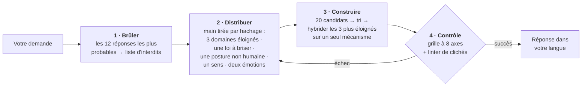

<div align="center">

# Imagination Engine

**L'étrangeté par soustraction.**

Une compétence d'agent qui fait produire à une IA des idées réellement étranges — non pas en lui demandant plus d'imagination,<br>mais en *supprimant les chemins qui mènent à la réponse évidente*.

[](https://github.com/djfksjd/imagination-engine-skill/actions/workflows/tests.yml)
[](#installation)
[](#installation)
[](#sous-le-capot)
[](LICENSE)

[English](README.md) · [한국어](README.ko.md) · [日本語](README.ja.md) · [简体中文](README.zh-CN.md) · [Español](README.es.md) · **Français** · [Deutsch](README.de.md) · [Português](README.pt-BR.md)

</div>

---

> Demander à un modèle d'« être créatif » l'amène à échantillonner les suites les plus probables du mot *créatif*. D'où la convergence des résultats : encore les réseaux mycéliens, encore la ville de néon sous la pluie, encore la machine qui se découvre des sentiments.
>
> **Insister ne déplace pas la distribution. Retirer des options, si.**

## Comment ça marche



|  | Ce qui se passe | Pourquoi ça marche |
|---|---|---|
| **1** | **Brûle les premiers réflexes.** Avant toute génération, le modèle écrit les douze réponses qu'il donnerait le plus probablement ; elles deviennent une liste d'interdits confrontée mécaniquement au texte final. | Il nomme aussi le *squelette* qu'elles partagent (dans l'exemple : un appareil, un opérateur, une substance stockée). Le squelette est la vraie cible : toute variante rhabillée tombe avec l'original. |
| **2** | **Distribue une main que le modèle n'a pas choisie.** Un tirage amorcé par hachage fournit trois domaines conceptuels issus de catégories disjointes, une loi du réel à briser, une posture non humaine, un sens à inventer et deux émotions qui doivent coexister. | Livré à lui-même, un modèle associe vers ses propres favoris. Le tirage est externe, reproductible, et un nouveau tirage donne de *nouvelles* cartes. |
| **3** | **Exige le remplacement de la loi brisée.** Chaque suppression installe une loi nouvelle, et cette loi doit interdire quelque chose que le monde ordinaire autorise. | Un monde où une règle manque simplement n'est pas étrange : il est vide. C'est la contrainte qui rend l'invention lisible. |
| **4** | **Fait passer la sortie par des contrôles.** Une grille à huit axes et un linter de formulations s'exécutent avant que l'utilisateur ne voie quoi que ce soit. | Un contrôle échoué veut dire régénérer — pas resoumettre avec les notes arrondies vers le haut. |

## Installation

Fonctionne dans **Claude Code** et **Codex**. Bibliothèque standard Python 3 uniquement : rien à installer, pas de clé d'API, pas d'accès réseau.

```bash
curl -fsSL https://raw.githubusercontent.com/djfksjd/imagination-engine-skill/main/install.sh | bash
```

<details>
<summary><b>Installation manuelle</b></summary>

```bash
# Claude Code
claude plugin marketplace add djfksjd/imagination-engine-skill
claude plugin install imagination-engine@djfksjd

# Codex
codex plugin marketplace add djfksjd/imagination-engine-skill
codex plugin add imagination-engine@djfksjd
```

Une seule arborescence sert les deux hôtes : le corps de la compétence est dans `skills/imagination-engine/`, et `AGENTS.md` est chargé comme contexte partagé.
</details>

## Utilisation

Décrivez ce que vous voulez. La compétence se déclenche sur une demande d'étrangeté, ou quand vous dites que les idées obtenues sont banales. Les prompts fonctionnent dans toutes les langues, et la réponse revient dans la vôtre.

```text
Utilise le moteur d'imagination sur : une machine qui sépare l'émotion de la voix.
Modes bébé, non humain et affect. Pas de scan neuronal, pas d'émotions en couleurs.
```

```text
Conçois pour mon jeu une créature qui ne ressemble à rien du genre.
Mode extremal, ancrage 2 — je dois pouvoir la fabriquer réellement.
```

> [!TIP]
> Ce que vous pouvez ajouter de plus précieux, c'est **votre propre liste d'interdits**. « Pas encore un X » vaut mieux que n'importe quel adjectif — et si vous ne la donnez pas, la compétence la demandera.

### Modes · jusqu'à trois cumulés

| Mode | Ce qu'il retire |
|---|---|
| `baby` | La fonction apprise, les noms corrects, l'ordre de la cause et de l'effet. Logique de nourrisson, exécution adulte — un résultat mignon est un échec. |
| `nonhuman` | L'utilité pour l'humain. Ici rien n'existe pour personne ; si le résultat est un produit, il est disqualifié. |
| `alien-physics` | L'apparence comme lieu de la nouveauté. Ce sont la physique, le temps ou le soi qui changent. |
| `affect` | Les cinq sens et les émotions nommées. Exige d'inventer un sens entièrement spécifié — y compris la nouvelle injustice qu'il crée. |
| `extremal` | Tout candidat sûr. Les seuils montent à une moyenne de 9,0, aucun axe sous 8. |
| `grounded` | Rien. Ajoute une voie vers quelque chose de réel sans modifier le principe. |

### Ancrages · à quel point le résultat doit rester atteignable

| | Niveau | Exigence |
|---|---|---|
| `0` | **Libre** | La cohérence interne est la seule obligation |
| `1` | **Lisible** | Explicable en trois phrases sans analogie avec une œuvre connue |
| `2` | **Représentable** | Une scène ou un objet concret qu'une équipe pourrait produire |
| `3` | **Opérable** | Une voie réelle vers un prototype, avec les pertes de cette traduction énoncées |

## Ce qui en sort

Huit sections fixes, dans votre langue : le nom · une définition en une ligne qui ne s'appuie sur aucune comparaison · la loi qui le fait exister · une scène de première rencontre · sa propriété la plus étrange · les sentiments contradictoires qu'il produit · ce qui change dans le monde du fait de son existence · et, obligatoire, **quelles versions familières ont été écartées et de quelle œuvre connue le résultat est le plus proche**.

<details open>
<summary>Extrait de l'exemple complet — sujet : <i>« une machine qui sépare l'émotion de la voix »</i></summary>

> ### Flatting
>
> Une pente qui se forme partout où une phrase est dite plus d'une fois, retirant la charge de chaque énonciation antérieure et la déposant sur les surfaces de la pièce.
>
> […] Comme le prélèvement va vers l'arrière, il édite ce qui a déjà eu lieu : une promesse répétée un mardi remonte et vide toutes les occasions antérieures où elle a été faite, y compris celle qui comptait. Ici, rassurer par la répétition est impossible.
>
> […] Les funérailles se sont inversées — on y lit les phrases que le mort n'a dites qu'une seule fois, souvent banales, souvent sur la météo, parce que ce sont les seules des siennes qui portent encore quelque chose.

</details>

Notez ce qui *n'y est pas* : aucun appareil, aucun dispositif lumineux, rien d'étrange à regarder. **L'étrangeté tient à ce qui est devenu impossible.** Le déroulé complet, étapes cachées comprises, est dans [`worked-example.md`](skills/imagination-engine/references/worked-example.md).

## Ce qu'elle ne fera pas

> [!IMPORTANT]
> - **Prétendre que personne n'y a jamais pensé.** C'est invérifiable, donc la compétence a interdiction de l'écrire. Elle nomme à la place les œuvres connues les plus proches et énonce la différence — à chaque fois, dans la sortie.
> - **Remplacer l'étrangeté par le choc.** Cruauté, gore, violences sexuelles et dégradation de groupes réels sont la voie la moins chère vers le malaise, et sont interdites comme raccourci. Le malaise doit venir de la prémisse.
> - **Faire croire qu'un linter validé signifie une bonne idée.** Le linter prouve que certains gestes connus sont *absents* ; il ne prouve la présence de rien. La grille est auto-notée et la compétence le dit. Ce que les deux contrôles imposent vraiment, c'est que le travail n'a pas été sauté.
> - **Rétrécir votre demande en silence.** S'il vous faut du réalisable, on monte l'ancrage plutôt que d'adoucir la prémisse. Et quand la réponse conventionnelle est la bonne, la compétence doit vous le dire et répondre normalement.

## Sous le capot

| Script | Rôle | Sortie non nulle |
|---|---|---|
| `draw.py` | Distribue la main de contraintes depuis sept jeux | `1` erreur d'usage ou de jeu |
| `banlist.py` | Fusionne le vidage des réflexes et le jeu de clichés en une liste vérifiable | `2` vidage trop court |
| `cliche_lint.py` | Signale formules interdites, adjectifs creux et phrases de plaquette, avec numéros de ligne | `3` matériel interdit présent |
| `score_gate.py` | Valide le candidat au regard de la grille, fail-closed | `2` contrôle échoué |

**Tout est reproductible.** Le tirage est amorcé par un hachage du sujet : la même demande distribue la même main, et tout résultat peut être rejoué et audité. `--run 2` distribue du matériel neuf et toujours disjoint pour une régénération ; `--salt` redistribue le même tirage.

```text
skills/imagination-engine/
├── SKILL.md                    # le flux de travail faisant autorité
├── references/
│   ├── output-template.md      # le contrat des sections livrées
│   ├── worked-example.md       # une exécution complète, étapes cachées comprises
│   ├── rubric.json             # huit axes · seuils · minimums par section
│   ├── candidate.schema.json   # ce que valide score_gate.py
│   ├── example-candidate.json  # un candidat qui passe les deux contrôles (et sert de fixture)
│   └── decks/                  # domaines · contraintes · sens · perspectives
│                               # affects · modes · clichés
└── scripts/                    # draw · banlist · cliche_lint · score_gate
```

## Tests

```bash
python3 -m pytest tests/ -q
```

Hors ligne : intégrité des jeux, déterminisme et disjonction du tirage, les deux contrôles, et l'exemple livré passant son propre linter.

## Contribuer

Les jeux sont l'endroit le plus simple pour aider : un domaine vraiment éloigné des autres, une loi du réel qui mérite d'être brisée, un sens qui mérite d'être inventé. Chaque entrée doit être « répondable » : un domaine exige une question à laquelle le résultat doit répondre, une contrainte exige son exigence de loi de remplacement. Lancez les tests avant d'ouvrir une PR.

<div align="center">
<sub>Licence MIT · conçu pour <a href="https://claude.com/claude-code">Claude Code</a> et Codex</sub>
</div>
