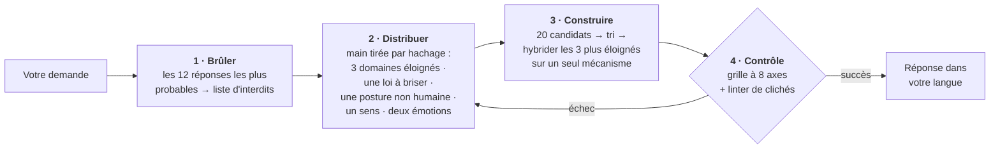

<div align="center">

# Imagination Engine

**L'étrangeté par soustraction.**

Une compétence d'agent qui fait produire à une IA des idées réellement étranges — non pas en lui demandant plus d'imagination,<br>mais en *supprimant les chemins qui mènent à la réponse évidente*.

[](https://github.com/djfksjd/imagination-engine-skill/actions/workflows/tests.yml)
[](#installation)
[](#installation)
[](#sous-le-capot)
[](LICENSE)

[English](README.md) · [한국어](README.ko.md) · [日本語](README.ja.md) · [简体中文](README.zh-CN.md) · [Español](README.es.md) · **Français** · [Deutsch](README.de.md) · [Português](README.pt-BR.md)

</div>

---

> [!CAUTION]
> ## Mesurée deux fois en aveugle. Perdue les deux fois.
>
> L'affirmation centrale de cette compétence — retirer les chemins vers la réponse évidente donne de meilleures idées qu'une invite ordinaire — a maintenant été mesurée deux fois contre un contrôle en invite ordinaire, et elle a perdu nettement les deux fois. Le second test a été préenregistré intégralement avant l'existence de la moindre donnée, et il a tourné sur la version actuelle, au réglage par défaut actuel (`alien-physics` seul, ancrage 1), le seuil auto-évalué ayant déjà été retiré de la barrière. Aucun de ces deux changements n'a rattrapé l'écart.
>
> Six commandes, cinq tirages du moteur et cinq du contrôle sur chacune, cinq juges en aveugle par commande à qui l'on n'a jamais dit que deux conditions existaient. Moteur moins contrôle, médiane des cinq juges, échelles de 1 à 7, moyenne à poids égal sur les six commandes :
>
> | | WANT | FIT | CRAFT |
> |---|---|---|---|
> | moteur − contrôle | **−2,83** | **−3,03** | **−1,67** |
>
> Chaque commande est négative sur chaque mesure. Le contrôle passe devant le moteur dans **30 cellules commande × juge sur 30** et rafle **90 des 90** places du trio de tête. Agrégé : WANT 5,76 → 2,98 ; FIT 6,35 → 3,33 ; CRAFT 5,88 → 4,23.
>
> La convergence — le problème pour lequel cette compétence a été construite — n'a pas été réduite de façon mesurable : `g_CORE` +0,10 et `g_SKELETON` −0,22, contre les +0,30 exigés par la règle. L'α ordinal de Krippendorff entre codeurs ressort à 0,786 et 0,673, sous le plancher préenregistré de 0,80 : **cette mesure est donc non concluante, et non favorable** — elle ne constitue pas une preuve en faveur de la compétence, et elle ne compte pas non plus contre elle.
>
> Le moteur a coûté **48× le contrôle par sortie**.
>
> La règle préenregistrée rend **FAIL**, et elle avait consigné d'avance « puissance insuffisante », « presque passé », « la marge était serrée » et « il a gagné sur les commandes de réserve » comme des FAIL, précisément pour que personne n'aille les chercher après coup. Selon cette règle, le contrôle en invite ordinaire devient le réglage recommandé et un nouveau banc d'essai est conçu.
>
> **Une affirmation causale que cette page portait est retirée.** Elle disait que le mode `nonhuman` avait causé l'effondrement de l'adéquation. Non : retirer `nonhuman` du réglage par défaut a fait passer le FIT agrégé de 3,27 à 3,33, face à un contrôle à 6,35. L'effondrement a survécu presque intact à son retrait. L'avertissement propre à ce mode — il dissout toute commande où figure une personne — tient toujours comme règle de conception, mais il n'est pas la cause de la perte mesurée.
>
> **À part, et toujours étayé.** Le résultat de la première expérience — un modèle sans aide s'effondre bel et bien quand la commande a une réponse évidente — est réel : sur la commande de la créature d'estuaire, six tirages indépendants en invite ordinaire ont produit le même organisme. Le problème visé existe. Ce qui est réfuté, c'est que ce pipeline le résolve.

---

> Demander à un modèle d'« être créatif » l'amène à échantillonner les suites les plus probables du mot *créatif*. D'où la convergence des résultats : encore les réseaux mycéliens, encore la ville de néon sous la pluie, encore la machine qui se découvre des sentiments.
>
> **Insister ne déplace pas la distribution. Retirer des options, si.**

## Comment ça marche



|  | Ce qui se passe | Pourquoi ça marche |
|---|---|---|
| **1** | **Brûle les premiers réflexes.** Avant toute génération, le modèle écrit les douze réponses qu'il donnerait le plus probablement ; elles deviennent une liste d'interdits confrontée mécaniquement au texte final. | Il nomme aussi le *squelette* qu'elles partagent (dans l'exemple : un appareil, un opérateur, une substance stockée). Le squelette est la vraie cible : toute variante rhabillée tombe avec l'original. |
| **2** | **Distribue une main que le modèle n'a pas choisie.** Un tirage amorcé par hachage fournit trois domaines conceptuels issus de catégories disjointes, une loi du réel à briser, une posture non humaine, un sens à inventer et deux émotions qui doivent coexister. | Livré à lui-même, un modèle associe vers ses propres favoris. Le tirage est externe, reproductible, et un nouveau tirage donne de *nouvelles* cartes. |
| **3** | **Exige le remplacement de la loi brisée.** Chaque suppression installe une loi nouvelle, et cette loi doit interdire quelque chose que le monde ordinaire autorise. | Un monde où une règle manque simplement n'est pas étrange : il est vide. C'est la contrainte qui rend l'invention lisible. |
| **4** | **Fait passer la sortie par des contrôles.** Une grille à huit axes et un linter de formulations s'exécutent avant que l'utilisateur ne voie quoi que ce soit. | Un contrôle échoué veut dire régénérer — pas resoumettre avec les notes arrondies vers le haut. |

## Installation

Fonctionne dans **Claude Code** et **Codex**. Bibliothèque standard Python 3 uniquement : rien à installer, pas de clé d'API, pas d'accès réseau.

```bash
curl -fsSL https://raw.githubusercontent.com/djfksjd/imagination-engine-skill/main/install.sh | bash
```

<details>
<summary><b>Installation manuelle</b></summary>

```bash
# Claude Code
claude plugin marketplace add djfksjd/imagination-engine-skill
claude plugin install imagination-engine@djfksjd

# Codex
codex plugin marketplace add djfksjd/imagination-engine-skill
codex plugin add imagination-engine@djfksjd
```

Une seule arborescence sert les deux hôtes : le corps de la compétence est dans `skills/imagination-engine/`, et `AGENTS.md` est chargé comme contexte partagé.
</details>

## Utilisation

Décrivez ce que vous voulez. La compétence se déclenche sur une demande d'étrangeté, ou quand vous dites que les idées obtenues sont banales. Les prompts fonctionnent dans toutes les langues, et la réponse revient dans la vôtre.

```text
Utilise le moteur d'imagination sur : une machine qui sépare l'émotion de la voix.
Modes bébé, non humain et affect. Pas de scan neuronal, pas d'émotions en couleurs.
```

```text
Conçois pour mon jeu une créature qui ne ressemble à rien du genre.
Mode extremal, ancrage 2 — je dois pouvoir la fabriquer réellement.
```

### Modes · jusqu'à trois cumulés

| Mode | Ce qu'il retire |
|---|---|
| `baby` | La fonction apprise, les noms corrects, l'ordre de la cause et de l'effet. Logique de nourrisson, exécution adulte — un résultat mignon est un échec. |
| `nonhuman` | L'utilité pour l'humain. Ici rien n'existe pour personne ; si le résultat est un produit, il est disqualifié. **Détruit toute commande où figure une personne** — voir l'avertissement plus bas. |
| `alien-physics` | L'apparence comme lieu de la nouveauté. Ce sont la physique, le temps ou le soi qui changent. |
| `affect` | Les cinq sens et les émotions nommées. Exige d'inventer un sens entièrement spécifié — y compris la nouvelle injustice qu'il crée. |
| `extremal` | Tout candidat sûr. Élargit la main, distribue deux règles à briser et relève la barre du rebut. |
| `grounded` | Rien. Ajoute une voie vers quelque chose de réel sans modifier le principe, et remplace l'axe `non_anthropocentrism` par `translation_integrity`. |

**Le réglage par défaut est `alien-physics` à l'ancrage 1, et `nonhuman` n'en fait plus partie.** Il en faisait partie. Cette page affirmait qu'une expérience contrôlée avait mesuré ce que coûtait `nonhuman` : adéquation à la commande divisée par deux, et 0 sortie du moteur retenue sur 24 par des juges en aveugle. **Cette attribution causale est retirée.** La reprise préenregistrée a tourné avec `alien-physics` seul, et le FIT agrégé n'a bougé que de 3,27 à 3,33, face à un contrôle à 6,35 : l'effondrement de l'adéquation n'était pas dû à `nonhuman` et n'est pas parti avec lui. Le reste de l'avertissement tient de lui-même comme règle de conception — `nonhuman` retire l'utilité humaine par construction, et c'est ce qu'il ne faut pas appliquer à une commande pour laquelle personne ne l'a choisi. **Si votre commande contient une personne — un joueur, un lecteur, une assemblée, un client — n'ajoutez pas `nonhuman`.** Il l'effacera.

### Ancrages · à quel point le résultat doit rester atteignable

| | Niveau | Exigence |
|---|---|---|
| `0` | **Libre** | La cohérence interne est la seule obligation |
| `1` | **Lisible** | Explicable en trois phrases sans analogie avec une œuvre connue |
| `2` | **Représentable** | Une scène ou un objet concret qu'une équipe pourrait produire |
| `3` | **Opérable** | Une voie réelle vers un prototype, avec les pertes de cette traduction énoncées |

### Conduire une session

Les étapes, c'est la compétence qui les exécute. Ce que vous contrôlez, ce sont les quatre choses ci-dessous, et chacune change le résultat davantage que n'importe quel adjectif.

| Ce que vous dites | Ce que ça change |
|---|---|
| **le sujet** | la graine de tout le tirage : la main dérive de son hachage, donc reformuler le sujet distribue d'autres cartes |
| **à quoi ça sert** | récit · monde · mécanique de jeu · objet · brief de concept art · rien. « Rien » est une vraie réponse, et c'est souvent celle qui donne les résultats les plus étranges |
| **modes et ancrage** | quels chemins sont supprimés, et jusqu'où le résultat doit rester atteignable |
| **votre propre liste d'interdits** | l'entrée la plus précieuse dont vous disposez. Voir ci-dessous |

**Donnez-lui votre liste d'interdits.** La compétence brûle ses douze premiers réflexes avant de générer quoi que ce soit, mais elle ne peut pas savoir de quoi *vous* êtes lassé. Une phrase — *« plus de réseaux mycéliens, plus de chose qui s'avère vivante à la fin »* — retire davantage de masse de probabilité qu'un paragraphe d'encouragements. Si vous n'en proposez pas, la compétence la demande avant de distribuer.

**Choisir les modes :**

| Si vous voulez | Essayez |
|---|---|
| une créature ou une entité qui ne soit pas du mobilier de genre | `nonhuman, alien-physics` · ancrage 1 |
| une règle du monde plutôt qu'un monstre | `alien-physics` · ancrage 0 |
| quelque chose qu'une équipe peut réellement monter ou filmer | `alien-physics, grounded` · ancrage 2 |
| une mécanique prototypable ce mois-ci | `grounded` · ancrage 3 |
| un sens, une émotion, un état intérieur | `affect` · ancrage 1 |
| une logique antérieure à la fonction apprise | `baby, nonhuman` · ancrage 0 |
| vous avez déjà refusé deux tours | ajoutez `extremal` |

Ancrage et modes sont indépendants. `grounded` à l'ancrage 0 est légal et produit quelque chose de constructible que personne n'a demandé de rendre lisible ; `extremal` à l'ancrage 3 est le réglage le plus dur de la compétence. `grounded` ne peut pas se cumuler avec `nonhuman` : l'axe qu'il remplace est précisément celui que ce mode existe pour imposer, et la barrière refuse la paire.

### La conversation, en pratique

**Commencer.** Dites ce que vous voulez, dans la langue que vous voulez. La compétence répond dans votre langue et raisonne en interne en anglais.

```text
Utilise l'imagination engine sur : ce qui se passe sur un palier entre deux étages.
Modes nonhuman et alien-physics, ancrage 1. Pas d'histoire de fantômes, pas d'esthétique d'espace liminal.
```

**Quand ça revient trop sage.** Ne dites pas « rends ça plus bizarre » : c'est exactement l'instruction qui échoue. La compétence a une réponse définie à la place :

```text
Toujours sage. Régénère.
```

Elle redistribue depuis un nouveau tirage, ajoute *tous les éléments de la réponse précédente* à la liste d'interdits, supprime une prémisse de plus parmi celles qu'elle protégeait — puis vous dit laquelle. Cette dernière ligne est en général le vrai intérêt de l'échange. Au troisième passage elle bascule sur `extremal`.

**Quand ça revient inutilisable.** Montez l'ancrage plutôt que d'adoucir la demande :

```text
Ancrage 3 — il me faut un chemin réel que je puisse construire, et je veux savoir ce que le principe perd en route.
```

**Quand vous voulez voir le travail.** Les étapes internes sont cachées à dessein. Demandez et elles s'ouvrent :

```text
Montre-moi les douze réflexes que tu as brûlés et la main que tu as tirée.
```

### Exécuter le pipeline à la main

Rien à installer au-delà de Python 3.11 et du dépôt. **Toutes les commandes ci-dessous s'exécutent depuis le répertoire de la compétence**, et les fichiers de travail vont dans un répertoire temporaire, jamais dans le dossier de la compétence :

```bash
cd skills/imagination-engine
mkdir -p /tmp/work
```

Deux des cinq entrées ne sont produites par aucun script : c'est vous qui les écrivez. Le dépôt en livre une version terminée pour chacune, de sorte que vous pouvez copier puis modifier plutôt que partir d'un fichier vide.

```bash
# 1 · brûler les réponses évidentes en une liste vérifiable.
#     obvious.txt, c'est à vous de l'écrire : les douze réponses que vous
#     donneriez en premier, une par ligne. references/example-obvious.txt en
#     est une déjà remplie.
cp references/example-obvious.txt /tmp/work/obvious.txt   # ou écrivez la vôtre
python3 scripts/banlist.py --topic "un palier entre deux étages" \
    --obvious /tmp/work/obvious.txt --extra "pas de fantomes,pas d esthetique liminale" --out /tmp/work
#     Passez vos propres interdits à --extra tels que vous les diriez, même si le
#     paquet embarqué en nomme déjà un : le fichier les enregistre et la barrière
#     les rejoue, si bien que « pas de dragons » promeut un avertissement du
#     paquet en interdiction. Le code 2 signifie que le relevé est trop court, ou
#     qu'il est une seule ligne dont on a changé le chiffre : douze variantes
#     d'un gabarit, c'est un instinct écrit douze fois. banlist.py accepte aussi
#     --allow <id de cliché> pour libérer une formule du paquet ; lisez d'abord
#     la limite honnête indiquée plus bas.

# 2 · distribuer la main (graine issue de la requête, donc rejouable à l'identique)
python3 scripts/draw.py --topic "un palier entre deux étages" \
    --modes nonhuman,alien-physics --run 1 --anchor 1 --out /tmp/work

# 3 · écrire le résultat deux fois : candidate.json pour que la barrière le note,
#     draft.md pour la lecture. Chaque section notée est marquée dans le
#     brouillon entre <!-- bind: sections.<id> --> ... <!-- /bind -->, au mot
#     près identique au candidat, sinon la barrière refuse le brouillon.
#       structure → references/candidate.schema.json, references/output-template.md
#       exemple   → references/example-candidate.json, references/example-draft.md
#     candidate.json demande aussi manual_checks_cleared : un OBJET INDEXÉ PAR ID
#     DE CONTRÔLE — {"obvious-01": "...", "obvious-02": "..."} — avec une réponse
#     écrite pour chaque contrôle manuel de la liste. Une commande de récit, de
#     monde, de rite ou de mécanique en produit d'ordinaire douze ; une commande
#     de produit, aucune, et c'est pourquoi l'exemple livré n'en solde qu'un.

# 4 · passer le linter en cours d'écriture (diagnostic ; le passer n'est pas un feu vert)
python3 scripts/cliche_lint.py --banlist /tmp/work/banlist.json --draft /tmp/work/draft.md

# 5 · la barrière. Les quatre artefacts, un seul verdict
python3 scripts/score_gate.py --candidate /tmp/work/candidate.json --draw /tmp/work/draw.json \
    --banlist /tmp/work/banlist.json --markdown /tmp/work/draft.md
```

Pour voir l'ensemble passer avant de lancer le vôtre, pointez l'étape 5 sur les quatre artefacts livrés : `--candidate references/example-candidate.json --draw references/example-draw.json --banlist references/example-banlist.json --markdown references/example-draft.md`.

`draw.py --list-modes` affiche les modes. `--run 2` distribue du matériel neuf, toujours de catégories disjointes, pour une régénération ; `--salt` redistribue le même tirage sans l'avancer.

### Codes de sortie, et quoi faire de chacun

| Code | Signification | Le correctif |
|---|---|---|
| `0` | passé | — |
| `1` | usage, fichier manquant ou paquet mal formé | une coquille, pas un jugement |
| `2` | **la barrière a refusé** — section absente ou trop mince, carte tirée restée décorative, artefact qui n'appartient pas aux autres | réécrivez l'idée. Il n'y a aucune note à arrondir : aucun nombre de cette barrière ne tranche quoi que ce soit |
| `3` | **du matériel interdit** est présent dans le brouillon | réécrivez la pensée, pas le mot. Supprimer la formule signalée et garder la phrase n'est pas un correctif |

Si le même contrôle échoue deux fois, c'est le matériel qui est mauvais, pas la formulation : redistribuez avec `--run <n+1>` au lieu d'éditer.

Un `2` n'appartient pas aux scripts : `No such file or directory` en laisse un aussi, parce que Python sort avant que le script démarre. C'est le mauvais répertoire de travail — revenez à `cd skills/imagination-engine`. À l'intérieur des scripts, une erreur d'usage vaut toujours `1`, si bien qu'une faute de frappe ne peut jamais être rapportée comme un verdict.

> [!IMPORTANT]
> **Une seule commande peut dire « passé », et elle prend tout.** `score_gate.py` redistribue la main à partir des paquets embarqués pour la comparer, lie le candidat carte par carte, exige que chaque axe de la grille soit noté et argumenté, exige une réponse écrite à chaque interdit trop long pour être apparié, et vérifie que le brouillon sur le point d'être montré est celui qui a été noté. Pas de `--extremal`, `--grounded`, `--min-mean`, `--min-axis` ni `--rubric` : un seuil affirmé au moment du verdict est affirmé par la partie que ce verdict concerne. **Et il n'y a pas non plus de seuil de note.** Vingt tirages mesurés se sont tous auto-notés dans une bande large d'un quart de point, juste au-dessus de l'ancienne barre de 8,0, y compris ceux que des juges en aveugle ont classés derniers ; un nombre sans variance ne sépare rien, il ne tranche donc plus rien ici. Les axes restent parce qu'y répondre change le travail. `cliche_lint.py` est une aide à la rédaction ; le passer n'est pas une autorisation.

**`--allow` est honoré d'un côté et pas de l'autre, exprès.** `cliche_lint.py --allow <id>` libère une formule du paquet pendant que vous rédigez. `score_gate.py` n'a pas cette option et ignore la libération enregistrée dans la liste d'interdits, parce que ce fichier est l'un des artefacts qu'il contrôle : l'honorer là reviendrait à laisser un tirage lever ses propres interdits au moment du verdict. Si une formule embarquée n'a vraiment pas sa place dans votre travail, la voie prévue est de forker le dépôt et de modifier `references/decks/cliches.json`.

**La liste d'interdits s'applique par son contenu, pas par la façon dont le fichier la classe.** Cinq modifications distinctes de `banlist.json` laissaient une formule protégée bien visible tout en l'empêchant de se déclencher : vider `extra` en gardant la ligne qui en était issue, rétrograder cette ligne en `warn`, la réétiqueter avec un id de cliché du deck, retaper le groupe d'un instinct brûlé en `deck`, ou ajouter un motif structurel dont la regex ne se termine jamais. `score_gate.py` prend désormais l'union de tous les endroits où un instinct brûlé ou l'une de vos exclusions `--extra` est consignée, et passe le brouillon au crible de ces énoncés comme interdits, sans lire ni id, ni niveau, ni groupe, ni libération ; seuls les motifs du deck sont compilés, un motif fourni est donc ignoré plutôt qu'exécuté. La limite, dite exactement : un énoncé supprimé de *toutes* les lignes qui le consignent est perdu. Supprimer une seule ligne laisse `counts` en désaccord avec le contenu, ce qui attrape la modification bâclée et non la modification soigneuse — la porte ne détient aucune copie de la liste que le run n'a pas écrite.

**Rien de ce que la porte lit n'est écarté en silence.** Un motif ajouté à `structural_patterns` est refusé *nommément* — ni compilé, ni ignoré : la première version de ce correctif l'ignorait, et `{"id": "mine", "regex": "\bcheese\b"}` avec « cheese » dans le brouillon affichait `PASSED`, c'est-à-dire l'échec même que la correction du blocage devait éviter, sous un visage plus aimable. Mets-le dans un `references/decks/cliches.json` forké et il sera compilé comme les autres. Une libération inscrite dans `allowed` est signalée par un avertissement nommant les ids, y compris sur le chemin du succès ; une liste `forbidden_moves` différente de celle du deck est signalée comme de la prose que rien n'applique. Tirer `affect` exige désormais `invented_sense` avec ses quatre champs, comme `SKILL.md` le disait déjà, et chaque champ de `draw.json` est recalculé — `notes` et les décomptes auto-déclarés compris. **`imagination-brainstorming` tranche ce champ dans l'autre sens** : il accepte les motifs fournis derrière un scan structurel et un minuteur. La différence est délibérée — cette porte refuse partout ailleurs la politique fournie par le run (`--rubric`, `--min-mean`, un `--allow` honoré), et un minuteur fait dépendre ce qui a été vérifié de la vitesse de ta machine.

> [!NOTE]
> La barrière est un plancher, pas un juge. Un passage établit que le travail exigé est présent et que les quatre artefacts s'appartiennent : la main a été distribuée par les paquets et n'a pas été retouchée ensuite, toutes les cartes ont servi, la liste d'interdits est celle qu'implique le propre relevé de ce tirage, chaque instinct long a une réponse écrite, et le brouillon sur le point d'être montré est le texte qui a été contrôlé. Elle ne peut pas vous dire que l'idée est bonne, et elle ne prétend plus qu'un nombre le puisse. Lisez le résultat vous-même.

## Ce qui en sort

Huit sections fixes, dans votre langue : le nom · une définition en une ligne qui ne s'appuie sur aucune comparaison · la loi qui le fait exister · une scène de première rencontre · sa propriété la plus étrange · les sentiments contradictoires qu'il produit · ce qui change dans le monde du fait de son existence · et, obligatoire, **quelles versions familières ont été écartées et de quelle œuvre connue le résultat est le plus proche**. Une neuvième section, **un chemin vers quelque chose de réel**, s'ajoute dès que le tirage est `grounded` ou que l'ancrage vaut `3` — le gate ne l'exige que dans ces deux cas précis, et aucune des sept autres sections ne disparaît lorsqu'elle apparaît.

<details open>
<summary>Extrait de l'exemple complet — sujet : <i>« une machine qui sépare l'émotion de la voix »</i></summary>

> ### Flatting
>
> Une pente qui se forme partout où une phrase est dite plus d'une fois, retirant la charge de chaque énonciation antérieure et la déposant sur les surfaces de la pièce.
>
> […] Comme le prélèvement va vers l'arrière, il édite ce qui a déjà eu lieu : une promesse répétée un mardi remonte et vide toutes les occasions antérieures où elle a été faite, y compris celle qui comptait. Ici, rassurer par la répétition est impossible.
>
> […] Les funérailles se sont inversées — on y lit les phrases que le mort n'a dites qu'une seule fois, souvent banales, souvent sur la météo, parce que ce sont les seules des siennes qui portent encore quelque chose.

</details>

Notez ce qui *n'y est pas* : aucun appareil, aucun dispositif lumineux, rien d'étrange à regarder. **L'étrangeté tient à ce qui est devenu impossible.** Le déroulé complet, étapes cachées comprises, est dans [`worked-example.md`](skills/imagination-engine/references/worked-example.md).

## Ce qu'elle ne fera pas

> [!IMPORTANT]
> - **Prétendre que personne n'y a jamais pensé.** C'est invérifiable, donc la compétence a interdiction de l'écrire. Elle nomme à la place les œuvres connues les plus proches et énonce la différence — à chaque fois, dans la sortie.
> - **Remplacer l'étrangeté par le choc.** Cruauté, gore, violences sexuelles et dégradation de groupes réels sont la voie la moins chère vers le malaise, et sont interdites comme raccourci. Le malaise doit venir de la prémisse.
> - **Faire croire qu'un linter validé signifie une bonne idée.** Le linter prouve que certains gestes connus sont *absents* ; il ne prouve la présence de rien. La grille est auto-notée et la compétence le dit. Ce que les deux contrôles imposent vraiment, c'est que le travail n'a pas été sauté.
> - **Rétrécir votre demande en silence.** S'il vous faut du réalisable, on monte l'ancrage plutôt que d'adoucir la prémisse. Et quand la réponse conventionnelle est la bonne, la compétence doit vous le dire et répondre normalement.

## Ce qu'elle est mesurée faire — et ce qu'elle ne fait pas

Deux expériences ont été menées. Les deux figurent ici en entier, parce qu'une compétence qui cache sa propre mesure demande qu'on lui fasse confiance plutôt qu'on la lise.

### Expérience 1 — juillet 2026

Quatre commandes dans quatre domaines sans rapport, cinq tirages avec une invite ordinaire et cinq avec le pipeline complet pour chacune, vingt mains distribuées sans recouvrement, codées et jugées en aveugle par des agents à qui l'on n'a jamais dit que deux conditions existaient.

**Confirmé, sous condition.** Une invite ordinaire converge vraiment — mais seulement quand la commande a une réponse évidente vers laquelle converger. Sur une créature d'estuaire, cinq tirages indépendants ont produit cinq versions du même organisme, et un sixième l'a produit encore. Sur une prémisse se déroulant entièrement dans un immeuble, cinq tirages ont produit cinq idées sans rapport. L'affirmation en tête de page décrit ce qui arrive à *certaines* commandes ; ce n'est pas une loi.

**Non démontré : que retirer des chemins décorrèle les réponses répétées.** Vingt tirages du moteur sur vingt mains disjointes ont convergé vers une seule forme — un processus sans corps plutôt qu'une chose, une obligation le plus souvent formulée comme une dette, une conséquence administrative. Agrégés, ils se ressemblaient *davantage* que ceux de l'invite ordinaire, pas moins. Et les cartes n'étaient pas décoratives : la plupart n'ont laissé aucune trace dans la formulation, donc elles avaient bien été absorbées, et les sorties ont convergé malgré tout. La lecture honnête : retirer l'attracteur de premier ordre marche — ces réponses ne ressemblent effectivement pas à celles d'une invite ordinaire — mais le retrait ne répartit pas uniformément ce qui reste. **Il déplace le mode.**

Ce n'est pas corrigé et cette page ne prétendra pas le contraire. Ce qui en découle en pratique : s'il vous faut des options réellement différentes, donnez-lui des commandes ou des modes différents plutôt que de relancer deux fois la même ; et si votre résultat est un processus sans corps qui impose une obligation et engendre de la paperasse, vous êtes arrivé là où les vingt derniers tirages sont arrivés — renvoyez-le.

### Expérience 2 — la reprise préenregistrée, sur la version actuelle

L'expérience 1 comportait deux défauts que son propre rapport a nommés : la section obligatoire du moteur « ce que ceci n'est pas » a permis à un codeur en aveugle de reconstituer la séparation des conditions, et un agent de contrôle a trouvé la compétence installée et exécuté le pipeline sans qu'on le lui demande. La reprise a fermé les deux : un typographe en aveugle a reformaté les sorties des deux bras dans un même gabarit de quatre sections, et chaque sortie de contrôle provenait d'un appel sans état, sans outil et sans compétence, où aucun mécanisme ne permettait de charger quoi que ce soit. La règle de décision, les six commandes, l'ordre d'agrégation et tous les seuils ont été fixés par écrit avant l'existence de la moindre donnée.

Six commandes (quatre reprises, deux de réserve désignées à l'avance), cinq tirages du moteur et cinq du contrôle sur chacune, cinq juges en aveugle et cinq codeurs en aveugle par paires sur chaque commande. Le moteur a tourné au réglage par défaut actuel, `alien-physics` à l'ancrage 1, le seuil auto-évalué étant retiré de la barrière. Les 30 tirages du moteur ont passé `score_gate.py` dans la limite fixée, dont 29 du premier coup : ce n'est pas un échec d'exécution.

| moteur − contrôle, médiane des juges, poids égal par commande | WANT | FIT | CRAFT |
|---|---|---|---|
| moyenne | **−2,83** | **−3,03** | **−1,67** |

Les six commandes sont négatives sur les trois mesures, les commandes de réserve exactement comme les commandes reprises. Sur les 300 notations agrégées : WANT 5,76 → 2,98 ; FIT 6,35 → 3,33 ; CRAFT 5,88 → 4,23. Le contrôle passe devant le moteur dans **30 cellules commande × juge sur 30** et prend **90 des 90** places du trio de tête. Le moteur a coûté **48× le contrôle par sortie**, et 12× le temps d'horloge.

Sur la convergence — ce pour quoi cette compétence existe — `g_CORE` vaut +0,10 et `g_SKELETON` −0,22, une valeur positive signifiant que le moteur converge moins, la règle exigeant +0,30. L'α ordinal de Krippendorff sur les cinq codeurs est de 0,786 pour CORE et 0,673 pour SKELETON, tous deux sous le plancher préenregistré de 0,80 : les codeurs n'appliquaient donc pas un seul et même construit, et **le résultat de convergence est non concluant, et non favorable**. Ni recodage, ni clarification de la grille, ni arbitrage n'étaient permis après coup, et il n'y en a pas eu.

Quinze des dix-sept conditions de la règle de décision sont violées, dont le veto CRAFT, qui coule le résultat à lui seul. La règle les exigeait toutes les dix-sept et rend **FAIL**. Sa conséquence était fixée elle aussi d'avance : le contrôle en invite ordinaire devient le réglage recommandé, et un nouveau banc d'essai est conçu.

**Ce que cela n'autorise pas.** Cela ne dit rien de `nonhuman` ni d'aucune autre configuration non par défaut, hors périmètre. Et comme les deux bras ne sont pas appariés en calcul, cela ne peut pas dire *quelle* partie du pipeline — la liste d'interdits, les cartes distribuées, le contrat de sortie figé — a produit la perte. Ce que cela dit, c'est que retirer `nonhuman` du réglage par défaut n'a pas corrigé le problème mesuré : le FIT agrégé est passé de 3,27 à 3,33 face à un contrôle à 6,35.

## Sous le capot

| Script | Rôle | Sortie non nulle |
|---|---|---|
| `draw.py` | Distribue la main de contraintes depuis sept jeux | `1` erreur d'usage ou de jeu |
| `banlist.py` | Fusionne le vidage des réflexes et le jeu de clichés en une liste vérifiable | `2` vidage trop court |
| `cliche_lint.py` | Signale formules interdites, adjectifs creux et phrases de plaquette, avec numéros de ligne | `3` matériel interdit présent |
| `score_gate.py` | Valide le candidat au regard de la grille, fail-closed | `2` contrôle échoué |

**Tout est reproductible.** Le tirage est amorcé par un hachage du sujet : la même demande distribue la même main, et tout résultat peut être rejoué et audité. `--run 2` distribue du matériel neuf et toujours disjoint pour une régénération ; `--salt` redistribue le même tirage.

```text
skills/imagination-engine/
├── SKILL.md                    # le flux de travail faisant autorité
├── references/
│   ├── output-template.md      # le contrat des sections livrées
│   ├── worked-example.md       # une exécution complète, étapes cachées comprises
│   ├── rubric.json             # les huit axes et les minimums par section (sans seuils)
│   ├── candidate.schema.json   # ce que valide score_gate.py
│   ├── example-obvious.txt     # ─┐ une exécution complète, livrée : les douze
│   ├── example-banlist.json    #  │ premiers réflexes, la liste bâtie sur eux,
│   ├── example-draw.json       #  │ la main, le candidat noté et le brouillon
│   ├── example-candidate.json  #  │ montré. Les quatre derniers sont les quatre
│   ├── example-draft.md        # ─┘ entrées de la barrière, et la fixture
│   └── decks/                  # domaines · contraintes · sens · perspectives
│                               # affects · modes · clichés
└── scripts/                    # draw · banlist · cliche_lint · score_gate
```

## Tests

```bash
python3 -m pytest tests/ -q
```

Hors ligne : intégrité des jeux, déterminisme et disjonction du tirage, les deux contrôles, et l'exemple livré passant son propre linter.

## Contribuer

Les jeux sont l'endroit le plus simple pour aider : un domaine vraiment éloigné des autres, une loi du réel qui mérite d'être brisée, un sens qui mérite d'être inventé. Chaque entrée doit être « répondable » : un domaine exige une question à laquelle le résultat doit répondre, une contrainte exige son exigence de loi de remplacement. Lancez les tests avant d'ouvrir une PR.

<div align="center">
<sub>Licence MIT · conçu pour <a href="https://claude.com/claude-code">Claude Code</a> et Codex</sub>
</div>
