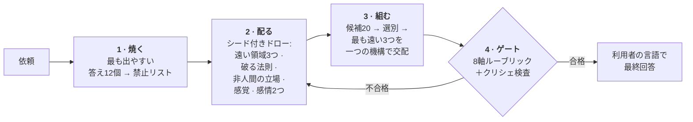

<div align="center">

# Imagination Engine

**引き算でつくる奇妙さ。**

AI に「もっと創造的に」と命じるのではなく、<br>*ありふれた答えへ至る経路そのものを塞ぐ*ことで、本当に奇妙な発想を生ませるエージェントスキル。

[](https://github.com/djfksjd/imagination-engine-skill/actions/workflows/tests.yml)
[](#インストール)
[](#インストール)
[](#内部構造)
[](LICENSE)

[English](README.md) · [한국어](README.ko.md) · **日本語** · [简体中文](README.zh-CN.md) · [Español](README.es.md) · [Français](README.fr.md) · [Deutsch](README.de.md) · [Português](README.pt-BR.md)

</div>

---

> モデルに「創造的に」と言うと、モデルは*創造的*という語に続く確率の高い文を選ぶ。結果が収束するのはそのためだ——またも菌糸ネットワーク、またも雨に濡れたネオンの街、またも感情を持ってしまう機械。
>
> **指示を強めても分布は動かない。選択肢を消すと動く。**

## 仕組み



|  | 何をするか | なぜ効くか |
|---|---|---|
| **1** | **最初の直感を先に焼く。** 何かを作る前に、モデルが最も出しやすい答え 12 個を書き出させ、禁止リストにする。最終稿はこのリストと機械的に照合される。 | 同時にその 12 個が共有する*骨格*を名指しする（作例では「装置＋操作者＋貯蔵された物質」）。本当の標的は骨格なので、表面を変えた変種も原型と一緒に死ぬ。 |
| **2** | **モデルが選ばなかった手札を配る。** ハッシュシードのドローが、互いに素な最上位カテゴリからの概念領域 3 つ、破るべき現実法則 1 つ、非人間的な立ち位置 1 つ、発明すべき感覚 1 つ、共存すべき感情 2 つを渡す。 | 放っておけばモデルは自分の好みへ連想する。ドローは外部から来て再現可能で、引き直せば*新しい札*が出る。 |
| **3** | **壊した法則の差し替えを義務づける。** 削除のたびに新しい法則を敷き、その法則は通常の世界で許されていた何かを禁じなければならない。 | 規則が単に無い世界は奇妙ではなく空虚だ。制約があってはじめて発明が読める。 |
| **4** | **出力をゲートに通す。** 8 軸ルーブリックと語句リンターが、ユーザーに見せる前に走る。 | ゲート不合格は「点数を上げて再提出」ではなく**再生成**を意味する。 |

## インストール

**Claude Code** と **Codex** で動作する。Python 3 標準ライブラリのみ——追加インストール・API キー・ネットワークは不要。

```bash
curl -fsSL https://raw.githubusercontent.com/djfksjd/imagination-engine-skill/main/install.sh | bash
```

<details>
<summary><b>手動インストール</b></summary>

```bash
# Claude Code
claude plugin marketplace add djfksjd/imagination-engine-skill
claude plugin install imagination-engine@djfksjd

# Codex
codex plugin marketplace add djfksjd/imagination-engine-skill
codex plugin add imagination-engine@djfksjd
```

一つのツリーで両ホストに対応する。スキル本体は `skills/imagination-engine/` にあり、`AGENTS.md` が共通コンテキストとして読み込まれる。
</details>

## 使い方

欲しいものをそのまま伝えればよい。奇妙なものを求めたとき、あるいは今までの案が平凡だと言ったときに起動する。どの言語のプロンプトでも動き、回答も同じ言語で返る。

```text
イマジネーション・エンジンで「声から感情を分離する機械」を設計して。
ベビーモード、非人間モード、感覚モード。脳波解析と、感情を色で表す案は禁止。
```

```text
ゲーム用の生き物を一体。そのジャンルのどれにも似ていないもの。
エクストリーマルモード、アンカー2 — 実際に作れる必要がある。
```

### モード · 最大 3 つまで重ねられる

| モード | 取り除くもの |
|---|---|
| `baby` | 学習された用途、正しい名前、因果の順序。幼児の論理＋成人の仕上げ——可愛い結果は失敗。 |
| `nonhuman` | 人間にとっての有用性。ここでは何ものも誰かのために存在せず、結果が製品なら失格。**人が出てくるブリーフはこのモードが壊す** — 下の警告を読んでください。 |
| `alien-physics` | 新しさの置き場所としての外見。代わりに物理・時間・自己の規則が変わる。 |
| `affect` | 五感と名前のある感情。新しい感覚を発明し、4 項目すべてを定義する——その感覚が生む新たな不正も含めて。 |
| `extremal` | 安全な候補すべて。手札を広げ、破るべき規則を二枚引き、捨てる基準を上げる。 |
| `grounded` | 何も取り除かない。原理に触れずに現実へ至る経路を一つ加え、ルーブリックの軸 `non_anthropocentrism` を `translation_integrity` に差し替える。 |

**既定はアンカー 1 の `alien-physics` 一つで、`nonhuman` は入っていません。** かつては入っていました。統制実験 — ブリーフ 4 件、それぞれ素のプロンプト 5 回とエンジン 5 回、何を試しているか一切知らされていない盲検の審査者 8 名 — で、旧既定は結果がブリーフにどれだけ合っているかを半減させ（6.45 → 3.27）、審査者は素のプロンプトの出力 24 件すべてを採用し、エンジンの出力は 24 件中 0 件しか採用しませんでした。理由は一貫していて、エンジンがブリーフに答える代わりにブリーフを溶かしてしまった、というものです。これは `nonhuman` が仕様どおりに働いた結果であり — 設計上、人間にとっての有用性を取り除きます — 誰もそれを選んでいないブリーフに適用してよいものではありません。**ブリーフに人がいるなら — プレイヤー、読者、会衆、客 — `nonhuman` を足さないでください。** その人たちが消えます。

### アンカー · 結果がどこまで手の届く範囲に留まるか

| | レベル | 要件 |
|---|---|---|
| `0` | **無拘束** | 内的一貫性のみが義務 |
| `1` | **説明可能** | 既知作品への比喩なしに三文で説明できる |
| `2` | **演出可能** | チームが制作・撮影できる具体的な場面や物体 |
| `3` | **運用可能** | 実際の試作への経路を一つ、その翻訳で失われるものを明示 |

### セッションの進め方

各ステージを回すのはスキルの仕事で、あなたが決めるのは次の四つだけです。どれも形容詞よりはるかに結果を変えます。

| あなたが伝えること | 何が変わるか |
|---|---|
| **主題** | 引き全体の種。手札は主題のハッシュから決まるので、言い換えれば別のカードが出る |
| **用途** | 物語 · 世界 · ゲームメカニクス · 物体 · コンセプトアートのブリーフ · なし。「なし」は正当な答えで、たいてい最も奇妙な結果になる |
| **モードとアンカー** | どの経路を塞ぐか、結果がどこまで手の届く範囲に留まるか |
| **あなた自身の禁止リスト** | 与えられる入力のうち最も価値が高い。下記参照 |

**禁止リストを渡してください。** スキルは生成前に自分の第一直感十二個を焼き払いますが、*あなたが*何に飽きているかは知りようがありません。一文で足りる — *「菌糸ネットワークはもういい、実は生きていたという落ちもいらない」* — この一行が、励ましの一段落よりはるかに大きな確率質量を消します。渡さなければ、引く前にスキルの方から尋ねます。

**モードの選び方:**

| 欲しいもの | 設定 |
|---|---|
| ジャンルの小道具でない生き物・存在 | `nonhuman, alien-physics` · アンカー 1 |
| 怪物ではなく世界の規則 | `alien-physics` · アンカー 0 |
| 実際に演出・撮影できるもの | `alien-physics, grounded` · アンカー 2 |
| 今月中に試作できるメカニクス | `grounded` · アンカー 3 |
| 感覚・感情・内的状態 | `affect` · アンカー 1 |
| 学習された機能より前の論理 | `baby, nonhuman` · アンカー 0 |
| すでに二度突き返した | `extremal` を追加 |

アンカーとモードは独立です。`grounded` にアンカー 0 は有効で、誰も分かりやすさを求めていない「作れるもの」が出てきます。`extremal` にアンカー 3 が最も厳しい設定です。`grounded` は `nonhuman` と重ねられません — 前者が差し替える軸こそ後者が守らせる軸なので、ゲートがその組み合わせを拒否します。

### 実際のやり取り

**始め方。** どの言語でも、欲しいものをそのまま書いてください。スキルはあなたの言語で答え、内部の推論は英語で行います。

```text
imagination engine で: 二つの階のあいだの踊り場で起きること。
nonhuman と alien-physics、アンカー 1。幽霊譚は不可、リミナルスペース的な美学も不可。
```

**無難すぎる答えが返ってきたとき。** 「もっと変にして」とは言わないでください — それが効かない指示です。スキルには決まった応答があります:

```text
まだ安全だ。再生成。
```

新しいランで引き直し、*直前の答えの全要素*を禁止リストに加え、それまで守っていた前提をもう一つ削除したうえで、どの前提だったかを告げます。この最後の一行がたいていこのやり取りの要点です。三度目からは `extremal` に切り替わります。

**使えない答えが返ってきたとき。** 要求を緩めるのではなく、アンカーを上げてください:

```text
アンカー 3 — 実際に作れる道筋が一つ必要で、その途上で原理が何を失うかも知りたい。
```

**作業を見たいとき。** 内部ステージは設計上隠されています。尋ねれば開きます:

```text
焼いた十二個の直感と引いた手札を見せて。
```

### パイプラインを自分で回す

Python 3.11 とこのリポジトリ以外に必要なものはありません。**以下のコマンドはすべてスキルディレクトリで実行します。** 作業ファイルは必ずスクラッチディレクトリへ — スキルフォルダの中には書かないでください。

```bash
cd skills/imagination-engine
mkdir -p /tmp/work
```

五つの入力のうち二つはスクリプトが作るものではなく、自分で書くものです。それぞれ書き上がった版がリポジトリに入っているので、空のファイルから始めずにコピーして直せます。

```bash
# 1 · ありきたりな答えを検査可能な禁止リストに焼く。
#     obvious.txt は自分で書くファイル。まっさきに出てくる答え十二個を一行ずつ。
#     references/example-obvious.txt が書き上がった例です。
cp references/example-obvious.txt /tmp/work/obvious.txt   # または自分で書く
python3 scripts/banlist.py --topic "二つの階のあいだの踊り場" \
    --obvious /tmp/work/obvious.txt --extra "幽霊なし,リミナル美学なし" --out /tmp/work
#     自分の禁止事項は言うとおりのまま --extra に渡す。同梱デッキが既に挙げて
#     いる語でも構わない。ファイルがそれを記録し、ゲートがそのまま再現するので、
#     「竜なし」はデッキの警告を禁止へ格上げする。終了コード 2 はダンプが短い
#     か、数字だけ変えた一行だという意味 — テンプレートの変奏十二個は一つの
#     本能を十二回書いたもの。banlist.py にはデッキの語を解除する
#     --allow <クリシェ id> もある。使う前に下の正直な限界を読むこと。

# 2 · 手札を引く（リクエストからシードを作るので完全に再現できる）
python3 scripts/draw.py --topic "二つの階のあいだの踊り場" \
    --modes nonhuman,alien-physics --run 1 --anchor 1 --out /tmp/work

# 3 · 結果を二通り書く。採点用の candidate.json と、読者に見せる draft.md。
#     採点される各セクションは草稿の中で <!-- bind: sections.<id> --> ...
#     <!-- /bind --> で囲み、候補側と完全に一致させる。ずれればゲートが拒否する。
#       構造     → references/candidate.schema.json, references/output-template.md
#       実物の例 → references/example-candidate.json, references/example-draft.md
#     candidate.json には manual_checks_cleared も要る。リストではなく検査 id を
#     キーにしたオブジェクト — {"obvious-01": "...", "obvious-02": "..."} — で、
#     禁止リストの手動チェックごとに書面の回答を一つずつ入れる。物語・世界・
#     儀礼・メカニクスのブリーフでは普通十二個出て、製品のブリーフでは一つも
#     出ない。同梱の例が一つしか解消していないのはそのためだ。

# 4 · 執筆中の草稿を lint する（診断であり、通ってもクリアランスではない）
python3 scripts/cliche_lint.py --banlist /tmp/work/banlist.json --draft /tmp/work/draft.md

# 5 · ゲート。四つの成果物すべてを受け取り、判定は一つ
python3 scripts/score_gate.py --candidate /tmp/work/candidate.json --draw /tmp/work/draw.json \
    --banlist /tmp/work/banlist.json --markdown /tmp/work/draft.md
```

自分の run を回す前に通る様子を見たいなら、5 番を同梱の四つの成果物に向けてください: `--candidate references/example-candidate.json --draw references/example-draw.json --banlist references/example-banlist.json --markdown references/example-draft.md`。

`draw.py --list-modes` でモード一覧が出ます。`--run 2` は再生成用に、やはり互いに重ならない新しい素材を配ります。`--salt` はランを進めずに引き直します。

### 終了コードと対処

| コード | 意味 | 対処 |
|---|---|---|
| `0` | 通過 | — |
| `1` | 使い方の誤り、ファイルなし、デッキの破損 | 判定ではなく打ち間違い |
| `2` | **ゲート失敗** — セクションの欠落や薄さ、引いたカードが装飾で終わっている、成果物どうしが噛み合っていない | アイデアを書き直す。切り上げる点数そのものが無い。このゲートのどの数字も何も決めない |
| `3` | 草稿に**禁止された素材がある** | 語ではなく思考を書き直す。指摘された表現だけ消して文を残すのは修正ではない |

同じ検査で二度落ちたら、表現ではなく素材が間違っています。直すのではなく `--run <n+1>` で引き直してください。

ひとつだけ、スクリプトのものではない `2` があります。`No such file or directory` も `2` を残す — スクリプトが始まる前に Python が終了するからです。作業ディレクトリが違うということなので、`cd skills/imagination-engine` に戻ってください。スクリプトの中では使い方の誤りはつねに `1` で、打ち間違いが判定として報告されることはありません。

> [!IMPORTANT]
> **「通過」と言えるコマンドは一つだけで、その一つがすべてを受け取ります。** `score_gate.py` は引きを同梱デッキで引き直して照合し、候補をカード一枚ずつに結び付け、ルーブリックの全軸に点数と論拠を求め、機械照合できない禁止項目ごとに書面の回答を求め、これから見せる草稿が採点されたその草稿かを確認します。`--extremal` も `--grounded` も `--min-mean` も `--min-axis` も `--rubric` もありません — 判定時に主張された閾値は、その判定の対象が主張したものです。**そして点数の閾値もありません。** 測定した二十回のランはすべて、旧来の基準 8.0 のすぐ上、幅 0.25 の帯の中で自己採点しました。その中には盲検審査で最下位に置かれたランも含まれます。分散のない数字は何も切り分けないので、ここではもう何も決めません。軸が残っているのは、答えを書く行為が仕事そのものを変えるからです。`cliche_lint.py` は下書き用の補助であり、通ってもクリアランスではありません。

**`--allow` は片方でだけ尊重されます。意図的にそうしています。** `cliche_lint.py --allow <id>` は執筆中にデッキの語を解除します。`score_gate.py` にはそのフラグが無く、禁止リストに記録された解除も無視します。そのファイル自体がゲートの検査対象の一つだからです — そこで解除を尊重すれば、ランが判定時に自分の禁止を自分で解くことになります。同梱の語がどうしてもあなたの仕事に合わないなら、リポジトリをフォークして `references/decks/cliches.json` を編集するのが正規の経路です。

**禁止リストは、ファイル内での分類ではなく内容で強制される。** `banlist.json` への五通りの編集が、保護された語句をファイルに残したまま発動を止めていた——`extra` を空にして そこから作られた行を残す、その行を `warn` に降格する、デッキのクリシェ id を付け替える、焼いた初発想のグループを `deck` と書き換える、終わらない正規表現の構造パターンを足す。`score_gate.py` は現在、焼いた初発想やあなたの `--extra` 除外が記録されているすべての場所の和集合を取り、それらの記述を禁止として草稿を検査する——id も段階もグループも解除も読まない。コンパイルされるのは同梱パターンのみで、渡されたパターンは実行されず無視される。限界を正確に言えば、それを記録する*すべて*の行から消された記述は失われる。一行だけ消すと `counts` が内容と食い違うので安易な編集は捕まるが、徹底した編集は捕まらない——ゲートは、その実行自身が書いたのではない禁止リストの控えを一切持っていない。

**ゲートが読んだものを黙って捨てることはない。** `structural_patterns` に自分で足したパターンは*名指しで拒否*される——コンパイルもされないが、黙殺もされない。この修正の最初の版は黙殺しており、`{"id": "mine", "regex": "\bcheese\b"}` と草稿の「cheese」に対して `PASSED` と出した。ハングを直した目的そのものが、より愛想のよい顔で戻ってきた形だ。フォークした `references/decks/cliches.json` に入れれば、他と同じようにコンパイルされる。`allowed` の解除は id を挙げた警告として報告される——合格経路でも同じだ。デッキと異なる `forbidden_moves` は、何も強制しない散文として報告される。`affect` を引いた場合は `SKILL.md` が以前から言っていたとおり四項目すべてを備えた `invented_sense` が必要になり、`draw.json` は `notes` や自己申告のカウントを含め全フィールドが再計算される。**`imagination-brainstorming` はこのフィールドで逆の判断をしている**——構造スキャンとタイマーを添えて供給パターンを受け入れる。この差は意図的だ。このゲートは他のあらゆる場所で実行時に供給されたポリシー（`--rubric`、`--min-mean`、尊重される `--allow`）を拒否しており、タイマーは「何が検査されたか」をマシンの速さに依存させてしまう。

> [!NOTE]
> ゲートは審判ではなく床です。通過が立証するのは、必要な作業が存在すること、そして四つの成果物が互いに属していることだけです — 手札はデッキが配ったままで後から編集されておらず、カードはすべて使われ、禁止リストはこのランのダンプが含意するそのリストであり、長い本能にはそれぞれ書面の回答があり、これから見せる草稿は検査されたその本文です。アイデアの良し悪しは判定できませんし、もはやどんな数字もそれができるふりをしません。結果は自分で読んでください。

## 出力されるもの

八つの固定セクションが、利用者の言語で返る。名前 · 比較に頼らない一文定義 · 存在の法則 · 最初の遭遇の場面 · 最も奇妙な性質 · 衝突する感情 · 世界に生じる変化 · そして必須項目である**捨てた見慣れた版と、最も近い既存作品**。`grounded` モードのとき、またはアンカーが `3` のときは、九番目のセクションである**現実に届く一つの経路**が加わる——ゲートがこれを要求するのはこの二つの場合に限られ、追加されても他の八つのセクションが消えるわけではない。

<details open>
<summary>実行例 — 題目: <i>「声から感情を分離する機械」</i></summary>

> ### Flatting（平坦化）
>
> 同じ文が二度以上発せられた場所ごとに形成される勾配。以前の発話から情動（charge）を引き抜き、部屋の表面に残す。
>
> ［…］引き抜きが後ろ向きに走るため、これは既に起きたことを編集する。火曜日に繰り返された約束は、その約束をした過去のすべての機会を——本当に大切だった一度を含めて——空にする。ここでは頻度による安心づけが不可能だ。
>
> ［…］葬儀は反転した。読み上げられるのは故人が一度だけ言った文、たいていは些細で、たいてい天気の話だ。それだけがまだ何かを保っているからである。

</details>

無いものに注目してほしい。装置もなく、光る機械もなく、見た目に奇妙なものは何もない。**奇妙さは「何が不可能になったか」の側にある。** 隠れた工程を含む全記録は [`worked-example.md`](skills/imagination-engine/references/worked-example.md) にある。

## しないこと

> [!IMPORTANT]
> - **「誰も思いつかなかった」と主張すること。** 検証不能なので、スキルはこの言い方を禁じられている。代わりに最も近い既存作品を名指し、差分を書く——毎回、出力の中で。
> - **衝撃で代用すること。** 残虐・流血・性暴力・実在集団の貶めは不快さを作る最も安価な近道であり、近道としては禁止。不快さは前提から来なければならない。
> - **リント通過を「良い着想」の証拠にすること。** リンターは特定の見慣れた手口が*無い*ことしか証明できない。ルーブリックは自己採点であり、スキルはそれを明言する。二つのゲートが実際に強制するのは「作業を飛ばさなかったこと」だ。
> - **依頼をこっそり縮めること。** 作れるものが必要なら、前提を弱めるのではなくアンカーを上げる。平凡な答えが正解の場合は、そう告げて普通に答えることになっている。

## 測定されたこと — そして測定されなかったこと

このスキルは 2026 年 7 月に試験されました。互いに無関係な四領域のブリーフ 4 件、それぞれ素のプロンプト 5 回とフルパイプライン 5 回、互いに重ならない二十組の手札、二つの条件が存在することすら知らされていないエージェントによる盲検のコーディングと審査です。結果の両面をここに書きます。自分の測定を隠すスキルは、読まれることではなく信じられることを求めているからです。

**確認された、ただし条件つきで。** 素のプロンプトは確かに収束します — ただし、ブリーフに収束すべき明白な答えがあるときだけです。汽水域の生き物を求めると、独立した五回の素のプロンプトが同じ生物の五つの版を出し、六回目も同じものを出しました。一つの建物の中だけで進む短編の前提を求めると、五回が互いに無関係な五つのアイデアを出しました。このページ冒頭の主張は*一部の*ブリーフに起きることの記述であって、法則ではありません。

**実証されていない: 経路を消せば繰り返しの答えが互いに離れる、ということ。** 重ならない二十組の手札で回した二十回のエンジンのランは、一つの形へ収束しました — 物ではなく身体のない過程、たいてい負債として語られる義務、事務的な帰結。まとめて見ると、素のプロンプト側より*より*似ています。しかもカードは装飾ではありませんでした。多くは文面に痕跡すら残しておらず、つまり本当に吸収されていて、それでも出力は収束したのです。正直な読み方はこうです。一次のアトラクタを消すことは効いています — これらの答えは実際に素のプロンプトの答えとは似ていません — が、消したからといって残りに一様に広がるわけではない。**最頻値が移動するだけです。**

これは直っていませんし、このページは直ったとは言いません。実務上そこから出てくること: 本当に違う選択肢が必要なら、同じブリーフを二度回すのではなく、別のブリーフか別のモードを与えてください。そして結果が義務を課して書類を生む身体のない過程になっていたら、あなたは直近二十回のランが辿り着いた場所に辿り着いたのですから、差し戻してください。

## 内部構造

| スクリプト | 役割 | 非ゼロ終了コード |
|---|---|---|
| `draw.py` | 7 つのデッキから制約の手札を配る | `1` 使い方・デッキの誤り |
| `banlist.py` | 直感ダンプ＋クリシェデッキ → 照合可能な禁止リスト | `2` ダンプが短すぎる |
| `cliche_lint.py` | 禁止語句・空疎な形容詞・ピッチ型の文を行番号付きで摘発 | `3` 禁止要素あり |
| `score_gate.py` | 候補をルーブリックで検証（フェイルクローズド） | `2` ゲート不合格 |

**すべて再現可能。** ドローは主題のハッシュでシードされるため、同じ依頼は同じ手札になり、どの結果も再生・監査できる。再生成は `--run 2` で互いに離れたままの新しい札を受け取り、`--salt` は同じ run を配り直す。

```text
skills/imagination-engine/
├── SKILL.md                    # 権威あるワークフロー
├── references/
│   ├── output-template.md      # 提出セクションの契約
│   ├── worked-example.md       # 隠れた工程を含む実行例 1 件
│   ├── rubric.json             # 8 軸とセクション最小量（閾値なし）
│   ├── candidate.schema.json   # score_gate.py が検証する構造
│   ├── example-obvious.txt     # ─┐ 一回分の実行がまるごと: 十二の第一感、
│   ├── example-banlist.json    #  │ そこから作った禁止リスト、引いた手札、
│   ├── example-draw.json       #  │ 採点された候補、見せた草稿。後ろの四つが
│   ├── example-candidate.json  #  │ ゲートの四入力であり、テスト用フィクスチャ
│   ├── example-draft.md        # ─┘ でもある
│   └── decks/                  # 領域 · 制約 · 感覚 · 視点
│                               # 感情 · モード · クリシェ
└── scripts/                    # draw · banlist · cliche_lint · score_gate
```

## テスト

```bash
python3 -m pytest tests/ -q
```

ネットワーク不要。デッキの整合性、ドローの決定性と非重複、両ゲート、そして同梱の作例が自身のリントを通ることまで検証する。

## 貢献

最も手を入れやすいのはデッキだ——他と本当に遠い領域、破る価値のある現実法則、発明に値する感覚。すべての項目は答えられるものであること。領域には結果が答えるべき問い（probe）が、制約には差し替え法則の要求が必ず付く。PR の前にテストを走らせてほしい。

<div align="center">
<sub>MIT ライセンス · <a href="https://claude.com/claude-code">Claude Code</a> と Codex のために</sub>
</div>
