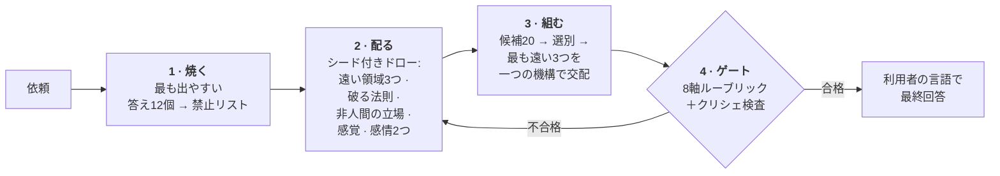

<div align="center">

# Imagination Engine

**引き算でつくる奇妙さ。**

AI に「もっと創造的に」と命じるのではなく、<br>*ありふれた答えへ至る経路そのものを塞ぐ*ことで、本当に奇妙な発想を生ませるエージェントスキル。

[](https://github.com/djfksjd/imagination-engine-skill/actions/workflows/tests.yml)
[](#インストール)
[](#インストール)
[](#内部構造)
[](LICENSE)

[English](README.md) · [한국어](README.ko.md) · **日本語** · [简体中文](README.zh-CN.md) · [Español](README.es.md) · [Français](README.fr.md) · [Deutsch](README.de.md) · [Português](README.pt-BR.md)

</div>

---

> モデルに「創造的に」と言うと、モデルは*創造的*という語に続く確率の高い文を選ぶ。結果が収束するのはそのためだ——またも菌糸ネットワーク、またも雨に濡れたネオンの街、またも感情を持ってしまう機械。
>
> **指示を強めても分布は動かない。選択肢を消すと動く。**

## 仕組み



|  | 何をするか | なぜ効くか |
|---|---|---|
| **1** | **最初の直感を先に焼く。** 何かを作る前に、モデルが最も出しやすい答え 12 個を書き出させ、禁止リストにする。最終稿はこのリストと機械的に照合される。 | 同時にその 12 個が共有する*骨格*を名指しする（作例では「装置＋操作者＋貯蔵された物質」）。本当の標的は骨格なので、表面を変えた変種も原型と一緒に死ぬ。 |
| **2** | **モデルが選ばなかった手札を配る。** ハッシュシードのドローが、互いに素な最上位カテゴリからの概念領域 3 つ、破るべき現実法則 1 つ、非人間的な立ち位置 1 つ、発明すべき感覚 1 つ、共存すべき感情 2 つを渡す。 | 放っておけばモデルは自分の好みへ連想する。ドローは外部から来て再現可能で、引き直せば*新しい札*が出る。 |
| **3** | **壊した法則の差し替えを義務づける。** 削除のたびに新しい法則を敷き、その法則は通常の世界で許されていた何かを禁じなければならない。 | 規則が単に無い世界は奇妙ではなく空虚だ。制約があってはじめて発明が読める。 |
| **4** | **出力をゲートに通す。** 8 軸ルーブリックと語句リンターが、ユーザーに見せる前に走る。 | ゲート不合格は「点数を上げて再提出」ではなく**再生成**を意味する。 |

## インストール

**Claude Code** と **Codex** で動作する。Python 3 標準ライブラリのみ——追加インストール・API キー・ネットワークは不要。

```bash
curl -fsSL https://raw.githubusercontent.com/djfksjd/imagination-engine-skill/main/install.sh | bash
```

<details>
<summary><b>手動インストール</b></summary>

```bash
# Claude Code
claude plugin marketplace add djfksjd/imagination-engine-skill
claude plugin install imagination-engine@djfksjd

# Codex
codex plugin marketplace add djfksjd/imagination-engine-skill
codex plugin add imagination-engine@djfksjd
```

一つのツリーで両ホストに対応する。スキル本体は `skills/imagination-engine/` にあり、`AGENTS.md` が共通コンテキストとして読み込まれる。
</details>

## 使い方

欲しいものをそのまま伝えればよい。奇妙なものを求めたとき、あるいは今までの案が平凡だと言ったときに起動する。どの言語のプロンプトでも動き、回答も同じ言語で返る。

```text
イマジネーション・エンジンで「声から感情を分離する機械」を設計して。
ベビーモード、非人間モード、感覚モード。脳波解析と、感情を色で表す案は禁止。
```

```text
ゲーム用の生き物を一体。そのジャンルのどれにも似ていないもの。
エクストリーマルモード、アンカー2 — 実際に作れる必要がある。
```

> [!TIP]
> 最も価値ある追加入力は**あなた自身の禁止リスト**だ。「またそれは要らない」はどんな形容詞より強い——渡さなければスキルの方から尋ねてくる。

### モード · 最大 3 つまで重ねられる

| モード | 取り除くもの |
|---|---|
| `baby` | 学習された用途、正しい名前、因果の順序。幼児の論理＋成人の仕上げ——可愛い結果は失敗。 |
| `nonhuman` | 人間にとっての有用性。ここでは何ものも誰かのために存在せず、結果が製品なら失格。 |
| `alien-physics` | 新しさの置き場所としての外見。代わりに物理・時間・自己の規則が変わる。 |
| `affect` | 五感と名前のある感情。新しい感覚を発明し、4 項目すべてを定義する——その感覚が生む新たな不正も含めて。 |
| `extremal` | 安全な候補すべて。閾値が平均 9.0、最低軸 8 に上がる。 |
| `grounded` | 何も取り除かない。原理に触れずに、現実へ至る経路を一つだけ加える。 |

### アンカー · 結果がどこまで手の届く範囲に留まるか

| | レベル | 要件 |
|---|---|---|
| `0` | **無拘束** | 内的一貫性のみが義務 |
| `1` | **説明可能** | 既知作品への比喩なしに三文で説明できる |
| `2` | **演出可能** | チームが制作・撮影できる具体的な場面や物体 |
| `3` | **運用可能** | 実際の試作への経路を一つ、その翻訳で失われるものを明示 |

## 出力されるもの

八つの固定セクションが、利用者の言語で返る。名前 · 比較に頼らない一文定義 · 存在の法則 · 最初の遭遇の場面 · 最も奇妙な性質 · 衝突する感情 · 世界に生じる変化 · そして必須項目である**捨てた見慣れた版と、最も近い既存作品**。

<details open>
<summary>実行例 — 題目: <i>「声から感情を分離する機械」</i></summary>

> ### Flatting（平坦化）
>
> 同じ文が二度以上発せられた場所ごとに形成される勾配。以前の発話から情動（charge）を引き抜き、部屋の表面に残す。
>
> ［…］引き抜きが後ろ向きに走るため、これは既に起きたことを編集する。火曜日に繰り返された約束は、その約束をした過去のすべての機会を——本当に大切だった一度を含めて——空にする。ここでは頻度による安心づけが不可能だ。
>
> ［…］葬儀は反転した。読み上げられるのは故人が一度だけ言った文、たいていは些細で、たいてい天気の話だ。それだけがまだ何かを保っているからである。

</details>

無いものに注目してほしい。装置もなく、光る機械もなく、見た目に奇妙なものは何もない。**奇妙さは「何が不可能になったか」の側にある。** 隠れた工程を含む全記録は [`worked-example.md`](skills/imagination-engine/references/worked-example.md) にある。

## しないこと

> [!IMPORTANT]
> - **「誰も思いつかなかった」と主張すること。** 検証不能なので、スキルはこの言い方を禁じられている。代わりに最も近い既存作品を名指し、差分を書く——毎回、出力の中で。
> - **衝撃で代用すること。** 残虐・流血・性暴力・実在集団の貶めは不快さを作る最も安価な近道であり、近道としては禁止。不快さは前提から来なければならない。
> - **リント通過を「良い着想」の証拠にすること。** リンターは特定の見慣れた手口が*無い*ことしか証明できない。ルーブリックは自己採点であり、スキルはそれを明言する。二つのゲートが実際に強制するのは「作業を飛ばさなかったこと」だ。
> - **依頼をこっそり縮めること。** 作れるものが必要なら、前提を弱めるのではなくアンカーを上げる。平凡な答えが正解の場合は、そう告げて普通に答えることになっている。

## 内部構造

| スクリプト | 役割 | 非ゼロ終了コード |
|---|---|---|
| `draw.py` | 7 つのデッキから制約の手札を配る | `1` 使い方・デッキの誤り |
| `banlist.py` | 直感ダンプ＋クリシェデッキ → 照合可能な禁止リスト | `2` ダンプが短すぎる |
| `cliche_lint.py` | 禁止語句・空疎な形容詞・ピッチ型の文を行番号付きで摘発 | `3` 禁止要素あり |
| `score_gate.py` | 候補をルーブリックで検証（フェイルクローズド） | `2` ゲート不合格 |

**すべて再現可能。** ドローは主題のハッシュでシードされるため、同じ依頼は同じ手札になり、どの結果も再生・監査できる。再生成は `--run 2` で互いに離れたままの新しい札を受け取り、`--salt` は同じ run を配り直す。

```text
skills/imagination-engine/
├── SKILL.md                    # 権威あるワークフロー
├── references/
│   ├── output-template.md      # 提出セクションの契約
│   ├── worked-example.md       # 隠れた工程を含む実行例 1 件
│   ├── rubric.json             # 8 軸 · 閾値 · セクション最小量
│   ├── candidate.schema.json   # score_gate.py が検証する構造
│   ├── example-candidate.json  # 両ゲートを通る候補（テスト用フィクスチャ兼用）
│   └── decks/                  # 領域 · 制約 · 感覚 · 視点
│                               # 感情 · モード · クリシェ
└── scripts/                    # draw · banlist · cliche_lint · score_gate
```

## テスト

```bash
python3 -m pytest tests/ -q
```

ネットワーク不要。デッキの整合性、ドローの決定性と非重複、両ゲート、そして同梱の作例が自身のリントを通ることまで検証する。

## 貢献

最も手を入れやすいのはデッキだ——他と本当に遠い領域、破る価値のある現実法則、発明に値する感覚。すべての項目は答えられるものであること。領域には結果が答えるべき問い（probe）が、制約には差し替え法則の要求が必ず付く。PR の前にテストを走らせてほしい。

<div align="center">
<sub>MIT ライセンス · <a href="https://claude.com/claude-code">Claude Code</a> と Codex のために</sub>
</div>
