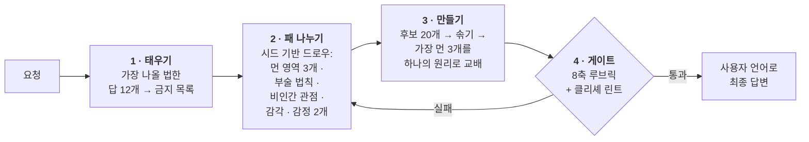

<div align="center">

# Imagination Engine

**빼기로 만드는 낯섦.**

AI에게 "더 창의적으로 해봐"라고 시키는 대신,<br>*뻔한 답으로 가는 경로 자체를 차단해서* 진짜 낯선 아이디어를 만들게 하는 에이전트 스킬.

[](https://github.com/djfksjd/imagination-engine-skill/actions/workflows/tests.yml)
[](#설치)
[](#설치)
[](#내부-구조)
[](LICENSE)

[English](README.md) · **한국어** · [日本語](README.ja.md) · [简体中文](README.zh-CN.md) · [Español](README.es.md) · [Français](README.fr.md) · [Deutsch](README.de.md) · [Português](README.pt-BR.md)

</div>

---

> 모델에게 "창의적으로"라고 하면, 모델은 *창의적*이라는 단어 뒤에 올 확률이 가장 높은 문장을 뽑는다. 결과가 늘 비슷한 이유다 — 또 균사체 네트워크, 또 비 내리는 네온 도시, 또 알고 보니 감정을 가진 기계.
>
> **지시를 세게 해도 확률분포는 안 움직인다. 선택지를 없애야 움직인다.**

## 작동 방식



|  | 무엇을 하는가 | 왜 통하는가 |
|---|---|---|
| **1** | **첫 직관을 먼저 태운다.** 무엇을 만들기 전에, 모델이 가장 낼 법한 답 12개를 적게 하고 그것을 금지 목록으로 만든다. 최종 원고는 이 목록과 기계적으로 대조된다. | 동시에 그 12개가 공유하는 *골격*을 지목한다(예제에서는 "장치 + 조작자 + 저장된 물질"). 진짜 표적은 골격이므로, 표면만 바꾼 변형도 원본과 함께 죽는다. |
| **2** | **모델이 고르지 않은 패를 나눠준다.** 해시 시드 드로우가 서로 다른 최상위 카테고리에서만 뽑은 개념 영역 3개, 부술 현실 법칙 1개, 비인간 관점 1개, 발명할 감각 1개, 공존해야 할 감정 2개를 건넨다. | 그냥 두면 모델은 자기가 좋아하는 소재로 흘러간다. 드로우는 외부에서 오고, 재현 가능하며, 다시 돌리면 *새 카드*가 나온다. |
| **3** | **부순 법칙은 반드시 대체하게 한다.** 삭제할 때마다 새 법칙을 세우고, 그 법칙은 원래 세계에서 가능하던 무언가를 금지해야 한다. | 규칙이 그냥 없어진 세계는 낯선 게 아니라 비어 있는 것이다. 제약이 있어야 발명이 읽힌다. |
| **4** | **출력을 게이트에 통과시킨다.** 8축 루브릭과 문구 린터가 사용자에게 보이기 전에 돌아간다. | 게이트 실패는 "점수를 올려 재제출"이 아니라 **재생성**을 뜻한다. |

## 설치

**Claude Code**와 **Codex**에서 동작한다. Python 3 표준 라이브러리만 쓴다 — 추가 설치·API 키·네트워크 불필요.

```bash
curl -fsSL https://raw.githubusercontent.com/djfksjd/imagination-engine-skill/main/install.sh | bash
```

<details>
<summary><b>수동 설치</b></summary>

```bash
# Claude Code
claude plugin marketplace add djfksjd/imagination-engine-skill
claude plugin install imagination-engine@djfksjd

# Codex
codex plugin marketplace add djfksjd/imagination-engine-skill
codex plugin add imagination-engine@djfksjd
```

하나의 트리로 두 호스트를 모두 지원한다. 스킬 본문은 `skills/imagination-engine/` 아래에 있고, `AGENTS.md`가 공용 컨텍스트로 로드된다.
</details>

## 사용법

원하는 걸 그냥 말하면 된다. 낯선 것을 요구하거나 지금 아이디어가 뻔하다고 말할 때 걸린다. 어떤 언어로 요청해도 되고, 답변은 요청한 언어로 나온다.

```text
상상 엔진으로 "목소리에서 감정을 분리하는 기계"를 설계해줘.
아기 모드, 비인간 모드, 감정 모드. 뇌파 분석과 감정을 색으로 표현하는 건 금지.
```

```text
게임에 넣을 생물 하나 — 이 장르에 있는 어떤 것과도 안 닮게.
극단 모드, 앵커 2. 실제로 만들 수 있어야 해.
```

> [!TIP]
> 가장 값진 추가 입력은 **당신의 금지 목록**이다. "또 그거 말고"는 어떤 형용사보다 강력하다 — 주지 않으면 스킬이 먼저 물어본다.

### 모드 · 최대 3개까지 겹침

| 모드 | 제거하는 것 |
|---|---|
| `baby` | 학습된 용도, 올바른 이름, 인과의 순서. 아기의 논리 + 성인의 완성도 — 귀여운 결과는 실패다. |
| `nonhuman` | 인간에게의 유용성. 여기서 존재하는 것은 누구를 위한 것도 아니며, 결과가 제품이면 실격이다. |
| `alien-physics` | 새로움의 자리로서의 외형. 대신 물리·시간·자아의 규칙이 바뀐다. |
| `affect` | 오감과 이름 있는 감정. 새 감각을 발명하되 4개 항목을 전부 정의해야 한다 — 그 감각이 만드는 새로운 부조리 포함. |
| `extremal` | 안전한 후보 전부. 임계값이 평균 9.0, 최저 축 8로 올라간다. |
| `grounded` | 아무것도 제거하지 않는다. 원리를 손대지 않은 채 현실로 가는 경로 하나를 덧붙인다. |

### 앵커 · 결과가 얼마나 손에 닿아야 하는가

| | 레벨 | 요구 |
|---|---|---|
| `0` | **무구속** | 내적 일관성만 지키면 된다 |
| `1` | **설명 가능** | 기존 작품에 비유하지 않고 세 문장으로 설명된다 |
| `2` | **연출 가능** | 팀이 제작·촬영할 수 있는 구체적 장면이나 사물 |
| `3` | **운용 가능** | 실제 프로토타입으로 가는 경로 하나 + 그 번역에서 잃는 것 명시 |

## 결과물

여덟 개의 고정 섹션이 사용자 언어로 나온다. 이름 · 비교에 기대지 않는 한 문장 정의 · 존재 법칙 · 첫 조우 장면 · 가장 낯선 특징 · 충돌하는 감정 · 세계에 미치는 영향 · 그리고 필수 항목인 **버린 익숙한 버전들과 가장 가까운 기존 작품**.

<details open>
<summary>실행 예 — 주제: <i>"목소리에서 감정을 분리하는 기계"</i></summary>

> ### Flatting (평탄화)
>
> 같은 문장이 두 번 이상 발화된 자리마다 형성되는 경사. 이전 발화들에서 정동(charge)을 빼내어 방의 표면에 남긴다.
>
> […] 빼앗음이 뒤로 흐르기 때문에 이미 일어난 일을 편집한다. 화요일에 반복된 약속은 그 약속을 했던 이전의 모든 순간을, 정말 중요했던 그 한 번까지 비워버린다. 여기서는 자주 말해서 안심시키는 일이 불가능하다.
>
> […] 장례식은 뒤집혔다 — 낭독되는 것은 고인이 딱 한 번만 말한 문장들, 대개 사소하고 대개 날씨 이야기다. 그것만이 아직 무언가를 담고 있기 때문이다.

</details>

없는 것에 주목할 것. 장치도, 빛나는 기계도, 이상하게 생긴 것도 없다. **낯섦은 무엇이 불가능해졌는가에 있다.** 숨은 단계까지 포함한 전체 실행 기록은 [`worked-example.md`](skills/imagination-engine/references/worked-example.md)에 있다.

## 하지 않는 것

> [!IMPORTANT]
> - **"아무도 생각 못 한 것"이라고 주장하기.** 검증 불가능하므로 스킬은 그 문장을 금지한다. 대신 가장 가까운 기존 작품을 지목하고 차이를 적는다 — 매번, 출력 안에서.
> - **충격으로 때우기.** 잔혹·유혈·성폭력·실존 집단 비하는 불편함을 만드는 가장 값싼 경로이며 지름길로서 금지된다. 불편함은 전제에서 나와야 한다.
> - **린트 통과 = 좋은 아이디어라고 우기기.** 린터는 특정한 익숙한 수법이 *없다*는 것만 증명한다. 루브릭은 자기 채점이고 스킬은 그 사실을 명시한다. 두 게이트가 실제로 강제하는 것은 "작업을 건너뛰지 않았다"이다.
> - **요청을 슬쩍 줄이기.** 만들 수 있는 것이 필요하면 전제를 무르게 하는 대신 앵커를 올린다. 평범한 답이 정답인 경우엔 그렇다고 말하고 평범하게 답하도록 되어 있다.

## 내부 구조

| 스크립트 | 역할 | 0이 아닌 종료 코드 |
|---|---|---|
| `draw.py` | 7개 덱에서 제약 패를 나눠준다 | `1` 사용법·덱 오류 |
| `banlist.py` | 첫 직관 덤프 + 클리셰 덱 → 검사 가능한 금지 목록 | `2` 덤프가 너무 짧음 |
| `cliche_lint.py` | 금지 문구·공허한 형용사·피치형 문장을 줄 번호와 함께 적발 | `3` 금지 요소 발견 |
| `score_gate.py` | 후보를 루브릭으로 검증 (fail-closed) | `2` 게이트 실패 |

**모든 것이 재현 가능하다.** 드로우는 주제의 해시로 시드되므로 같은 요청은 같은 패를 받고, 어떤 결과든 재생·감사할 수 있다. 재생성은 `--run 2`로 여전히 서로 먼 새 카드를 받고, `--salt`는 같은 run을 다시 섞는다.

```text
skills/imagination-engine/
├── SKILL.md                    # 권위 있는 워크플로 문서
├── references/
│   ├── output-template.md      # 전달되는 섹션 계약
│   ├── worked-example.md       # 숨은 단계까지 포함한 실행 예 1건
│   ├── rubric.json             # 8축 · 임계값 · 섹션 최소 분량
│   ├── candidate.schema.json   # score_gate.py가 검증하는 구조
│   ├── example-candidate.json  # 두 게이트를 통과하는 후보(테스트 픽스처 겸용)
│   └── decks/                  # 영역 · 제약 · 감각 · 관점
│                               # 감정 · 모드 · 클리셰
└── scripts/                    # draw · banlist · cliche_lint · score_gate
```

## 테스트

```bash
python3 -m pytest tests/ -q
```

네트워크 없이 돌아간다. 덱 무결성, 드로우 결정성·비중복성, 두 게이트, 그리고 동봉된 예제가 자기 린트를 통과하는지까지 검증한다.

## 기여

가장 쉬운 기여 지점은 덱이다 — 다른 것들과 정말로 먼 영역, 부술 가치가 있는 현실 법칙, 발명할 만한 감각. 모든 항목은 답할 수 있어야 한다. 영역에는 결과가 답해야 할 질문(probe)이, 제약에는 대체 법칙 요구사항이 반드시 붙는다. PR 전에 테스트를 돌릴 것.

<div align="center">
<sub>MIT 라이선스 · <a href="https://claude.com/claude-code">Claude Code</a>와 Codex를 위해 만들었다</sub>
</div>
