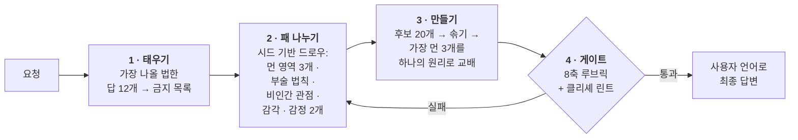

<div align="center">

# Imagination Engine

**빼기로 만드는 낯섦.**

AI에게 "더 창의적으로 해봐"라고 시키는 대신,<br>*뻔한 답으로 가는 경로 자체를 차단해서* 진짜 낯선 아이디어를 만들게 하는 에이전트 스킬.

[](https://github.com/djfksjd/imagination-engine-skill/actions/workflows/tests.yml)
[](#설치)
[](#설치)
[](#내부-구조)
[](LICENSE)

[English](README.md) · **한국어** · [日本語](README.ja.md) · [简体中文](README.zh-CN.md) · [Español](README.es.md) · [Français](README.fr.md) · [Deutsch](README.de.md) · [Português](README.pt-BR.md)

</div>

---

> [!CAUTION]
> ## 블라인드 심사로 두 번 시험했고, 두 번 다 졌다.
>
> 이 스킬의 핵심 주장 — 뻔한 답으로 가는 길을 지우면 평범한 프롬프트보다 나은 아이디어가 나온다는 것 — 은 평범한 프롬프트 대조군과 두 번 비교 측정됐고, 두 번 모두 확실하게 졌다. 두 번째 시험은 데이터가 하나도 생기기 전에 전면 사전등록됐고, 현재 빌드에서 현재 기본값(`alien-physics` 단독, 앵커 1)으로, 자기채점 임계값을 게이트에서 제거한 상태로 돌았다. 두 변경 어느 쪽도 격차를 되돌리지 못했다.
>
> 브리프 6개, 각각 엔진 5회와 대조군 5회, 브리프마다 두 조건이 존재한다는 사실조차 듣지 못한 블라인드 심사자 5명. 엔진에서 대조군을 뺀 값, 심사자 5명의 중앙값, 1–7 척도, 브리프 6개 동일가중 평균:
>
> | | WANT | FIT | CRAFT |
> |---|---|---|---|
> | 엔진 − 대조군 | **−2.83** | **−3.03** | **−1.67** |
>
> 브리프 전부가 측정 전부에서 음수였다. 브리프×심사자 **30개 칸 전부에서** 대조군이 엔진보다 위였고, 상위 3위 자리 **90개를 90개 다** 대조군이 가져갔다. 모아서 보면 WANT 5.76 → 2.98, FIT 6.35 → 3.33, CRAFT 5.88 → 4.23.
>
> 이 스킬이 줄이려고 만들어진 문제인 수렴은 측정 가능한 수준으로 줄지 않았다. `g_CORE` +0.10, `g_SKELETON` −0.22로, 규칙이 요구한 +0.30에 못 미쳤다. 코더들의 순서형 Krippendorff α는 0.786과 0.673으로 사전등록된 .80 하한 아래였고, 따라서 **이 측정은 유리한 결과가 아니라 판정 불가**다 — 스킬에 유리한 증거도 아니고 불리한 증거로 세지도 않는다.
>
> 엔진은 산출물 하나당 대조군의 **48배** 비용이 들었다.
>
> 사전등록된 규칙의 판정은 **FAIL**이다. 그 규칙은 "검정력 부족", "거의 통과했다", "차이가 근소했다", "홀드아웃에서는 이겼다"를 미리 FAIL로 등록해 두었다. 나중에 아무도 그런 말에 손을 뻗지 못하게 하기 위해서다. 그 규칙에 따라 이제 권장 기본값은 평범한 프롬프트 대조군이고, 새 하네스를 설계한다.
>
> **이 페이지가 하던 인과 주장 하나를 철회한다.** `nonhuman` 모드가 적합도 붕괴를 일으켰다고 적었었다. 아니다. `nonhuman`을 기본값에서 빼자 통합 FIT는 3.27에서 3.33으로 움직였을 뿐이고, 대조군은 6.35였다. 붕괴는 그 모드가 빠진 뒤에도 거의 그대로였다. 사람이 등장하는 브리프를 그 모드가 녹여 없앤다는 경고는 설계 지침으로는 유효하지만, 측정된 손실의 원인은 아니었다.
>
> **이것과는 별개로, 여전히 뒷받침되는 것.** 도움 없는 모델이 뻔한 답이 있는 브리프에서 실제로 수렴해 버린다는 첫 실험의 발견은 진짜 결과다. 기수 하구 생물 브리프에서 독립적인 여섯 번의 평범한 프롬프트가 같은 생물을 냈다. 이 스킬이 겨냥한 문제는 실재한다. 반박된 것은 이 파이프라인이 그 문제를 푼다는 주장이다.

---

> 모델에게 "창의적으로"라고 하면, 모델은 *창의적*이라는 단어 뒤에 올 확률이 가장 높은 문장을 뽑는다. 결과가 늘 비슷한 이유다 — 또 균사체 네트워크, 또 비 내리는 네온 도시, 또 알고 보니 감정을 가진 기계.
>
> **지시를 세게 해도 확률분포는 안 움직인다. 선택지를 없애야 움직인다.**

## 작동 방식



|  | 무엇을 하는가 | 왜 통하는가 |
|---|---|---|
| **1** | **첫 직관을 먼저 태운다.** 무엇을 만들기 전에, 모델이 가장 낼 법한 답 12개를 적게 하고 그것을 금지 목록으로 만든다. 최종 원고는 이 목록과 기계적으로 대조된다. | 동시에 그 12개가 공유하는 *골격*을 지목한다(예제에서는 "장치 + 조작자 + 저장된 물질"). 진짜 표적은 골격이므로, 표면만 바꾼 변형도 원본과 함께 죽는다. |
| **2** | **모델이 고르지 않은 패를 나눠준다.** 해시 시드 드로우가 서로 다른 최상위 카테고리에서만 뽑은 개념 영역 3개, 부술 현실 법칙 1개, 비인간 관점 1개, 발명할 감각 1개, 공존해야 할 감정 2개를 건넨다. | 그냥 두면 모델은 자기가 좋아하는 소재로 흘러간다. 드로우는 외부에서 오고, 재현 가능하며, 다시 돌리면 *새 카드*가 나온다. |
| **3** | **부순 법칙은 반드시 대체하게 한다.** 삭제할 때마다 새 법칙을 세우고, 그 법칙은 원래 세계에서 가능하던 무언가를 금지해야 한다. | 규칙이 그냥 없어진 세계는 낯선 게 아니라 비어 있는 것이다. 제약이 있어야 발명이 읽힌다. |
| **4** | **출력을 게이트에 통과시킨다.** 8축 루브릭과 문구 린터가 사용자에게 보이기 전에 돌아간다. | 게이트 실패는 "점수를 올려 재제출"이 아니라 **재생성**을 뜻한다. |

## 설치

**Claude Code**와 **Codex**에서 동작한다. Python 3 표준 라이브러리만 쓴다 — 추가 설치·API 키·네트워크 불필요.

```bash
curl -fsSL https://raw.githubusercontent.com/djfksjd/imagination-engine-skill/main/install.sh | bash
```

<details>
<summary><b>수동 설치</b></summary>

```bash
# Claude Code
claude plugin marketplace add djfksjd/imagination-engine-skill
claude plugin install imagination-engine@djfksjd

# Codex
codex plugin marketplace add djfksjd/imagination-engine-skill
codex plugin add imagination-engine@djfksjd
```

하나의 트리로 두 호스트를 모두 지원한다. 스킬 본문은 `skills/imagination-engine/` 아래에 있고, `AGENTS.md`가 공용 컨텍스트로 로드된다.
</details>

## 사용법

원하는 걸 그냥 말하면 된다. 낯선 것을 요구하거나 지금 아이디어가 뻔하다고 말할 때 걸린다. 어떤 언어로 요청해도 되고, 답변은 요청한 언어로 나온다.

```text
상상 엔진으로 "목소리에서 감정을 분리하는 기계"를 설계해줘.
아기 모드, 비인간 모드, 감정 모드. 뇌파 분석과 감정을 색으로 표현하는 건 금지.
```

```text
게임에 넣을 생물 하나 — 이 장르에 있는 어떤 것과도 안 닮게.
극단 모드, 앵커 2. 실제로 만들 수 있어야 해.
```

### 모드 · 최대 3개까지 겹침

| 모드 | 제거하는 것 |
|---|---|
| `baby` | 학습된 용도, 올바른 이름, 인과의 순서. 아기의 논리 + 성인의 완성도 — 귀여운 결과는 실패다. |
| `nonhuman` | 인간에게의 유용성. 여기서 존재하는 것은 누구를 위한 것도 아니며, 결과가 제품이면 실격이다. **사람이 등장하는 브리프는 이 모드가 무너뜨린다** — 아래 경고를 읽을 것. |
| `alien-physics` | 새로움의 자리로서의 외형. 대신 물리·시간·자아의 규칙이 바뀐다. |
| `affect` | 오감과 이름 있는 감정. 새 감각을 발명하되 4개 항목을 전부 정의해야 한다 — 그 감각이 만드는 새로운 부조리 포함. |
| `extremal` | 안전한 후보 전부. 패를 넓히고 깨뜨릴 규칙을 둘 뽑으며, 버리는 기준을 높인다. |
| `grounded` | 아무것도 제거하지 않는다. 원리를 손대지 않은 채 현실로 가는 경로 하나를 덧붙이고, 루브릭 축 `non_anthropocentrism`을 `translation_integrity`로 치환한다. |

**기본값은 앵커 1의 `alien-physics` 하나이고, `nonhuman`은 빠져 있다.** 예전에는 들어 있었다. 이 페이지는 통제 실험이 `nonhuman`의 대가를 측정했다고 — 브리프 적합도를 절반으로 떨어뜨렸고 블라인드 심사자의 채택이 24개 중 0개였다고 — 적어 왔다. **그 인과 귀속은 철회한다.** 사전등록된 재시험은 `alien-physics` 단독으로 돌았고, 통합 FIT는 3.27에서 3.33으로 움직였을 뿐이며 대조군은 6.35였다. 적합도 붕괴는 `nonhuman` 탓이 아니었고, 그 모드와 함께 사라지지도 않았다. 경고의 나머지는 설계 지침으로서 그 자체로 유효하다 — `nonhuman`은 구조상 인간에게의 유용성을 제거하며, 아무도 그것을 고르지 않은 브리프에 적용할 것이 아니다. **브리프에 사람이 있다면 — 플레이어, 독자, 회중, 손님 — `nonhuman`을 넣지 말 것.** 그 사람들이 지워진다.

### 앵커 · 결과가 얼마나 손에 닿아야 하는가

| | 레벨 | 요구 |
|---|---|---|
| `0` | **무구속** | 내적 일관성만 지키면 된다 |
| `1` | **설명 가능** | 기존 작품에 비유하지 않고 세 문장으로 설명된다 |
| `2` | **연출 가능** | 팀이 제작·촬영할 수 있는 구체적 장면이나 사물 |
| `3` | **운용 가능** | 실제 프로토타입으로 가는 경로 하나 + 그 번역에서 잃는 것 명시 |

### 세션을 이끄는 법

단계를 직접 돌리는 건 스킬이고, 당신이 정하는 건 아래 네 가지다. 넷 다 어떤 형용사보다 결과를 크게 바꾼다.

| 당신이 말하는 것 | 무엇이 달라지는가 |
|---|---|
| **주제** | 뽑기 전체의 씨앗. 패는 주제 해시로 결정되므로 문장을 바꾸면 다른 카드가 나온다 |
| **쓸 곳** | 이야기 · 세계 · 게임 메커닉 · 오브젝트 · 컨셉아트 브리프 · 없음. "없음"도 진짜 답이고, 대개 가장 이상한 결과가 나온다 |
| **모드와 앵커** | 어떤 경로를 차단할지, 결과가 얼마나 손에 닿아야 하는지 |
| **당신의 금지 목록** | 넣을 수 있는 가장 값비싼 입력. 아래 참조 |

**금지 목록을 주자.** 스킬은 생성 전에 자기 첫 직관 열두 개를 스스로 태우지만, *당신이* 무엇에 질렸는지는 알 수 없다. 한 문장이면 된다 — *"균사 네트워크 말고, 알고 보니 살아 있었다는 것도 말고"* — 이 한 줄이 격려 한 문단보다 훨씬 많은 확률질량을 지운다. 주지 않으면 스킬이 뽑기 전에 먼저 물어본다.

**모드 고르기:**

| 원하는 것 | 이렇게 |
|---|---|
| 장르 소품이 아닌 생물이나 존재 | `nonhuman, alien-physics` · 앵커 1 |
| 괴물이 아니라 세계 규칙 | `alien-physics` · 앵커 0 |
| 실제로 연출하거나 촬영 가능한 것 | `alien-physics, grounded` · 앵커 2 |
| 이번 달에 프로토타입 가능한 메커닉 | `grounded` · 앵커 3 |
| 감각, 감정, 내면 상태 | `affect` · 앵커 1 |
| 학습된 기능 이전의 논리 | `baby, nonhuman` · 앵커 0 |
| 이미 두 번 반려했다 | `extremal` 추가 |

앵커와 모드는 서로 독립이다. `grounded` + 앵커 0은 합법이고, 아무도 이해하기 쉬우라고 요구하지 않은 만들 수 있는 것이 나온다. `extremal` + 앵커 3이 이 스킬에서 가장 빡빡한 설정이다. `grounded`는 `nonhuman`과 겹칠 수 없다 — 전자가 치환하는 축이 후자가 강제하려는 바로 그 축이라서 게이트가 조합을 거부한다.

### 실제 대화

**시작.** 어떤 언어로든 원하는 것을 말하면 된다. 스킬은 당신이 쓴 언어로 답하고, 내부 추론은 영어로 한다.

```text
imagination engine으로: 두 층 사이 계단참에서 벌어지는 일.
nonhuman, alien-physics, 앵커 1. 귀신 이야기 말고, 리미널 스페이스 감성도 말고.
```

**너무 안전하게 돌아왔을 때.** "더 이상하게 해줘"라고 하지 말자 — 그게 바로 실패하는 지시다. 스킬에는 정해진 답이 따로 있다:

```text
아직 안전해. 재생성.
```

새 런으로 다시 뽑고, *직전 답의 모든 요소*를 금지 목록에 추가하고, 지금까지 보호하고 있던 전제를 하나 더 삭제한 뒤 — 어떤 전제였는지 알려준다. 대개 그 마지막 한 줄이 이 교환에서 제일 흥미롭다. 세 번째부터는 `extremal`로 전환한다.

**쓸 수 없는 결과가 왔을 때.** 요구를 무르지 말고 앵커를 올리자:

```text
앵커 3 — 실제로 만들 수 있는 경로 하나가 필요하고, 그 과정에서 원리가 무엇을 잃는지도 알고 싶어.
```

**작업 과정이 보고 싶을 때.** 내부 단계는 설계상 숨겨져 있다. 물으면 열린다:

```text
네가 태운 직관 열두 개랑 뽑은 패를 보여줘.
```

### 파이프라인 직접 돌리기

Python 3.11과 저장소 외에 설치할 것은 없다. **아래 명령은 모두 스킬 디렉터리에서 실행한다.** 작업 파일은 반드시 스크래치 디렉터리에 쓴다 — 스킬 폴더 안에 쓰지 않는다:

```bash
cd skills/imagination-engine
mkdir -p /tmp/work
```

다섯 개의 입력 중 둘은 스크립트가 만들어 주지 않고 직접 쓴다. 저장소에 각각의 완성본이 들어 있으니, 빈 파일에서 시작하지 말고 복사해서 고치면 된다.

```bash
# 1 · 뻔한 답을 검사 가능한 금지 목록으로 태운다.
#     obvious.txt는 직접 쓰는 파일이다: 가장 먼저 떠오르는 답 열두 개를 한 줄에 하나씩.
#     references/example-obvious.txt가 다 채워진 예다.
cp references/example-obvious.txt /tmp/work/obvious.txt   # 또는 직접 작성
python3 scripts/banlist.py --topic "두 층 사이의 계단참" \
    --obvious /tmp/work/obvious.txt --extra "귀신 금지,리미널 감성 금지" --out /tmp/work
#     자신의 금지 목록은 말하는 그대로 --extra에 넘긴다. 번들 덱에 이미 있는
#     말이라도 상관없다. 파일이 이를 기록하고 게이트가 그대로 재현하므로,
#     "용 금지"는 덱의 경고를 금지로 승격시킨다. 종료 코드 2는 덤프가 짧거나,
#     숫자만 바꾼 한 줄이라는 뜻이다 — 템플릿의 변주 열둘은 하나의 본능을
#     열두 번 쓴 것이다. banlist.py에는 덱 문구를 해제하는 --allow <클리셰 id>도
#     있다. 쓰기 전에 아래의 솔직한 한계를 읽을 것.

# 2 · 패를 뽑는다 (요청에서 시드를 만들므로 그대로 재현된다)
python3 scripts/draw.py --topic "두 층 사이의 계단참" \
    --modes nonhuman,alien-physics --run 1 --anchor 1 --out /tmp/work

# 3 · 결과를 두 벌로 쓴다: 채점용 candidate.json과 독자용 draft.md.
#     채점되는 각 섹션은 초안 안에 <!-- bind: sections.<id> --> ... <!-- /bind -->
#     로 표시하고 후보 쪽 문안과 정확히 일치해야 한다. 아니면 게이트가 초안을 거부한다.
#       구조    → references/candidate.schema.json, references/output-template.md
#       실물 예 → references/example-candidate.json, references/example-draft.md
#     candidate.json에는 manual_checks_cleared도 필요하다. 리스트가 아니라
#     검사 id를 키로 하는 객체다 — {"obvious-01": "...", "obvious-02": "..."} —
#     금지 목록의 수동 검사마다 서면 답변이 하나씩 있어야 한다. 이야기·세계·
#     의례·메커닉 브리프는 보통 열둘이 나오고, 제품 브리프는 하나도 나오지
#     않는다. 동봉된 예제가 하나만 해소하는 이유가 그것이다.

# 4 · 쓰는 도중 초안을 린트한다 (진단일 뿐, 통과해도 승인이 아니다)
python3 scripts/cliche_lint.py --banlist /tmp/work/banlist.json --draft /tmp/work/draft.md

# 5 · 게이트. 네 산출물 전부를 받아 판정 하나를 낸다
python3 scripts/score_gate.py --candidate /tmp/work/candidate.json --draw /tmp/work/draw.json \
    --banlist /tmp/work/banlist.json --markdown /tmp/work/draft.md
```

자기 것을 돌리기 전에 통과하는 모습을 먼저 보고 싶다면 5번을 저장소에 실린 네 산출물로 겨누면 된다: `--candidate references/example-candidate.json --draw references/example-draw.json --banlist references/example-banlist.json --markdown references/example-draft.md`.

`draw.py --list-modes`로 모드를 출력한다. `--run 2`는 재생성용으로 여전히 서로 겹치지 않는 새 재료를 뽑고, `--salt`는 같은 런을 진행시키지 않은 채 다시 뽑는다.

### 종료 코드와 대응

| 코드 | 뜻 | 대응 |
|---|---|---|
| `0` | 통과 | — |
| `1` | 사용법 오류, 파일 없음, 덱 손상 | 판정이 아니라 오타다 |
| `2` | **게이트 실패** — 섹션 누락 또는 빈약, 뽑힌 카드가 장식에 그침, 산출물끼리 서로 맞지 않음 | 아이디어를 다시 쓴다. 올려 적을 점수 자체가 없다. 이 게이트의 어떤 숫자도 판정하지 않는다 |
| `3` | 초안에 **금지된 재료가 있음** | 단어가 아니라 생각을 고친다. 지적된 표현만 지우고 문장을 남기는 건 수정이 아니다 |

같은 검사에서 두 번 실패하면 표현이 아니라 재료가 잘못된 것이다. 고쳐 쓰지 말고 `--run <n+1>`로 다시 뽑는다.

종료 코드 하나는 스크립트가 낸 것이 아니다. `No such file or directory`도 `2`를 남기는데, 스크립트가 시작되기 전에 파이썬이 먼저 끝나기 때문이다. 작업 디렉터리가 틀렸다는 뜻이니 `cd skills/imagination-engine`으로 돌아간다. 스크립트 안에서 사용법 오류는 언제나 `1`이라, 실수가 판정으로 보고되는 일은 없다.

> [!IMPORTANT]
> **"통과"라고 말할 수 있는 명령은 하나뿐이고, 그 하나가 전부를 받는다.** `score_gate.py`는 뽑기를 번들 덱으로 다시 돌려 대조하고, 후보를 카드 하나하나에 결속시키고, 루브릭의 모든 축에 점수와 근거를 요구하고, 기계로 매칭할 수 없는 금지 항목마다 서면 답변을 요구하고, 지금 보여줄 초안이 채점된 그 초안인지 확인한다. `--extremal`도 `--grounded`도 `--min-mean`도 `--min-axis`도 `--rubric`도 없다 — 판정 시점에 주장된 임계값은 그 판정의 대상이 주장한 것이다. **그리고 점수 임계값도 없다.** 측정된 스무 번의 런이 전부 옛 기준선 8.0 바로 위, 폭 0.25의 구간 안에서 자기 점수를 매겼고, 그중에는 블라인드 심사에서 꼴찌로 놓인 런도 있었다. 분산이 없는 숫자는 아무것도 가르지 못하므로, 이제 여기서 아무것도 결정하지 않는다. 축이 남은 이유는 답을 쓰는 행위가 작업을 바꾸기 때문이다. `cliche_lint.py`는 작성 보조일 뿐이고 통과해도 승인이 아니다.

**`--allow`는 한쪽에서만 존중되며, 그것이 의도다.** `cliche_lint.py --allow <id>`는 초안을 쓰는 동안 덱 문구를 해제한다. `score_gate.py`에는 그런 플래그가 없고 금지 목록에 기록된 해제도 무시한다. 그 파일 자체가 게이트가 검사하는 산출물 중 하나이기 때문이다 — 거기서 해제를 존중하면 런이 판정 시점에 자기 금지를 스스로 풀어주는 셈이 된다. 번들 문구가 정말로 당신 작업에 맞지 않는다면, 저장소를 포크해 `references/decks/cliches.json`을 고치는 것이 정식 경로다.

**금지 목록은 파일이 그것을 어떻게 분류했는지가 아니라 내용으로 강제된다.** `banlist.json`을 고치는 다섯 가지 방법이, 보호된 문구를 파일에 그대로 남겨둔 채 발동만 막고 있었다 — `extra`를 비우고 거기서 만들어진 행은 남기기, 그 행을 `warn`으로 강등하기, 번들 클리셰 id로 이름표 바꿔 달기, 태운 첫 직감의 group을 `deck`으로 고쳐 쓰기, 끝나지 않는 정규식의 구조 패턴 추가하기. 이제 `score_gate.py`는 태운 첫 직감이나 당신의 `--extra` 제외가 기록된 모든 위치의 합집합을 취해, 그 진술들을 금지로 삼아 초안을 검사한다 — id도, 등급도, group도, 해제도 읽지 않는다. 컴파일되는 것은 번들 패턴뿐이므로, 파일이 제공한 패턴은 실행되지 않고 무시된다. 한계를 정확히 말하면, 그것을 기록한 *모든* 행에서 지워진 진술은 사라진다. 행 하나만 지우면 `counts`가 내용과 어긋나 값싼 편집은 잡히지만 철저한 편집은 잡히지 않는다 — 게이트는 그 런이 직접 쓰지 않은 금지 목록 사본을 하나도 갖고 있지 않다.

**게이트가 읽은 것을 말없이 버리는 일은 없다.** `structural_patterns`에 직접 넣은 패턴은 *이름을 밝혀 거부*된다 — 컴파일하지도 않지만, 조용히 무시하지도 않는다. 이 수정의 첫 판본은 무시했고, `{"id": "mine", "regex": "\bcheese\b"}`와 초안 속 "cheese"에 대해 `PASSED`를 출력했다. 멈춤 현상을 고치며 피하려던 바로 그 실패가 더 상냥한 얼굴로 돌아온 것이다. 포크한 `references/decks/cliches.json`에 넣으면 다른 규칙과 똑같이 컴파일된다. `allowed`의 해제는 id를 명시한 경고로 보고되며, 통과 경로에서도 마찬가지다. 덱과 다른 `forbidden_moves` 목록은 아무것도 강제하지 않는 산문으로 보고된다. `affect`를 뽑았다면 이제 `SKILL.md`가 줄곧 말해온 대로 네 항목을 모두 채운 `invented_sense`가 필요하고, `draw.json`은 `notes`와 자체 보고 카운트를 포함해 모든 필드가 재계산된다. **`imagination-brainstorming`은 이 필드를 반대로 결정한다** — 구조 스캔과 타이머를 붙여 공급된 패턴을 받아들인다. 이 차이는 의도된 것이다. 이 게이트는 다른 모든 곳에서 런이 공급한 정책(`--rubric`, `--min-mean`, 존중되는 `--allow`)을 거부하며, 타이머는 무엇이 검사됐는지를 기계 속도에 의존하게 만든다.

> [!NOTE]
> 게이트는 심판이 아니라 바닥이다. 통과가 확립하는 것은 필요한 작업이 존재한다는 것, 그리고 네 산출물이 서로에게 속한다는 것뿐이다 — 패는 덱이 돌린 그대로이고 이후 손대지 않았으며, 카드는 전부 쓰였고, 금지 목록은 이 런의 덤프가 함의하는 바로 그 목록이며, 긴 본능마다 서면 답변이 있고, 지금 보여줄 초안이 검사받은 그 텍스트다. 아이디어가 좋은지는 말해주지 못하고, 이제 어떤 숫자도 말해줄 수 있는 척하지 않는다. 결과는 직접 읽어야 한다.

## 결과물

여덟 개의 고정 섹션이 사용자 언어로 나온다. 이름 · 비교에 기대지 않는 한 문장 정의 · 존재 법칙 · 첫 조우 장면 · 가장 낯선 특징 · 충돌하는 감정 · 세계에 미치는 영향 · 그리고 필수 항목인 **버린 익숙한 버전들과 가장 가까운 기존 작품**. `grounded` 모드이거나 anchor가 `3`일 때는 아홉 번째 섹션인 **현실에 닿는 하나의 경로**가 추가된다 — 게이트는 정확히 이 두 경우에만 이를 요구하며, 이 섹션이 추가된다고 나머지 여덟 섹션이 사라지는 것은 아니다.

<details open>
<summary>실행 예 — 주제: <i>"목소리에서 감정을 분리하는 기계"</i></summary>

> ### Flatting (평탄화)
>
> 같은 문장이 두 번 이상 발화된 자리마다 형성되는 경사. 이전 발화들에서 정동(charge)을 빼내어 방의 표면에 남긴다.
>
> […] 빼앗음이 뒤로 흐르기 때문에 이미 일어난 일을 편집한다. 화요일에 반복된 약속은 그 약속을 했던 이전의 모든 순간을, 정말 중요했던 그 한 번까지 비워버린다. 여기서는 자주 말해서 안심시키는 일이 불가능하다.
>
> […] 장례식은 뒤집혔다 — 낭독되는 것은 고인이 딱 한 번만 말한 문장들, 대개 사소하고 대개 날씨 이야기다. 그것만이 아직 무언가를 담고 있기 때문이다.

</details>

없는 것에 주목할 것. 장치도, 빛나는 기계도, 이상하게 생긴 것도 없다. **낯섦은 무엇이 불가능해졌는가에 있다.** 숨은 단계까지 포함한 전체 실행 기록은 [`worked-example.md`](skills/imagination-engine/references/worked-example.md)에 있다.

## 하지 않는 것

> [!IMPORTANT]
> - **"아무도 생각 못 한 것"이라고 주장하기.** 검증 불가능하므로 스킬은 그 문장을 금지한다. 대신 가장 가까운 기존 작품을 지목하고 차이를 적는다 — 매번, 출력 안에서.
> - **충격으로 때우기.** 잔혹·유혈·성폭력·실존 집단 비하는 불편함을 만드는 가장 값싼 경로이며 지름길로서 금지된다. 불편함은 전제에서 나와야 한다.
> - **린트 통과 = 좋은 아이디어라고 우기기.** 린터는 특정한 익숙한 수법이 *없다*는 것만 증명한다. 루브릭은 자기 채점이고 스킬은 그 사실을 명시한다. 두 게이트가 실제로 강제하는 것은 "작업을 건너뛰지 않았다"이다.
> - **요청을 슬쩍 줄이기.** 만들 수 있는 것이 필요하면 전제를 무르게 하는 대신 앵커를 올린다. 평범한 답이 정답인 경우엔 그렇다고 말하고 평범하게 답하도록 되어 있다.

## 측정된 것 — 그리고 측정되지 않은 것

실험은 두 번 있었다. 둘 다 여기 온전히 적는다. 자기 측정을 감추는 스킬은 읽히기보다 믿기기를 요구하는 것이기 때문이다.

### 실험 1 — 2026년 7월

서로 무관한 네 영역의 브리프 4개, 각각 평범한 프롬프트 5회와 전체 파이프라인 5회, 서로 겹치지 않는 스무 벌의 패, 두 조건이 존재한다는 사실조차 듣지 못한 에이전트들이 블라인드로 코딩하고 심사했다.

**확인됨, 단 조건이 붙는다.** 평범한 프롬프트는 실제로 수렴한다 — 다만 브리프에 수렴할 뻔한 답이 있을 때만 그렇다. 기수 하구의 생물을 요청하자 독립적인 다섯 번의 평범한 프롬프트가 같은 생물의 다섯 판본을 냈고, 여섯 번째도 같은 것을 냈다. 건물 하나 안에서 벌어지는 단편의 전제를 요청하자 다섯 번이 서로 무관한 다섯 아이디어를 냈다. 이 페이지 맨 위의 주장은 *일부* 브리프에 일어나는 일에 대한 서술이지 법칙이 아니다.

**입증되지 않음: 길을 지우면 반복된 답이 서로 달라진다는 것.** 서로 겹치지 않는 스무 벌의 패로 돌린 스무 번의 엔진 런이 하나의 형태로 수렴했다 — 사물이 아니라 몸 없는 과정, 대개 빚으로 표현되는 의무, 행정적인 결과. 모아 놓고 보면 평범한 프롬프트 쪽보다 오히려 더 서로 닮았다. 게다가 카드는 장식이 아니었다. 대부분은 문면에 흔적조차 남기지 않았으니 실제로 흡수된 것이고, 그런데도 산출물은 수렴했다. 솔직한 독법은 이렇다. 일차 끌개를 지우는 것은 작동한다 — 이 답들은 실제로 평범한 프롬프트의 답과 다르다 — 그러나 지운다고 남은 공간에 고르게 퍼지지는 않는다. **최빈값이 이동할 뿐이다.**

이것은 고쳐지지 않았고 이 페이지는 고쳤다고 주장하지 않는다. 실무적으로 따라 나오는 것: 정말로 다른 선택지가 필요하면 같은 브리프를 두 번 돌리지 말고 다른 브리프나 다른 모드를 주라. 그리고 결과가 의무를 부과하고 서류를 낳는 몸 없는 과정이라면, 당신은 지난 스무 번의 런이 도착한 곳에 도착한 것이니 돌려보내라.

### 실험 2 — 사전등록된 재시험, 현재 빌드에서

실험 1에는 자체 보고서가 스스로 지적한 결함이 둘 있었다. 엔진의 필수 "이것이 아닌 것" 섹션 때문에 블라인드 코더가 두 조건의 구분을 되짚어낼 수 있었고, 대조군 에이전트 하나가 설치된 스킬을 발견해 시키지도 않은 파이프라인을 돌렸다. 재시험은 둘 다 막았다. 양쪽 산출물을 블라인드 조판자가 동일한 4개 섹션 형식으로 다시 렌더링했고, 대조군 산출물은 도구도 스킬도 없는 무상태 호출로 생성해 애초에 무엇도 불러올 경로가 없게 했다. 판정 규칙, 브리프 6개, 집계 순서, 모든 임계값은 데이터가 생기기 전에 문서로 고정됐다.

브리프 6개(4개는 이월, 2개는 미리 지정한 홀드아웃), 각각 엔진 5회와 대조군 5회, 브리프마다 블라인드 심사자 5명과 블라인드 쌍별 코더 5명. 엔진은 현재 기본값인 앵커 1의 `alien-physics`로, 자기채점 임계값을 제거한 게이트로 돌았다. 엔진 런 30개 전부가 상한 안에서 `score_gate.py`를 통과했고 그중 29개는 첫 시도에 통과했으니, 실행 실패가 아니다.

| 엔진 − 대조군, 심사자 중앙값, 브리프 동일가중 | WANT | FIT | CRAFT |
|---|---|---|---|
| 평균 | **−2.83** | **−3.03** | **−1.67** |

브리프 6개 전부가 측정 3종 전부에서 음수였고, 홀드아웃도 이월 브리프와 똑같았다. 평정 300건을 모으면 WANT 5.76 → 2.98, FIT 6.35 → 3.33, CRAFT 5.88 → 4.23. 브리프×심사자 **30개 칸 전부에서** 대조군이 엔진보다 위였고, 상위 3위 자리 **90개를 90개 다** 가져갔다. 엔진은 산출물 하나당 대조군의 **48배** 비용과 12배의 실시간이 들었다.

이 스킬이 겨냥한 수렴에서는 `g_CORE` +0.10, `g_SKELETON` −0.22였다. 값이 클수록 엔진이 덜 수렴한 것이고, 규칙이 요구한 값은 +0.30이다. 코더 5명의 순서형 Krippendorff α는 CORE 0.786, SKELETON 0.673으로 사전등록된 .80 하한 아래였다. 즉 코더들이 하나의 구성개념을 적용하고 있지 않았다는 뜻이고, 따라서 **수렴 결과는 유리한 결과가 아니라 판정 불가**다. 사후 재코딩도 루브릭 보정도 조정도 허용되지 않았고, 하지 않았다.

판정 규칙의 17개 조건 중 15개가 위반됐다. 여기에는 그 하나만으로 결과를 침몰시키는 CRAFT 거부권도 포함된다. 규칙은 17개 전부를 요구하며, 판정은 **FAIL**이다. 그 귀결도 미리 고정돼 있었다. 권장 기본값은 평범한 프롬프트 대조군이 되고, 새 하네스를 설계한다.

**이 결과가 허용하지 않는 것.** `nonhuman`을 비롯한 비기본 설정에 대해서는 아무 말도 하지 않는다. 범위 밖이었다. 그리고 두 조건의 연산량이 맞춰져 있지 않으므로, 파이프라인의 *어느* 부분이 — 금지 목록인지, 뽑힌 카드인지, 고정된 출력 계약인지 — 손실을 만들었는지도 말할 수 없다. 말할 수 있는 것은, `nonhuman`을 기본값에서 뺀 것이 측정된 문제를 고치지 못했다는 사실이다. 통합 FIT는 3.27 → 3.33이고 대조군은 6.35였다.

## 내부 구조

| 스크립트 | 역할 | 0이 아닌 종료 코드 |
|---|---|---|
| `draw.py` | 7개 덱에서 제약 패를 나눠준다 | `1` 사용법·덱 오류 |
| `banlist.py` | 첫 직관 덤프 + 클리셰 덱 → 검사 가능한 금지 목록 | `2` 덤프가 너무 짧음 |
| `cliche_lint.py` | 금지 문구·공허한 형용사·피치형 문장을 줄 번호와 함께 적발 | `3` 금지 요소 발견 |
| `score_gate.py` | 후보를 루브릭으로 검증 (fail-closed) | `2` 게이트 실패 |

**모든 것이 재현 가능하다.** 드로우는 주제의 해시로 시드되므로 같은 요청은 같은 패를 받고, 어떤 결과든 재생·감사할 수 있다. 재생성은 `--run 2`로 여전히 서로 먼 새 카드를 받고, `--salt`는 같은 run을 다시 섞는다.

```text
skills/imagination-engine/
├── SKILL.md                    # 권위 있는 워크플로 문서
├── references/
│   ├── output-template.md      # 전달되는 섹션 계약
│   ├── worked-example.md       # 숨은 단계까지 포함한 실행 예 1건
│   ├── rubric.json             # 8축과 섹션 최소 분량 (임계값 없음)
│   ├── candidate.schema.json   # score_gate.py가 검증하는 구조
│   ├── example-obvious.txt     # ─┐ 실행 예 한 건이 통째로: 열두 개의 첫 본능,
│   ├── example-banlist.json    #  │ 거기서 만든 금지 목록, 뽑힌 패, 채점된
│   ├── example-draw.json       #  │ 후보, 보여준 초안. 뒤의 넷이 게이트가 받는
│   ├── example-candidate.json  #  │ 네 입력이고, 테스트 픽스처이기도 하다
│   ├── example-draft.md        # ─┘
│   └── decks/                  # 영역 · 제약 · 감각 · 관점
│                               # 감정 · 모드 · 클리셰
└── scripts/                    # draw · banlist · cliche_lint · score_gate
```

## 테스트

```bash
python3 -m pytest tests/ -q
```

네트워크 없이 돌아간다. 덱 무결성, 드로우 결정성·비중복성, 두 게이트, 그리고 동봉된 예제가 자기 린트를 통과하는지까지 검증한다.

## 기여

가장 쉬운 기여 지점은 덱이다 — 다른 것들과 정말로 먼 영역, 부술 가치가 있는 현실 법칙, 발명할 만한 감각. 모든 항목은 답할 수 있어야 한다. 영역에는 결과가 답해야 할 질문(probe)이, 제약에는 대체 법칙 요구사항이 반드시 붙는다. PR 전에 테스트를 돌릴 것.

<div align="center">
<sub>MIT 라이선스 · <a href="https://claude.com/claude-code">Claude Code</a>와 Codex를 위해 만들었다</sub>
</div>
