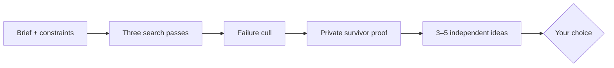

<div align="center">

# ✦ Imagination Engine

**Useful surprise without losing the brief.**

A compact divergent-ideation skill for Codex and Claude Code.

[](https://github.com/djfksjd/imagination-engine-skill/actions/workflows/tests.yml)


[English](README.md) · [한국어](README.ko.md) · [日本語](README.ja.md) · [简体中文](README.zh-CN.md) · [Español](README.es.md) · [Français](README.fr.md) · [Deutsch](README.de.md) · [Português (Brasil)](README.pt-BR.md)

</div>

---

> [!TIP]
> **Most users should install [Imagination](https://github.com/djfksjd/imagination).**
> It combines this engine with a concept workshop while keeping your choice
> between the two stages.

Imagination Engine generates a small portfolio of ideas that are genuinely
different in **causal mechanism**, not merely in names or aesthetics. Fit is a
veto: an unusual idea that weakens the brief does not survive.



## Try it

```text
Use $imagination-engine to propose five genuinely different negotiation
mechanics without dialogue trees, hidden dice, or a persuasion stat.
```

Each direction includes its mechanism, connection to the brief, and most
important risk. The response ends with one question that helps you choose.

## What makes it different

| Stage | What the skill does |
|---|---|
| Frame | Extracts the outcome, audience, value and non-negotiables |
| Search | Uses direct, mechanism-transfer and premise-shift passes |
| Cull | Rejects constraint violations, renamed clichés and arbitrary novelty |
| Compare | Uses pairwise fit, mechanism, useful-surprise and portfolio checks |
| Prove | Privately verifies constraints, causal chain, first encounter and decisive uncertainty |
| Deliver | Returns 3–5 independent directions without choosing for you |

No generation script, random deck, absolute self-score, or mechanical gate is
loaded into the creative context.

## Measured result

In a fresh preregistered blind comparison against a strong plain prompt:

| Metric | Treatment minus control |
|---|---:|
| Continuation preference | **50–0 (100.0%)** |
| Useful surprise | **+0.97** |
| Portfolio diversity | **+0.66** |
| Brief fit | **+0.60** |
| Craft | **+0.56** |
| Token cost | `1.12×` |

The 95% Wilson interval for preference was 92.9–100.0%. Judges were independent
calls from the same model family rather than human domain users, so this result
supports the tested distribution—not universal creativity. See
[`evals/README.md`](evals/README.md) and the
[frozen result](evals/results/2026-07-30-gpt-5.4-confirmation-v053.json).

## Standalone install

```bash
curl -fsSL https://raw.githubusercontent.com/djfksjd/imagination-engine-skill/main/install.sh | bash
```

```bash
claude plugin marketplace add djfksjd/imagination-engine-skill
claude plugin install imagination-engine@djfksjd
codex plugin marketplace add djfksjd/imagination-engine-skill
codex plugin add imagination-engine@djfksjd
```

## Scope

Use this skill for concepts, premises, mechanics, products, services, worlds
and rituals when useful novelty matters. Do not use it for factual work,
routine tasks with a known answer, or development of an idea already selected;
use
[Imagination Brainstorming](https://github.com/djfksjd/imagination-brainstorming-skill)
for that stage.

## Development and legacy

```bash
python3 -m pytest tests/ -q
python3 evals/harness.py --help
```

The former experimental architecture is preserved under
[`legacy/v0.4.0/`](legacy/v0.4.0/) for research only. It is never loaded at
runtime. MIT licensed.
