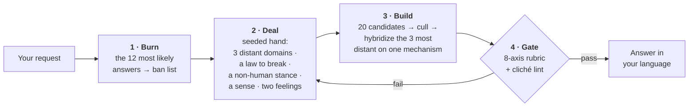

<div align="center">

# Imagination Engine

**Strange ideas by subtraction.**

An agent skill that makes an AI produce genuinely strange ideas — by *removing the paths to the obvious answer*<br>instead of asking it to be more imaginative.

[](https://github.com/djfksjd/imagination-engine-skill/actions/workflows/tests.yml)
[](#install)
[](#install)
[](#under-the-hood)
[](LICENSE)

**English** · [한국어](README.ko.md) · [日本語](README.ja.md) · [简体中文](README.zh-CN.md) · [Español](README.es.md) · [Français](README.fr.md) · [Deutsch](README.de.md) · [Português](README.pt-BR.md)

</div>

---

> [!CAUTION]
> ## Tested twice under blind judging. It lost both times.
>
> This skill's central claim — that removing the paths to the obvious answer produces better ideas than plain prompting — has now been measured twice against a plain-prompt control, and lost decisively on both occasions. The second test was pre-registered in full before any data existed, and it ran on the current build, at the current default (`alien-physics` alone, anchor 1) and with the self-scored gate threshold removed. Neither change recovered the gap.
>
> Six briefs, five engine runs and five control runs on each, five blind judges per brief who were never told two conditions existed. Engine minus control, median across judges, 1–7 scales, equal-weight mean over the six briefs:
>
> | | WANT | FIT | CRAFT |
> |---|---|---|---|
> | engine minus control | **−2.83** | **−3.03** | **−1.67** |
>
> Every brief was negative on every measure. The control ranked above the engine in **30 of 30** brief × judge cells and took **90 of 90** top-three slots. Pooled: WANT 5.76 → 2.98, FIT 6.35 → 3.33, CRAFT 5.88 → 4.23.
>
> Convergence — the problem this skill was built to reduce — was not measurably reduced: `g_CORE` +0.10 and `g_SKELETON` −0.22 against the +0.30 the rule required. The coders' ordinal Krippendorff's α came in at 0.786 and 0.673, below the pre-registered .80 floor, so **that measure is inconclusive rather than favourable** — it is not evidence for the skill, and it is not counted against it either.
>
> The engine cost **48× the control per output**.
>
> The pre-registered rule returns **FAIL**, and it registered "underpowered", "almost passed", "the margin was tight" and "it won on the holdouts" as FAIL in advance, precisely so nobody could reach for them afterwards. Under that rule the plain-prompt control is the recommended default and a new harness is designed.
>
> **A causal claim this page used to make is withdrawn.** It said the `nonhuman` mode caused the fit collapse. It did not: removing `nonhuman` from the default moved pooled FIT from 3.27 to 3.33, against a control at 6.35. The collapse survived its removal almost untouched. The mode's warning — that it dissolves any brief with a person in it — stands as design guidance, but it was not the cause of the measured loss.
>
> **Separate, and still supported.** The first experiment's finding that an unaided model genuinely collapses on a brief with an obvious answer is a real result: six independent plain-prompt runs on the estuary-creature brief produced the same organism. The problem this skill was built for is real. What is refuted is that this pipeline solves it.

---

> Telling a model to "be creative" makes it sample from the most likely continuations of the word *creative*. That is why the results converge: the same fungal networks, the same rain-soaked neon city, the same machine that turns out to have feelings.
>
> **Instructing harder does not move the distribution. Removing options does.**

## How it works



|  | What happens | Why it works |
|---|---|---|
| **1** | **Burns the first instincts.** Before generating anything, the model writes down the twelve answers it is most likely to give. Those become a ban list, checked mechanically against the final draft. | It also names the *skeleton* they share — in the worked example: an apparatus, an operator, a stored substance. The skeleton is the real target, so every reskinned clone dies with the originals. |
| **2** | **Deals a hand the model did not choose.** A hash-seeded draw hands over three concept domains from guaranteed-disjoint categories, one law of reality to break, one non-human stance, one sense to invent, and two feelings that must coexist. | Left to itself, a model free-associates to its own favourites. The draw is external, reproducible, and re-running deals *new* cards rather than the same ones. |
| **3** | **Requires the broken law to be replaced.** Every deletion installs a new law, and that law must forbid something the ordinary world allows. | A world where a rule is merely absent is empty, not strange. Constraint is what makes invention legible. |
| **4** | **Gates the output.** An eight-axis rubric and a phrase linter run before the user sees anything. | A failed gate means regenerate — not resubmit with the scores rounded up. |

## Install

Runs in **Claude Code** and **Codex**. Python 3 standard library only: nothing to install, no API key, no network access.

```bash
curl -fsSL https://raw.githubusercontent.com/djfksjd/imagination-engine-skill/main/install.sh | bash
```

<details>
<summary><b>Manual install</b></summary>

```bash
# Claude Code
claude plugin marketplace add djfksjd/imagination-engine-skill
claude plugin install imagination-engine@djfksjd

# Codex
codex plugin marketplace add djfksjd/imagination-engine-skill
codex plugin add imagination-engine@djfksjd
```

One tree serves both hosts: the skill body lives under `skills/imagination-engine/`, and `AGENTS.md` is loaded as shared context.
</details>

## Use it

Describe what you want. The skill triggers on requests for something strange, or on complaints that the ideas so far are generic. Prompts work in any language, and the answer comes back in the language you used.

```text
Use the imagination engine on: a machine that separates emotion from voice.
Baby, non-human and affect modes. No neural scanning, no feelings shown as colour.
```

```text
Design a creature for my game that is nothing like anything in the genre.
Extremal mode, anchor 2 — I have to be able to actually build it.
```

### Modes · stack up to three

| Mode | What it removes |
|---|---|
| `baby` | Learned function, correct names, and the order of cause and effect. Infant logic, adult execution — a cute result is a failed one. |
| `nonhuman` | Human benefit. Nothing here exists for anyone; if the result is a product, it is disqualified. **Destroys any brief with a person in it** — see the warning below. |
| `alien-physics` | Appearance as the site of novelty. Physics, time, or selfhood changes instead. |
| `affect` | The five senses and the named emotions. Requires an invented sense, fully specified — including the new injustice it creates. |
| `extremal` | Every safe candidate. Widens the hand, deals two rules to break, and raises the discard bar. |
| `grounded` | Nothing. Adds one path to something real without editing the principle, and substitutes the rubric axis `translation_integrity` for `non_anthropocentrism`. Cannot be stacked with `nonhuman` — it substitutes the axis that mode exists to enforce. |

**The default is `alien-physics` at anchor 1**, and `nonhuman` is not in it. It used to be. This page used to say that a controlled experiment had measured what `nonhuman` cost — that it halved fit to the brief and took 0 of 24 accepts from blind judges. **That causal attribution is withdrawn.** The pre-registered rerun ran `alien-physics` alone and pooled FIT moved only from 3.27 to 3.33, against a control at 6.35: the fit collapse was not caused by `nonhuman` and did not leave with it. The rest of the warning is design guidance and it stands on its own terms — `nonhuman` removes human usefulness by construction, which is the wrong thing to apply to a brief nobody chose it for. **If your brief has a person in it — a player, a reader, a congregation, a customer — do not add `nonhuman`.** It will remove them.

### Anchors · how reachable the result must stay

| | Level | Requirement |
|---|---|---|
| `0` | **Unbound** | Internal consistency is the only obligation |
| `1` | **Legible** | Explainable in three sentences without analogy to a known work |
| `2` | **Stageable** | A concrete scene or artifact a team could produce |
| `3` | **Operable** | One real path to a prototype, with the losses from that translation stated |

### Driving a session

You do not run the stages — the skill does. What you control is the four things below, and each of them changes the result more than any adjective would.

| You say | What it changes |
|---|---|
| **the subject** | the seed for the whole draw — the hand is hashed from it, so rephrasing the topic deals different cards |
| **what it is for** | story · world · game mechanic · artifact · concept-art brief · nothing. "Nothing" is a real answer and it produces the strangest results |
| **modes and anchor** | which paths are removed, and how far the result has to stay reachable |
| **your own ban list** | the highest-value input available. See below |

**Give it your ban list.** The skill burns its own twelve first instincts before it generates anything, but it cannot know what *you* are sick of. One sentence — *"not another fungal network, not another thing that turns out to be alive"* — removes more probability mass than a paragraph of encouragement. If you do not offer one, the skill asks for it before drawing.

**Picking modes:**

| If you want | Try |
|---|---|
| a creature or entity that isn't genre furniture | `nonhuman, alien-physics` · anchor 1 |
| a world rule rather than a monster | `alien-physics` · anchor 0 |
| something a team can actually stage or shoot | `alien-physics, grounded` · anchor 2 |
| a mechanic you could prototype this month | `grounded` · anchor 3 |
| a sense, a feeling, or an interior state | `affect` · anchor 1 |
| logic that predates learned function | `baby, nonhuman` · anchor 0 |
| you have already rejected two rounds | add `extremal` |

Anchor and modes are independent. `grounded` at anchor 0 is legal and produces something buildable that nobody asked to be legible; `extremal` at anchor 3 is the hardest setting the skill has.

### The conversation, in practice

**Starting.** Say what you want in any language. The skill answers in the language you used and reasons internally in English.

```text
Use the imagination engine on: what happens in a stairwell between two floors.
Non-human and alien-physics modes, anchor 1. Not a ghost story, not a liminal-space aesthetic.
```

**When it comes back too safe.** Do not say "make it weirder" — that is the instruction that fails, and the skill has a defined answer for it instead:

```text
Still safe. Regenerate.
```

It will redeal from a fresh run, add *every element of the previous answer* to the ban list, and delete one more of the premises it had been protecting — then tell you which premise that was. That last line is usually the interesting part of the exchange. On a third pass it switches to `extremal`.

**When it comes back unusable.** Raise the anchor rather than softening the request:

```text
Anchor 3 — I need one path I could actually build, and I want to know what the principle loses on the way.
```

**When you want to see the work.** The internal stages are hidden by design. Ask and they open:

```text
Show me the twelve instincts you burned and the hand you drew.
```

### Running the pipeline by hand

Nothing here needs installing beyond Python 3.11 and the repo. **Every command below runs from the skill directory**, and working files go to a scratch directory, never into the skill folder:

```bash
cd skills/imagination-engine
mkdir -p /tmp/work
```

Two of the five inputs are written by you rather than produced by a script. The repo ships a filled-in version of each, so you can copy one and edit rather than start from an empty file.

```bash
# 1 · burn the obvious answers into a checkable ban list.
#     obvious.txt is yours to write: the twelve answers you would give first,
#     one per line. references/example-obvious.txt is a finished one.
cp references/example-obvious.txt /tmp/work/obvious.txt   # or write your own
python3 scripts/banlist.py --topic "a stairwell between two floors" \
    --obvious /tmp/work/obvious.txt --extra "no ghosts,no liminal aesthetic" --out /tmp/work
#     Pass your own prohibitions to --extra exactly as you would say them, even
#     if the bundled deck already names one: the file records them and the gate
#     replays with them, so "no dragons" promotes a deck warning to a ban.
#     Exit 2 means the dump is too short, or that it is one line with a number
#     changed — twelve variants of a template are one instinct written twelve
#     times. banlist.py also takes --allow <cliché id> to release a deck phrase;
#     read the honest limit on it below before relying on it.

# 2 · deal the hand (seeded from the request, so it replays exactly)
python3 scripts/draw.py --topic "a stairwell between two floors" \
    --modes nonhuman,alien-physics --run 1 --anchor 1 --out /tmp/work

# 3 · write the result twice: candidate.json for the gate to score, draft.md for
#     the reader. Each scored section is marked in the draft inside
#     <!-- bind: sections.<id> --> ... <!-- /bind -->, matching the candidate
#     exactly, or the gate refuses the draft.
#       structure  → references/candidate.schema.json, references/output-template.md
#       worked     → references/example-candidate.json, references/example-draft.md
#     candidate.json also needs manual_checks_cleared: an OBJECT KEYED BY CHECK
#     ID — {"obvious-01": "...", "obvious-02": "..."} — with one written answer
#     for every manual check the ban list carries. A story, world, ritual or
#     mechanic brief usually produces twelve of them; a product brief produces
#     none, which is why the shipped example clears only one.

# 4 · lint a draft mid-write (a diagnostic; passing is not clearance)
python3 scripts/cliche_lint.py --banlist /tmp/work/banlist.json --draft /tmp/work/draft.md

# 5 · the gate. All four artefacts, one verdict
python3 scripts/score_gate.py --candidate /tmp/work/candidate.json --draw /tmp/work/draw.json \
    --banlist /tmp/work/banlist.json --markdown /tmp/work/draft.md
```

To watch the whole thing pass before running your own, point step 5 at the four shipped artefacts: `--candidate references/example-candidate.json --draw references/example-draw.json --banlist references/example-banlist.json --markdown references/example-draft.md`.

`draw.py --list-modes` prints the modes. `--run 2` deals fresh, still-disjoint material for a regeneration; `--salt` redeals the same run without advancing it.

### Exit codes, and what to do about each

| Code | Meaning | The fix |
|---|---|---|
| `0` | passed | — |
| `1` | usage, missing file, or malformed deck | a typo, not a judgement |
| `2` | **the gate failed** — a section is missing or thin, a drawn card was decoration, an artefact does not belong to the others | rewrite the idea. There is no score to round up: no number in this gate decides anything |
| `3` | **banned material is present** in the draft | rewrite the thought, not the word. Deleting the flagged phrase and keeping the sentence is not a fix |

If the same check fails twice, the material is wrong rather than the phrasing: redeal with `--run <n+1>` instead of editing.

One exit code is not the scripts': `No such file or directory` also leaves `2` behind, because Python exits before the script starts. That is the wrong working directory — go back to `cd skills/imagination-engine`. Inside the scripts, a usage error is always `1`, so a mistake is never reportable as a verdict.

> [!IMPORTANT]
> **One command can say "passed", and it takes everything.** `score_gate.py` replays the draw against the bundled decks, binds the candidate to it card by card, requires every rubric axis to be scored and argued, requires a written answer to every ban too long to match mechanically, and checks that the draft about to be shown is the one that was scored. There is no `--extremal`, no `--grounded`, no `--min-mean`, no `--min-axis`, no `--rubric` — a threshold asserted at verdict time is asserted by the party the verdict is about. **And there is no score threshold either.** Twenty measured runs all self-scored into a band a quarter of a point wide, immediately above the old bar of 8.0, including runs blind judges ranked last in their pile; a number with no variance decides nothing, so it no longer decides anything here. The axes stay because answering them changes the work. `cliche_lint.py` is a drafting aid; passing it is not clearance.

**`--allow` is honoured in one place and not the other, on purpose.** `cliche_lint.py --allow <id>` releases a deck phrase while you draft. `score_gate.py` has no such flag and ignores the release recorded in the ban list, because that file is one of the artefacts it is checking — honouring it there would let a run release its own bans at verdict time. If a bundled phrase genuinely does not belong in your work, fork the repo and edit `references/decks/cliches.json`.

**The ban list is enforced by content, not by how it files things.** Five separate edits to `banlist.json` used to leave a protected phrase in plain sight and stop it firing — emptying `extra` while keeping the row built from it, demoting that row to `warn`, relabelling it with a bundled cliché id, retyping a burnt instinct's group as `deck`, or adding a structural pattern whose regex never finishes. `score_gate.py` now takes the union of every location that records a burnt instinct or one of your `--extra` exclusions and lints the draft against those statements as bans, reading no id, no tier, no group and no release; only the bundled patterns are compiled, so a supplied one is ignored rather than run. The limit, stated exactly: a statement deleted from *every* row that records it is gone. Deleting one row leaves `counts` disagreeing with the contents, which catches the cheap edit and not a thorough one — the gate holds no copy of the ban list that the run did not write.

**Nothing the gate reads is discarded in silence.** A pattern you add to `structural_patterns` is refused *by name* — not compiled, and not ignored either: the first version of this fix ignored it, and `{"id": "mine", "regex": "\bcheese\b"}` with cheese in the draft printed `PASSED`, which is the failure the hang was fixed to avoid wearing a friendlier face. Put it in a forked `references/decks/cliches.json` and it compiles like any other. A release in `allowed` is reported as a warning naming the ids, on the pass path too; a `forbidden_moves` list that differs from the deck's is reported as prose that nothing enforces. Drawing `affect` now requires `invented_sense` with all four fields, as `SKILL.md` always said, and every field of `draw.json` is recomputed — `notes` and the self-reported counts included. **`imagination-brainstorming` decides this field the other way**: it accepts supplied patterns behind a structural scan and a timer. The difference is deliberate — this gate refuses run-supplied policy everywhere else (`--rubric`, `--min-mean`, an honoured `--allow`), and a timer makes what got linted depend on how fast your machine is.

> [!NOTE]
> The gate is a floor, not a judge. A pass establishes that the required work is present and that the four artefacts belong to each other — the hand was dealt by the decks and not edited afterwards, every card was used, the ban list is the one this run's own dump implies, every long instinct has a written answer, and the draft about to be shown is the text that was checked. It cannot tell you the idea is good and it no longer pretends a number can. Read the result yourself.

## What comes out

Eight fixed sections, in your language: the name · a one-line definition that does not lean on a comparison · the law it runs on · a first-encounter scene · its strangest property · the conflicting feelings it produces · what changes in the world because it exists · and, required, **which familiar versions were discarded and what the result is closest to**. A ninth section, **one path to something real**, is added whenever the run is `grounded` or the anchor is `3` — the gate requires it in exactly those two cases and neither of the other seven sections goes away when it appears.

<details open>
<summary>From the worked example — prompt: <i>"a machine that separates emotion from voice"</i></summary>

> ### Flatting
>
> A grade that forms wherever a sentence is said more than once, drawing the charge out of every earlier saying and leaving it on the surfaces of the room.
>
> […] Because the taking runs backwards, it edits what has already happened: a promise repeated on a Tuesday reaches back and empties every earlier occasion on which it was made, including the one that mattered. Reassurance by frequency is impossible here.
>
> […] Funerals have inverted — the readings are the things the dead person said exactly once, usually trivial, often about the weather, because those are the only sentences of theirs that still carry anything.

</details>

Note what is *not* there: no apparatus, no glowing device, nothing that looks unusual. **The strangeness is in what has become impossible.** The full run, including the hidden stages, is in [`worked-example.md`](skills/imagination-engine/references/worked-example.md).

## What it will not do

> [!IMPORTANT]
> - **Claim that nobody has ever thought of this.** That is unverifiable, so the skill is forbidden from saying it. Instead it names the nearest known works and states the difference — in the output, every time.
> - **Use shock as a substitute.** Cruelty, gore, sexual violence, and degradation of real groups are the cheapest route to discomfort and are banned as shortcuts. The unease has to come from the premise.
> - **Pretend a lint pass means the idea is good.** The linter proves that specific familiar moves are *absent*; it cannot prove anything is present. The rubric is self-scored and the skill says so. What both gates really enforce is that the work was not skipped.
> - **Quietly shrink your request.** If you need something buildable, raise the anchor rather than softening the premise. And when a conventional answer is the correct answer, the skill is supposed to tell you that and answer normally.

## What it is measured to do — and what it is not

Two experiments have been run. Both are here in full, because a skill that hides its own measurement is asking to be trusted rather than read.

### Experiment 1 — July 2026

Four briefs in four unrelated domains, five plain-prompt runs and five full-pipeline runs each, twenty disjoint dealt hands, coded and judged blind by agents that were never told two conditions existed.

**Confirmed, with a condition attached.** A plain prompt really does converge — but only when the brief has an obvious answer to converge on. Asked for an estuary creature, five independent plain-prompt runs produced five versions of one organism, and a sixth produced it again. Asked for a premise set inside one building, five runs produced five unrelated ideas. The claim at the top of this page is a description of what happens to *some* briefs, not a law.

**Not demonstrated: that removing paths decorrelates repeated answers.** Twenty engine runs on twenty disjoint hands converged on one recurring shape — a bodiless process rather than a thing, an obligation usually framed as a debt, an administrative consequence. Pooled, they were *more* alike than the plain-prompt runs, not less. And the cards were not decoration: most left no trace in the wording at all, so they had genuinely been absorbed, and the outputs converged anyway. The honest reading is that removing the first-order attractor works — these answers really are unlike a plain prompt's — but removal does not spread what is left evenly. **It relocates the mode.**

That is not fixed and this page will not claim it is. What follows from it, practically: if you need genuinely different options, give the skill different briefs or different modes rather than running the same one twice, and if your result is a bodiless process that levies an obligation and generates paperwork, you have arrived where the last twenty runs arrived — send it back.

### Experiment 2 — the pre-registered rerun, on the current build

Experiment 1 had two flaws its own report named: the engine's mandatory "What this is not" section let a blind coder reconstruct the split, and one control agent found the installed skill and ran the pipeline unprompted. The rerun closed both — both arms were rendered into one identical four-section schema by a blind typesetter, and every control output came from a tool-less, skill-less, stateless call with no mechanism to load anything. The decision rule, the six briefs, the aggregation order and every threshold were fixed in writing before any data existed.

Six briefs (four carried over, two holdouts named in advance), five engine and five control runs each, five blind judges and five blind pairwise coders per brief. The engine ran the current default, `alien-physics` at anchor 1, with the self-scored gate threshold removed. All 30 engine runs cleared `score_gate.py` within cap, 29 of them first time, so this was not an execution failure.

| engine minus control, median over judges, equal-weight over briefs | WANT | FIT | CRAFT |
|---|---|---|---|
| mean | **−2.83** | **−3.03** | **−1.67** |

Every one of the six briefs was negative on every one of the three measures, holdouts exactly like the carried-over briefs. Pooled over 300 ratings: WANT 5.76 → 2.98, FIT 6.35 → 3.33, CRAFT 5.88 → 4.23. The control ranked above the engine in **30 of 30** brief × judge cells and took **90 of 90** top-three slots. The engine cost **48× the control per output**, and 12× the wall clock.

On convergence — the thing this skill exists to reduce — `g_CORE` was +0.10 and `g_SKELETON` −0.22, where positive means the engine is less converged and the rule required +0.30. Ordinal Krippendorff's α across the five coders was 0.786 on CORE and 0.673 on SKELETON, both under the pre-registered .80 floor, so the coders were not applying one construct and **the convergence result is inconclusive rather than favourable**. No re-coding, rubric clarification or adjudication was permitted after the fact, and none was done.

Fifteen of the seventeen decision-rule conditions were violated, including the CRAFT veto, which sinks the result on its own. The rule required all seventeen and returns **FAIL**. Its consequence was fixed in advance too: the plain-prompt control becomes the recommended default and a new harness is designed.

**What this does not license.** It says nothing about `nonhuman` or any other non-default configuration, which was out of scope. And because the arms are not compute-matched, it cannot say *which* part of the pipeline — the ban list, the dealt cards, the fixed output contract — produced the loss. What it does say is that dropping `nonhuman` from the default did not fix the measured problem: pooled FIT moved 3.27 → 3.33 against a control at 6.35.

## Under the hood

| Script | Role | Non-zero exit |
|---|---|---|
| `draw.py` | Deals the constraint hand from seven decks | `1` usage or deck error |
| `banlist.py` | Merges the instinct dump with the cliché deck into a checkable ban list | `2` the dump was too short |
| `cliche_lint.py` | Drafting aid only. Flags banned phrases, hollow adjectives, and pitch-shaped sentences with line numbers | `3` banned material present |
| `score_gate.py` | **The only gate.** Replays the draw, binds the candidate and the draft to it, scores, and answers the ban list | `2` gate failed |

**Everything is reproducible.** The draw is seeded from a hash of the topic, so the same request deals the same hand and any result can be replayed and audited. `--run 2` deals fresh, still-disjoint material for a regeneration; `--salt` redeals the same run.

```text
skills/imagination-engine/
├── SKILL.md                    # the authoritative workflow
├── references/
│   ├── output-template.md      # the delivered section contract
│   ├── worked-example.md       # one complete run, including the hidden stages
│   ├── rubric.json             # the eight axes and the section minimums
│   ├── candidate.schema.json   # what score_gate.py validates
│   ├── example-obvious.txt     # ─┐ one complete run, shipped: the twelve
│   ├── example-banlist.json    #  │ instincts, the ban list built from them,
│   ├── example-draw.json       #  │ the hand, the scored candidate and the
│   ├── example-candidate.json  #  │ draft. The last four are the gate's four
│   ├── example-draft.md        # ─┘ inputs, and the suite's fixture
│   └── decks/                  # domains · constraints · senses · perspectives
│                               # affects · modes · clichés
└── scripts/                    # draw · banlist · cliche_lint · score_gate
```

## Tests

```bash
python3 -m pytest tests/ -q
```

Offline, no fixtures beyond the repo itself: deck integrity, draw determinism and disjointness, both gates, and the shipped example passing its own lint.

## Contributing

The decks are the easiest place to help — a domain genuinely far from the others, a reality rule worth breaking, a sense worth inventing. Keep every entry answerable: a domain needs a probe question the result must answer, and a constraint needs a replacement requirement. Run the tests before opening a PR.

<div align="center">
<sub>MIT licensed · built for <a href="https://claude.com/claude-code">Claude Code</a> and Codex</sub>
</div>
