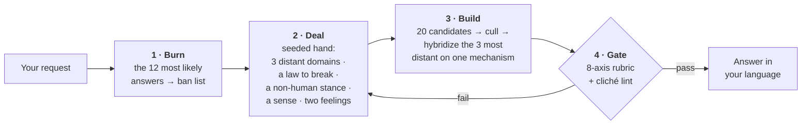

<div align="center">

# Imagination Engine

**Strange ideas by subtraction.**

An agent skill that makes an AI produce genuinely strange ideas — by *removing the paths to the obvious answer*<br>instead of asking it to be more imaginative.

[](https://github.com/djfksjd/imagination-engine-skill/actions/workflows/tests.yml)
[](#install)
[](#install)
[](#under-the-hood)
[](LICENSE)

**English** · [한국어](README.ko.md) · [日本語](README.ja.md) · [简体中文](README.zh-CN.md) · [Español](README.es.md) · [Français](README.fr.md) · [Deutsch](README.de.md) · [Português](README.pt-BR.md)

</div>

---

> Telling a model to "be creative" makes it sample from the most likely continuations of the word *creative*. That is why the results converge: the same fungal networks, the same rain-soaked neon city, the same machine that turns out to have feelings.
>
> **Instructing harder does not move the distribution. Removing options does.**

## How it works



|  | What happens | Why it works |
|---|---|---|
| **1** | **Burns the first instincts.** Before generating anything, the model writes down the twelve answers it is most likely to give. Those become a ban list, checked mechanically against the final draft. | It also names the *skeleton* they share — in the worked example: an apparatus, an operator, a stored substance. The skeleton is the real target, so every reskinned clone dies with the originals. |
| **2** | **Deals a hand the model did not choose.** A hash-seeded draw hands over three concept domains from guaranteed-disjoint categories, one law of reality to break, one non-human stance, one sense to invent, and two feelings that must coexist. | Left to itself, a model free-associates to its own favourites. The draw is external, reproducible, and re-running deals *new* cards rather than the same ones. |
| **3** | **Requires the broken law to be replaced.** Every deletion installs a new law, and that law must forbid something the ordinary world allows. | A world where a rule is merely absent is empty, not strange. Constraint is what makes invention legible. |
| **4** | **Gates the output.** An eight-axis rubric and a phrase linter run before the user sees anything. | A failed gate means regenerate — not resubmit with the scores rounded up. |

## Install

Runs in **Claude Code** and **Codex**. Python 3 standard library only: nothing to install, no API key, no network access.

```bash
curl -fsSL https://raw.githubusercontent.com/djfksjd/imagination-engine-skill/main/install.sh | bash
```

<details>
<summary><b>Manual install</b></summary>

```bash
# Claude Code
claude plugin marketplace add djfksjd/imagination-engine-skill
claude plugin install imagination-engine@djfksjd

# Codex
codex plugin marketplace add djfksjd/imagination-engine-skill
codex plugin add imagination-engine@djfksjd
```

One tree serves both hosts: the skill body lives under `skills/imagination-engine/`, and `AGENTS.md` is loaded as shared context.
</details>

## Use it

Describe what you want. The skill triggers on requests for something strange, or on complaints that the ideas so far are generic. Prompts work in any language, and the answer comes back in the language you used.

```text
Use the imagination engine on: a machine that separates emotion from voice.
Baby, non-human and affect modes. No neural scanning, no feelings shown as colour.
```

```text
Design a creature for my game that is nothing like anything in the genre.
Extremal mode, anchor 2 — I have to be able to actually build it.
```

### Modes · stack up to three

| Mode | What it removes |
|---|---|
| `baby` | Learned function, correct names, and the order of cause and effect. Infant logic, adult execution — a cute result is a failed one. |
| `nonhuman` | Human benefit. Nothing here exists for anyone; if the result is a product, it is disqualified. |
| `alien-physics` | Appearance as the site of novelty. Physics, time, or selfhood changes instead. |
| `affect` | The five senses and the named emotions. Requires an invented sense, fully specified — including the new injustice it creates. |
| `extremal` | Every safe candidate. Thresholds rise to a mean of 9.0 with no axis below 8. |
| `grounded` | Nothing. Adds one path to something real without editing the principle. |

### Anchors · how reachable the result must stay

| | Level | Requirement |
|---|---|---|
| `0` | **Unbound** | Internal consistency is the only obligation |
| `1` | **Legible** | Explainable in three sentences without analogy to a known work |
| `2` | **Stageable** | A concrete scene or artifact a team could produce |
| `3` | **Operable** | One real path to a prototype, with the losses from that translation stated |

### Driving a session

You do not run the stages — the skill does. What you control is the four things below, and each of them changes the result more than any adjective would.

| You say | What it changes |
|---|---|
| **the subject** | the seed for the whole draw — the hand is hashed from it, so rephrasing the topic deals different cards |
| **what it is for** | story · world · game mechanic · artifact · concept-art brief · nothing. "Nothing" is a real answer and it produces the strangest results |
| **modes and anchor** | which paths are removed, and how far the result has to stay reachable |
| **your own ban list** | the highest-value input available. See below |

**Give it your ban list.** The skill burns its own twelve first instincts before it generates anything, but it cannot know what *you* are sick of. One sentence — *"not another fungal network, not another thing that turns out to be alive"* — removes more probability mass than a paragraph of encouragement. If you do not offer one, the skill asks for it before drawing.

**Picking modes:**

| If you want | Try |
|---|---|
| a creature or entity that isn't genre furniture | `nonhuman, alien-physics` · anchor 1 |
| a world rule rather than a monster | `alien-physics` · anchor 0 |
| something a team can actually stage or shoot | `alien-physics, grounded` · anchor 2 |
| a mechanic you could prototype this month | `grounded` · anchor 3 |
| a sense, a feeling, or an interior state | `affect` · anchor 1 |
| logic that predates learned function | `baby, nonhuman` · anchor 0 |
| you have already rejected two rounds | add `extremal` |

Anchor and modes are independent. `grounded` at anchor 0 is legal and produces something buildable that nobody asked to be legible; `extremal` at anchor 3 is the hardest setting the skill has.

### The conversation, in practice

**Starting.** Say what you want in any language. The skill answers in the language you used and reasons internally in English.

```text
Use the imagination engine on: what happens in a stairwell between two floors.
Non-human and alien-physics modes, anchor 1. Not a ghost story, not a liminal-space aesthetic.
```

**When it comes back too safe.** Do not say "make it weirder" — that is the instruction that fails, and the skill has a defined answer for it instead:

```text
Still safe. Regenerate.
```

It will redeal from a fresh run, add *every element of the previous answer* to the ban list, and delete one more of the premises it had been protecting — then tell you which premise that was. That last line is usually the interesting part of the exchange. On a third pass it switches to `extremal`.

**When it comes back unusable.** Raise the anchor rather than softening the request:

```text
Anchor 3 — I need one path I could actually build, and I want to know what the principle loses on the way.
```

**When you want to see the work.** The internal stages are hidden by design. Ask and they open:

```text
Show me the twelve instincts you burned and the hand you drew.
```

### Running the pipeline by hand

Nothing here needs installing beyond Python 3.11 and the repo. Scripts live in `skills/imagination-engine/scripts/`; write working files to a scratch directory, never into the skill folder.

```bash
# 1 · deal the hand (seeded from the topic, so it replays exactly)
python3 scripts/draw.py --topic "a stairwell between two floors" \
    --modes nonhuman,alien-physics --run 1 --anchor 1 --out /tmp/work

# 2 · burn the obvious answers into a checkable ban list
python3 scripts/banlist.py --topic "a stairwell between two floors" \
    --obvious /tmp/work/obvious.txt --extra "no ghosts,no liminal aesthetic" --out /tmp/work

# 3 · lint any draft against that list
python3 scripts/cliche_lint.py --banlist /tmp/work/banlist.json --draft /tmp/work/draft.md

# 4 · gate the finished candidate
python3 scripts/score_gate.py --candidate /tmp/work/candidate.json          # add --extremal, or --grounded
```

`draw.py --list-modes` prints the modes. `--run 2` deals fresh, still-disjoint material for a regeneration; `--salt` redeals the same run without advancing it.

### Exit codes, and what to do about each

| Code | Meaning | The fix |
|---|---|---|
| `0` | passed | — |
| `1` | usage, missing file, or malformed deck | a typo, not a judgement |
| `2` | **the gate failed** — a section is missing or thin, an axis is under the floor, a drawn card was decoration | rewrite the idea. Rounding a score up is the one move the skill forbids |
| `3` | **banned material is present** in the draft | rewrite the thought, not the word. Deleting the flagged phrase and keeping the sentence is not a fix |

If the same axis fails twice, the material is wrong rather than the phrasing: redeal with `--run <n+1>` instead of editing.

> [!NOTE]
> The gates are floors, not judges. They prove that specific familiar moves are *absent* and that the required work was *done*. They cannot tell you the idea is good, and a passing score is self-assigned. Read the result yourself.

## What comes out

Eight fixed sections, in your language: the name · a one-line definition that does not lean on a comparison · the law it runs on · a first-encounter scene · its strangest property · the conflicting feelings it produces · what changes in the world because it exists · and, required, **which familiar versions were discarded and what the result is closest to**.

<details open>
<summary>From the worked example — prompt: <i>"a machine that separates emotion from voice"</i></summary>

> ### Flatting
>
> A grade that forms wherever a sentence is said more than once, drawing the charge out of every earlier saying and leaving it on the surfaces of the room.
>
> […] Because the taking runs backwards, it edits what has already happened: a promise repeated on a Tuesday reaches back and empties every earlier occasion on which it was made, including the one that mattered. Reassurance by frequency is impossible here.
>
> […] Funerals have inverted — the readings are the things the dead person said exactly once, usually trivial, often about the weather, because those are the only sentences of theirs that still carry anything.

</details>

Note what is *not* there: no apparatus, no glowing device, nothing that looks unusual. **The strangeness is in what has become impossible.** The full run, including the hidden stages, is in [`worked-example.md`](skills/imagination-engine/references/worked-example.md).

## What it will not do

> [!IMPORTANT]
> - **Claim that nobody has ever thought of this.** That is unverifiable, so the skill is forbidden from saying it. Instead it names the nearest known works and states the difference — in the output, every time.
> - **Use shock as a substitute.** Cruelty, gore, sexual violence, and degradation of real groups are the cheapest route to discomfort and are banned as shortcuts. The unease has to come from the premise.
> - **Pretend a lint pass means the idea is good.** The linter proves that specific familiar moves are *absent*; it cannot prove anything is present. The rubric is self-scored and the skill says so. What both gates really enforce is that the work was not skipped.
> - **Quietly shrink your request.** If you need something buildable, raise the anchor rather than softening the premise. And when a conventional answer is the correct answer, the skill is supposed to tell you that and answer normally.

## Under the hood

| Script | Role | Non-zero exit |
|---|---|---|
| `draw.py` | Deals the constraint hand from seven decks | `1` usage or deck error |
| `banlist.py` | Merges the instinct dump with the cliché deck into a checkable ban list | `2` the dump was too short |
| `cliche_lint.py` | Flags banned phrases, hollow adjectives, and pitch-shaped sentences with line numbers | `3` banned material present |
| `score_gate.py` | Validates the candidate against the rubric, fail-closed | `2` gate failed |

**Everything is reproducible.** The draw is seeded from a hash of the topic, so the same request deals the same hand and any result can be replayed and audited. `--run 2` deals fresh, still-disjoint material for a regeneration; `--salt` redeals the same run.

```text
skills/imagination-engine/
├── SKILL.md                    # the authoritative workflow
├── references/
│   ├── output-template.md      # the delivered section contract
│   ├── worked-example.md       # one complete run, including the hidden stages
│   ├── rubric.json             # eight axes, thresholds, section minimums
│   ├── candidate.schema.json   # what score_gate.py validates
│   ├── example-candidate.json  # a candidate that passes both gates (also a test fixture)
│   └── decks/                  # domains · constraints · senses · perspectives
│                               # affects · modes · clichés
└── scripts/                    # draw · banlist · cliche_lint · score_gate
```

## Tests

```bash
python3 -m pytest tests/ -q
```

Offline, no fixtures beyond the repo itself: deck integrity, draw determinism and disjointness, both gates, and the shipped example passing its own lint.

## Contributing

The decks are the easiest place to help — a domain genuinely far from the others, a reality rule worth breaking, a sense worth inventing. Keep every entry answerable: a domain needs a probe question the result must answer, and a constraint needs a replacement requirement. Run the tests before opening a PR.

<div align="center">
<sub>MIT licensed · built for <a href="https://claude.com/claude-code">Claude Code</a> and Codex</sub>
</div>
