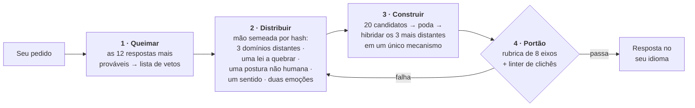

<div align="center">

# Imagination Engine

**Estranheza por subtração.**

Uma skill de agente que faz uma IA produzir ideias realmente estranhas — não pedindo mais imaginação,<br>mas *removendo os caminhos que levam à resposta óbvia*.

[](https://github.com/djfksjd/imagination-engine-skill/actions/workflows/tests.yml)
[](#instalação)
[](#instalação)
[](#por-dentro)
[](LICENSE)

[English](README.md) · [한국어](README.ko.md) · [日本語](README.ja.md) · [简体中文](README.zh-CN.md) · [Español](README.es.md) · [Français](README.fr.md) · [Deutsch](README.de.md) · **Português**

</div>

---

> Pedir a um modelo que "seja criativo" faz com que ele amostre as continuações mais prováveis da palavra *criativo*. É por isso que os resultados convergem: de novo as redes de micélio, de novo a cidade de neon sob a chuva, de novo a máquina que descobre ter sentimentos.
>
> **Insistir mais não move a distribuição. Remover opções, sim.**

## Como funciona



|  | O que acontece | Por que funciona |
|---|---|---|
| **1** | **Queima os primeiros impulsos.** Antes de gerar qualquer coisa, o modelo escreve as doze respostas que mais provavelmente daria; elas viram uma lista de vetos conferida mecanicamente contra o rascunho final. | Ele também nomeia o *esqueleto* que elas compartilham (no exemplo: um aparelho, um operador, uma substância armazenada). O esqueleto é o alvo real — toda variante repaginada cai junto com o original. |
| **2** | **Distribui uma mão que o modelo não escolheu.** Um sorteio semeado por hash entrega três domínios conceituais de categorias comprovadamente disjuntas, uma lei da realidade a quebrar, uma postura não humana, um sentido a inventar e duas emoções que precisam coexistir. | Deixado por conta própria, um modelo associa para os próprios favoritos. O sorteio é externo, reprodutível, e refazê-lo dá cartas *novas*. |
| **3** | **Exige substituir a lei quebrada.** Cada supressão instala uma lei nova, e essa lei precisa proibir algo que o mundo comum permite. | Um mundo em que uma regra apenas falta não é estranho: é vazio. A restrição é o que torna a invenção legível. |
| **4** | **Passa a saída por portões.** Uma rubrica de oito eixos e um linter de frases rodam antes de o usuário ver qualquer coisa. | Portão reprovado significa regerar — não reenviar com as notas arredondadas para cima. |

## Instalação

Roda no **Claude Code** e no **Codex**. Apenas biblioteca padrão do Python 3: nada a instalar, sem chave de API, sem acesso à rede.

```bash
curl -fsSL https://raw.githubusercontent.com/djfksjd/imagination-engine-skill/main/install.sh | bash
```

<details>
<summary><b>Instalação manual</b></summary>

```bash
# Claude Code
claude plugin marketplace add djfksjd/imagination-engine-skill
claude plugin install imagination-engine@djfksjd

# Codex
codex plugin marketplace add djfksjd/imagination-engine-skill
codex plugin add imagination-engine@djfksjd
```

Uma única árvore serve os dois hosts: o corpo da skill fica em `skills/imagination-engine/`, e `AGENTS.md` é carregado como contexto compartilhado.
</details>

## Como usar

Descreva o que você quer. A skill dispara em pedidos de algo estranho ou quando você reclama que as ideias até aqui são genéricas. Prompts funcionam em qualquer idioma, e a resposta volta no idioma que você usou.

```text
Use o motor de imaginação em: uma máquina que separa emoção da voz.
Modos bebê, não humano e afeto. Nada de escaneamento neural, nada de emoções como cores.
```

```text
Projete uma criatura para o meu jogo que não se pareça com nada do gênero.
Modo extremal, âncora 2 — eu preciso conseguir construir de verdade.
```

### Modos · até três empilhados

| Modo | O que remove |
|---|---|
| `baby` | A função aprendida, os nomes corretos e a ordem de causa e efeito. Lógica de bebê, execução adulta — um resultado fofo é um fracasso. |
| `nonhuman` | A utilidade para pessoas. Aqui nada existe para ninguém; se o resultado for um produto, está desclassificado. |
| `alien-physics` | A aparência como lugar da novidade. Mudam a física, o tempo ou o self. |
| `affect` | Os cinco sentidos e as emoções nomeadas. Exige um sentido inventado e totalmente especificado — incluindo a nova injustiça que ele cria. |
| `extremal` | Todo candidato seguro. Os limiares sobem para média 9,0, nenhum eixo abaixo de 8. |
| `grounded` | Nada. Acrescenta um caminho até algo real sem editar o princípio. |

### Âncoras · quão alcançável o resultado precisa continuar

| | Nível | Requisito |
|---|---|---|
| `0` | **Sem amarras** | Coerência interna é a única obrigação |
| `1` | **Legível** | Explicável em três frases sem analogia a uma obra conhecida |
| `2` | **Encenável** | Uma cena ou objeto concreto que uma equipe conseguiria produzir |
| `3` | **Operável** | Um caminho real até um protótipo, com as perdas dessa tradução declaradas |

### Como conduzir uma sessão

Quem executa as etapas é a habilidade. O que você controla são as quatro coisas abaixo, e cada uma muda o resultado mais do que qualquer adjetivo.

| O que você diz | O que muda |
|---|---|
| **o tema** | a semente de toda a distribuição: a mão vem do hash dele, então reformular o tema entrega outras cartas |
| **para que serve** | história · mundo · mecânica de jogo · objeto · briefing de concept art · nada. "Nada" é uma resposta legítima e costuma dar os resultados mais estranhos |
| **modos e âncora** | quais caminhos são removidos e quão alcançável o resultado precisa continuar |
| **sua própria lista de proibições** | a entrada mais valiosa disponível. Veja abaixo |

**Dê a ela a sua lista de proibições.** A habilidade queima os próprios doze primeiros impulsos antes de gerar qualquer coisa, mas não tem como saber do que *você* está cansado. Uma frase — *"chega de rede de micélio, chega de coisa que no fim se revela viva"* — remove mais massa de probabilidade do que um parágrafo de incentivo. Se você não oferecer, a habilidade pede antes de distribuir.

**Escolhendo modos:**

| Se você quer | Tente |
|---|---|
| uma criatura ou entidade que não seja mobília de gênero | `nonhuman, alien-physics` · âncora 1 |
| uma regra de mundo em vez de um monstro | `alien-physics` · âncora 0 |
| algo que um time consiga de fato encenar ou filmar | `alien-physics, grounded` · âncora 2 |
| uma mecânica prototipável este mês | `grounded` · âncora 3 |
| um sentido, uma emoção, um estado interior | `affect` · âncora 1 |
| lógica anterior à função aprendida | `baby, nonhuman` · âncora 0 |
| você já rejeitou duas rodadas | acrescente `extremal` |

Âncora e modos são independentes. `grounded` na âncora 0 é válido e produz algo construível que ninguém pediu para ser legível; `extremal` na âncora 3 é o ajuste mais duro que existe aqui. `grounded` não pode se somar a `nonhuman`: o eixo que ele substitui é justamente o que aquele modo existe para impor, e o portão recusa o par.

### A conversa, na prática

**Começando.** Diga o que quer em qualquer idioma. A habilidade responde no idioma que você usou e raciocina internamente em inglês.

```text
Use o imagination engine em: o que acontece num patamar entre dois andares.
Modos nonhuman e alien-physics, âncora 1. Nada de história de fantasma, nada de estética de espaço liminar.
```

**Quando volta seguro demais.** Não diga "deixa mais estranho" — essa é exatamente a instrução que falha. A habilidade tem uma resposta definida no lugar:

```text
Ainda seguro. Regenere.
```

Ela redistribui a partir de uma nova rodada, acrescenta *todos os elementos da resposta anterior* à lista de proibições e apaga mais uma das premissas que vinha protegendo — e diz qual foi. Essa última linha costuma ser o ponto da troca. Na terceira passada ela muda para `extremal`.

**Quando volta inutilizável.** Suba a âncora em vez de amaciar o pedido:

```text
Âncora 3 — preciso de um caminho real que eu consiga construir, e quero saber o que o princípio perde no caminho.
```

**Quando quiser ver o trabalho.** As etapas internas são ocultas por design. Peça e elas se abrem:

```text
Me mostra os doze impulsos que você queimou e a mão que distribuiu.
```

### Rodando o pipeline à mão

Nada a instalar além de Python 3.11 e do repositório. **Todos os comandos abaixo rodam a partir do diretório da habilidade**, e os arquivos de trabalho vão para um diretório temporário, nunca dentro da pasta da habilidade:

```bash
cd skills/imagination-engine
mkdir -p /tmp/work
```

Duas das cinco entradas não saem de nenhum script: você as escreve. O repositório traz uma versão pronta de cada uma, então dá para copiar e editar em vez de começar de um arquivo vazio.

```bash
# 1 · queime as respostas óbvias numa lista verificável.
#     obvious.txt é você quem escreve: as doze respostas que daria primeiro,
#     uma por linha. references/example-obvious.txt é uma já preenchida.
cp references/example-obvious.txt /tmp/work/obvious.txt   # ou escreva a sua
python3 scripts/banlist.py --topic "um patamar entre dois andares" \
    --obvious /tmp/work/obvious.txt --extra "sem fantasmas,sem estetica liminar" --out /tmp/work

# 2 · distribua a mão (semeada pelo pedido, então reproduz exatamente)
python3 scripts/draw.py --topic "um patamar entre dois andares" \
    --modes nonhuman,alien-physics --run 1 --anchor 1 --out /tmp/work

# 3 · escreva o resultado duas vezes: candidate.json para o portão pontuar e
#     draft.md para quem vai ler. Cada seção pontuada aparece no rascunho entre
#     <!-- bind: sections.<id> --> ... <!-- /bind -->, igual à do candidato,
#     senão o portão recusa o rascunho.
#       estrutura → references/candidate.schema.json, references/output-template.md
#       exemplo   → references/example-candidate.json, references/example-draft.md

# 4 · passe o linter no meio da escrita (é diagnóstico; passar não é liberação)
python3 scripts/cliche_lint.py --banlist /tmp/work/banlist.json --draft /tmp/work/draft.md

# 5 · o portão. Os quatro artefatos, um veredito
python3 scripts/score_gate.py --candidate /tmp/work/candidate.json --draw /tmp/work/draw.json \
    --banlist /tmp/work/banlist.json --markdown /tmp/work/draft.md
```

Para ver tudo passar antes de rodar o seu, aponte o passo 5 para os quatro artefatos que vêm no repositório: `--candidate references/example-candidate.json --draw references/example-draw.json --banlist references/example-banlist.json --markdown references/example-draft.md`.

`draw.py --list-modes` imprime os modos. `--run 2` distribui material novo, ainda de categorias disjuntas, para uma regeneração; `--salt` redistribui a mesma rodada sem avançá-la.

### Códigos de saída, e o que fazer com cada um

| Código | Significado | O conserto |
|---|---|---|
| `0` | passou | — |
| `1` | uso, arquivo ausente ou baralho malformado | é erro de digitação, não julgamento |
| `2` | **o portão reprovou** — seção faltando ou magra, um eixo abaixo do piso, uma carta distribuída virou enfeite | reescreva a ideia. Arredondar uma nota para cima é a única jogada que a habilidade proíbe |
| `3` | **há material proibido** no rascunho | reescreva o pensamento, não a palavra. Apagar a expressão apontada e manter a frase não é conserto |

Se o mesmo eixo falha duas vezes, o material é que está errado, não a redação: redistribua com `--run <n+1>` em vez de editar.

Um `2` não é dos scripts: `No such file or directory` também deixa `2`, porque o Python sai antes de o script começar. É o diretório de trabalho errado — volte para `cd skills/imagination-engine`. Dentro dos scripts, erro de uso é sempre `1`, de modo que um engano nunca é relatado como veredito.

> [!IMPORTANT]
> **Um único comando pode dizer "passou", e ele recebe tudo.** `score_gate.py` redistribui a mão a partir dos baralhos embutidos para conferir, amarra o candidato carta por carta, pontua com o perfil que a *rodada* implica, exige resposta escrita para cada proibição longa demais para casar automaticamente, e verifica se o rascunho prestes a ser mostrado é o que foi pontuado. Não existe `--extremal`, `--grounded`, `--min-mean`, `--min-axis` nem `--rubric`: um limiar afirmado na hora do veredicto é afirmado pela parte de que o veredicto trata. `cliche_lint.py` é um apoio de redação; passar nele não é liberação.

> [!NOTE]
> Os portões são pisos, não juízes. Provam que certas jogadas familiares estão *ausentes* e que o trabalho exigido foi *feito*. Não conseguem dizer que a ideia é boa, e a nota de aprovação é autoatribuída. Leia o resultado você mesmo.

## O que sai

Oito seções fixas, no seu idioma: o nome · uma definição de uma linha que não se apoia em comparações · a lei pela qual existe · uma cena de primeiro encontro · sua propriedade mais estranha · os sentimentos conflitantes que provoca · o que muda no mundo por ele existir · e, obrigatório, **quais versões familiares foram descartadas e de qual obra conhecida o resultado é mais próximo**.

<details open>
<summary>Do exemplo completo — tema: <i>"uma máquina que separa emoção da voz"</i></summary>

> ### Flatting
>
> Um declive que se forma onde quer que uma frase seja dita mais de uma vez, puxando a carga de cada enunciação anterior e deixando-a nas superfícies do cômodo.
>
> […] Como a retirada corre para trás, ela edita o que já aconteceu: uma promessa repetida numa terça-feira alcança e esvazia todas as ocasiões anteriores em que foi feita, inclusive aquela que importava. Aqui é impossível tranquilizar alguém pela repetição.
>
> […] Os funerais se inverteram — lê-se o que a pessoa morta disse exatamente uma vez, quase sempre trivial, quase sempre sobre o tempo, porque são as únicas frases dela que ainda carregam alguma coisa.

</details>

Repare no que *não* está ali: nenhum aparelho, nenhum dispositivo luminoso, nada de aparência esquisita. **A estranheza está no que se tornou impossível.** A execução completa, com as etapas ocultas, está em [`worked-example.md`](skills/imagination-engine/references/worked-example.md).

## O que ela não vai fazer

> [!IMPORTANT]
> - **Afirmar que ninguém jamais pensou nisso.** Isso é inverificável, então a skill está proibida de dizer. Em vez disso, nomeia as obras conhecidas mais próximas e declara a diferença — sempre, dentro da saída.
> - **Usar choque como substituto.** Crueldade, gore, violência sexual e degradação de grupos reais são a rota mais barata ao desconforto e ficam proibidas como atalho. O desconforto precisa vir da premissa.
> - **Fingir que passar no linter significa boa ideia.** O linter prova que certos movimentos conhecidos estão *ausentes*; não prova a presença de nada. A rubrica é autoavaliada e a skill diz isso. O que os dois portões realmente impõem é que o trabalho não foi pulado.
> - **Encolher seu pedido em silêncio.** Se você precisa de algo construível, sobe-se a âncora em vez de amolecer a premissa. E quando a resposta convencional é a correta, a skill deve dizer isso e responder normalmente.

## Por dentro

| Script | Papel | Saída ≠ 0 |
|---|---|---|
| `draw.py` | Distribui a mão de restrições a partir de sete baralhos | `1` erro de uso ou de baralho |
| `banlist.py` | Funde o despejo de impulsos com o baralho de clichês em uma lista verificável | `2` despejo curto demais |
| `cliche_lint.py` | Aponta frases proibidas, adjetivos ocos e frases de folheto, com número de linha | `3` material proibido presente |
| `score_gate.py` | Valida o candidato contra a rubrica, fail-closed | `2` portão reprovado |

**Tudo é reproduzível.** O sorteio é semeado por um hash do tema, então o mesmo pedido distribui a mesma mão e qualquer resultado pode ser reproduzido e auditado. `--run 2` distribui material novo e ainda disjunto para uma regeração; `--salt` redistribui o mesmo sorteio.

```text
skills/imagination-engine/
├── SKILL.md                    # o fluxo de trabalho autoritativo
├── references/
│   ├── output-template.md      # o contrato das seções entregues
│   ├── worked-example.md       # uma execução completa, com as etapas ocultas
│   ├── rubric.json             # oito eixos · limiares · mínimos por seção
│   ├── candidate.schema.json   # o que score_gate.py valida
│   ├── example-obvious.txt     # ─┐ uma execução inteira, já no repositório: os
│   ├── example-banlist.json    #  │ doze primeiros instintos, a lista feita a
│   ├── example-draw.json       #  │ partir deles, a mão, o candidato pontuado e
│   ├── example-candidate.json  #  │ o rascunho. Os quatro últimos são as quatro
│   ├── example-draft.md        # ─┘ entradas do portão, e a fixture dos testes
│   └── decks/                  # domínios · restrições · sentidos · perspectivas
│                               # afetos · modos · clichês
└── scripts/                    # draw · banlist · cliche_lint · score_gate
```

## Testes

```bash
python3 -m pytest tests/ -q
```

Offline: integridade dos baralhos, determinismo e disjunção do sorteio, os dois portões, e o exemplo incluído passando no próprio linter.

## Contribuindo

Os baralhos são o ponto mais fácil para ajudar — um domínio genuinamente distante dos demais, uma lei da realidade que valha a pena quebrar, um sentido que valha a pena inventar. Toda entrada precisa ser respondível: um domínio exige uma pergunta que o resultado tenha de responder, e uma restrição exige seu requisito de lei substituta. Rode os testes antes de abrir um PR.

<div align="center">
<sub>Licença MIT · construído para <a href="https://claude.com/claude-code">Claude Code</a> e Codex</sub>
</div>
