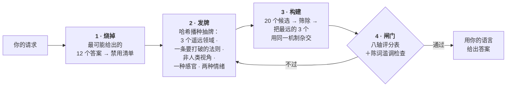

<div align="center">

# Imagination Engine

**用减法造出陌生。**

一个让 AI 产出真正陌生想法的智能体技能——做法不是命令它"更有想象力"，<br>而是*堵死通往常见答案的路径*。

[](https://github.com/djfksjd/imagination-engine-skill/actions/workflows/tests.yml)
[](#安装)
[](#安装)
[](#内部构造)
[](LICENSE)

[English](README.md) · [한국어](README.ko.md) · [日本語](README.ja.md) · **简体中文** · [Español](README.es.md) · [Français](README.fr.md) · [Deutsch](README.de.md) · [Português](README.pt-BR.md)

</div>

---

> 让模型"发挥创造力"，它只会去采样"创造力"这个词后面最可能出现的句子。这就是结果趋同的原因：又是菌丝网络，又是雨夜霓虹的城市，又是最后发现自己有感情的机器。
>
> **加重语气不会改变分布，删掉选项才会。**

## 工作方式



|  | 做什么 | 为什么有效 |
|---|---|---|
| **1** | **先烧掉第一直觉。** 在生成任何东西之前，让模型写下它最可能给出的 12 个答案，并把它们变成禁用清单，最终稿会被机械比对。 | 同时点名这 12 条共享的*骨架*（示例中是"装置＋操作者＋被储存的物质"）。真正的靶子是骨架，任何换皮的变体都会随原型一起出局。 |
| **2** | **发一手模型没得挑的牌。** 哈希播种的抽牌交出三个来自互不相交顶层类别的概念领域、一条要打破的现实法则、一个非人类视角、一种待发明的感官，以及两种必须同时成立的情绪。 | 放任不管，模型只会联想到自己的老相好。抽牌来自外部、可复现，重抽给的是*新牌*。 |
| **3** | **打破的法则必须被替换。** 每一次删除都要立一条新法则，且这条法则必须禁止普通世界里允许的某件事。 | 规则只是消失的世界不是陌生，而是空的。有约束，发明才可读。 |
| **4** | **给输出上闸。** 八轴评分表和词句检查器在用户看到任何东西之前先跑。 | 闸门不过意味着**重新生成**，而不是把分数抹高再交一次。 |

## 安装

支持 **Claude Code** 与 **Codex**。仅用 Python 3 标准库——无需额外依赖、无需 API 密钥、无需联网。

```bash
curl -fsSL https://raw.githubusercontent.com/djfksjd/imagination-engine-skill/main/install.sh | bash
```

<details>
<summary><b>手动安装</b></summary>

```bash
# Claude Code
claude plugin marketplace add djfksjd/imagination-engine-skill
claude plugin install imagination-engine@djfksjd

# Codex
codex plugin marketplace add djfksjd/imagination-engine-skill
codex plugin add imagination-engine@djfksjd
```

同一套目录服务两个宿主：技能本体位于 `skills/imagination-engine/`，`AGENTS.md` 会作为共享上下文加载。
</details>

## 用法

直接说你要什么。当你要求陌生的东西，或抱怨目前的点子太平庸时，技能就会触发。任何语言的提示都可以，回答会用同一语言。

```text
用想象引擎设计"把情感从声音里分离出来的机器"。
婴儿模式、非人类模式、感官模式。禁止脑波扫描，禁止把情绪表现为颜色。
```

```text
给我的游戏设计一个生物，跟这个品类里的任何东西都不像。
极端模式，锚点 2 —— 我得真能把它做出来。
```

### 模式 · 最多叠加三个

| 模式 | 它移除什么 |
|---|---|
| `baby` | 习得的用途、正确的名称、因果的先后。婴儿的逻辑＋成人的完成度——结果可爱就是失败。 |
| `nonhuman` | 对人的有用性。这里没有任何东西为谁而存在；若结果是一件产品，直接判负。**只要简报里有人，这个模式就会把它毁掉** —— 见下方警告。 |
| `alien-physics` | 把新奇寄托在外形上。改变的是物理、时间或自我的规则。 |
| `affect` | 五感与已命名的情绪。必须发明一种感官并写满四个字段——包括它造成的新的不公。 |
| `extremal` | 所有安全候选。把手牌加宽，发两条要打破的规则，并抬高丢弃的门槛。 |
| `grounded` | 不移除任何东西。在不修改原理的前提下补上一条通往现实的路径，并把评分轴 `non_anthropocentrism` 替换为 `translation_integrity`。 |

**默认是锚点 1 上的 `alien-physics` 一项，`nonhuman` 不在其中。** 它曾经在。一次对照实验 —— 四个简报，每个各跑五次普通提示与五次引擎，八位从未被告知在测什么的盲评者 —— 发现旧默认把结果与简报的贴合度削掉一半（6.45 → 3.27），评委接受了 24 份普通提示产出中的全部 24 份，而引擎产出 24 份中接受 0 份。理由高度一致：引擎没有回答简报，而是把简报溶掉了。这正是 `nonhuman` 按规格工作的样子 —— 它在设计上就移除对人的有用性 —— 而把它套到没人选它的简报上是错的。**如果你的简报里有人 —— 玩家、读者、会众、顾客 —— 不要加 `nonhuman`。** 它会把这些人抹掉。

### 锚点 · 结果必须保持多大的可及性

| | 级别 | 要求 |
|---|---|---|
| `0` | **无约束** | 只需内部自洽 |
| `1` | **可说明** | 不借助任何已知作品的类比，用三句话讲清 |
| `2` | **可呈现** | 团队能制作或拍摄的具体场景或实物 |
| `3` | **可操作** | 给出一条通往真实原型的路径，并写明该转译损失了什么 |

### 如何驾驭一次会话

跑各个阶段是技能的事，你要决定的只有下面四项。每一项都比任何形容词更能改变结果。

| 你说出的内容 | 会改变什么 |
|---|---|
| **主题** | 整副牌的种子。手牌由主题的哈希决定，换一种说法就换一副牌 |
| **用途** | 故事 · 世界 · 玩法机制 · 物件 · 概念美术简报 · 无。"无"是正当答案，而且往往产出最奇怪的结果 |
| **模式与锚点** | 封掉哪些路径，以及结果必须保持多大的可及性 |
| **你自己的禁用清单** | 你能提供的最有价值的输入。见下 |

**把你的禁用清单交给它。** 技能会在生成之前烧掉自己的十二个第一直觉，但它无从知道*你*已经腻了什么。一句话就够 — *"别再来菌丝网络，也别来'其实它是活的'那一套"* — 这一行抹掉的概率质量远多于一整段鼓励。你不给，技能会在发牌前主动问。

**模式怎么选：**

| 你想要 | 试试 |
|---|---|
| 不是类型片道具的生物或存在 | `nonhuman, alien-physics` · 锚点 1 |
| 世界规则，而不是怪物 | `alien-physics` · 锚点 0 |
| 真能排演或拍出来的东西 | `alien-physics, grounded` · 锚点 2 |
| 这个月就能做出原型的机制 | `grounded` · 锚点 3 |
| 一种感官、一种情绪、一种内在状态 | `affect` · 锚点 1 |
| 早于习得功能的逻辑 | `baby, nonhuman` · 锚点 0 |
| 你已经退回两轮了 | 加上 `extremal` |

锚点与模式互相独立。`grounded` 配锚点 0 是合法的，会产出一个没人要求它好懂的可造之物；`extremal` 配锚点 3 是本技能最严的设置。`grounded` 不能与 `nonhuman` 叠加 — 前者替换掉的那条轴，正是后者要强制执行的那条，网关会拒绝这个组合。

### 实际怎么对话

**开始。** 用任何语言说出你想要什么。技能用你使用的语言回答，内部推理用英语。

```text
用 imagination engine：两层楼之间的楼梯平台上发生的事。
nonhuman 与 alien-physics，锚点 1。不要鬼故事，也不要阈限空间那种调调。
```

**回来的东西太安全时。** 别说"再怪一点" — 那正是不管用的指令。技能有既定的应答：

```text
还是安全。重新生成。
```

它会以新的一轮重新发牌，把*上一轮答案的每个元素*加入禁用清单，再删掉一条它一直在保护的前提，然后告诉你删的是哪一条。这最后一句通常才是这次交换的价值所在。到第三轮它会切换到 `extremal`。

**回来的东西没法用时。** 别削弱要求，把锚点抬高：

```text
锚点 3 — 我需要一条真能落地的路径，也想知道原理在这条路上会失去什么。
```

**想看它的工作过程时。** 内部阶段按设计是隐藏的。问就打开：

```text
把你烧掉的十二个直觉和抽到的手牌给我看。
```

### 自己跑这条流水线

除了 Python 3.11 和本仓库，不需要安装任何东西。**下面每条命令都在技能目录里执行。** 工作文件一律写进临时目录，绝不要写进技能文件夹：

```bash
cd skills/imagination-engine
mkdir -p /tmp/work
```

五个输入里有两个不是脚本产出的，得你自己写。仓库为这两个各带了一份写好的，所以可以复制过来改，而不是从空文件开始。

```bash
# 1 · 把显而易见的答案烧成可核查的禁用清单。
#     obvious.txt 由你来写：你最先会给出的十二个答案，一行一个。
#     references/example-obvious.txt 就是一份写满的。
cp references/example-obvious.txt /tmp/work/obvious.txt   # 或者自己写
python3 scripts/banlist.py --topic "两层楼之间的楼梯平台" \
    --obvious /tmp/work/obvious.txt --extra "不要鬼,不要阈限美学" --out /tmp/work
#     把你自己的禁忌原样交给 --extra，哪怕内置牌堆里已经有这个词：文件会记录
#     它们，网关会照样重放，所以"不要龙"会把牌堆里的警告提升为禁止。退出码 2
#     表示倾倒太短，或者它只是同一行改了个数字 —— 一个模板的十二个变体，是把
#     同一个本能写了十二遍。banlist.py 还有 --allow <陈词 id> 可以解禁牌堆里的
#     词；用它之前请先读下面那条诚实的限制。

# 2 · 发牌（种子取自这次请求，因此可以精确重放）
python3 scripts/draw.py --topic "两层楼之间的楼梯平台" \
    --modes nonhuman,alien-physics --run 1 --anchor 1 --out /tmp/work

# 3 · 把结果写两份：给网关评分的 candidate.json，和给人读的 draft.md。
#     每个被评分的章节都要在草稿里用 <!-- bind: sections.<id> --> ...
#     <!-- /bind --> 标出，且与候选一字不差，否则网关拒收这份草稿。
#       结构   → references/candidate.schema.json、references/output-template.md
#       成品例 → references/example-candidate.json、references/example-draft.md
#     candidate.json 还需要 manual_checks_cleared：它不是列表，而是以检查 id 为
#     键的对象 —— {"obvious-01": "...", "obvious-02": "..."} —— 禁令清单里每条
#     人工检查都要有一段书面回答。故事、世界、仪式或机制类简报通常会产生十二
#     条；产品类简报一条也没有，这就是随附示例只清掉一条的原因。

# 4 · 写作途中检查草稿（只是诊断，通过它不算放行）
python3 scripts/cliche_lint.py --banlist /tmp/work/banlist.json --draft /tmp/work/draft.md

# 5 · 网关。四份产物一起交，出一个裁定
python3 scripts/score_gate.py --candidate /tmp/work/candidate.json --draw /tmp/work/draw.json \
    --banlist /tmp/work/banlist.json --markdown /tmp/work/draft.md
```

想在跑自己的之前先看一次通过的样子，就把第 5 步指向仓库自带的四份产物：`--candidate references/example-candidate.json --draw references/example-draw.json --banlist references/example-banlist.json --markdown references/example-draft.md`。

`draw.py --list-modes` 会列出模式。`--run 2` 为重新生成发一副全新且依然互不相交的材料；`--salt` 在不推进轮次的情况下重发。

### 退出码与对应处理

| 码 | 含义 | 怎么办 |
|---|---|---|
| `0` | 通过 | — |
| `1` | 用法错误、文件缺失或牌堆损坏 | 是笔误，不是判决 |
| `2` | **网关失败** — 章节缺失或单薄、抽到的牌只是装饰、几份产物彼此对不上 | 重写这个想法。这里根本没有可以往上凑的分数：这道网关里没有任何数字在做裁定 |
| `3` | 草稿中**存在被禁材料** | 改的是念头，不是词。删掉被标出的短语而留下那句话，不算修改 |

同一项检查连续两次失败，说明错的是材料而不是措辞：别改写，用 `--run <n+1>` 重新发牌。

有一个 `2` 不是脚本给的：`No such file or directory` 同样会留下 `2`，因为脚本还没开始，Python 就退出了。那是工作目录不对——回到 `cd skills/imagination-engine`。在脚本内部，用法错误一律是 `1`，所以打错字永远不会被当成裁定报出来。

> [!IMPORTANT]
> **能说"通过"的命令只有一条，而这一条要拿全部东西。** `score_gate.py` 会用内置牌堆重新发一次牌来核对，把候选逐张绑到牌上，要求评分表的每一条轴都打分并写出论据，对每条无法机械匹配的禁令要求书面回答，并检查即将展示的草稿就是被评分的那一份。没有 `--extremal`、`--grounded`、`--min-mean`、`--min-axis`、`--rubric` —— 在裁定时刻声明的阈值，是由被裁定的一方声明的。**而且也没有分数阈值。** 被测量的二十次运行，自评分全部落在旧基线 8.0 正上方、宽度仅 0.25 的区间里，其中还包括被盲评者排在最后的那些。一个没有方差的数字分不出任何东西，所以它在这里不再裁定任何东西。轴之所以留下，是因为回答它们会改变工作本身。`cliche_lint.py` 只是起草辅助，通过它不算放行。

**`--allow` 只在一处被尊重，这是有意的。** `cliche_lint.py --allow <id>` 会在你起草时解禁牌堆里的某个词。`score_gate.py` 没有这个开关，也会忽略禁令清单里记录的解禁 —— 因为那份文件本身就是网关正在核查的产物之一；在那里尊重解禁，等于让一次运行在裁定时刻自行解开自己的禁令。如果某个内置词确实不适合你的工作，正规做法是 fork 仓库并修改 `references/decks/cliches.json`。

> [!NOTE]
> 网关是地板，不是裁判。通过所确立的，只是该做的功课都在，而且四份产物彼此相属 —— 手牌是牌堆发的且事后没被改动，每张牌都用上了，禁令清单正是这一轮自己的倾倒所蕴含的那一份，每条长本能都有书面回答，即将展示的草稿就是被检查过的那段文本。它无法告诉你这个想法好不好，而且它不再假装有哪个数字能告诉你。结果还得你自己读。

## 产出什么

八个固定小节，用你的语言写成：名称 · 不依赖类比的一句话定义 · 它赖以存在的法则 · 初次遭遇的场景 · 最陌生的性质 · 它引发的相互冲突的感受 · 世界因它而发生的改变 · 以及必填项：**丢弃了哪些熟悉版本，以及最接近哪部既有作品**。只要运行模式是 `grounded`，或锚点为 `3`，就会加上第九个小节：**一条通向现实的路径**——只有这两种情况下门禁才会要求它，它出现时其余八个小节并不会消失。

<details open>
<summary>完整示例 —— 题目：<i>"把情感从声音里分离出来的机器"</i></summary>

> ### Flatting（磨平）
>
> 凡是同一句话被说过不止一次的地方，就会形成一道坡：它把此前每一次言说中的"电荷"抽走，留在房间的表面上。
>
> ［…］因为抽取是向后进行的，它编辑的是已经发生的事：某个星期二重复的承诺会回溯清空此前做出该承诺的每一个场合，包括真正重要的那一次。在这里，靠反复述说来给人安心是不可能的。
>
> ［…］葬礼因此颠倒了——被诵读的是死者只说过一次的句子，通常琐碎，多半关于天气，因为只有那些还承载着什么。

</details>

请注意缺席的东西：没有装置，没有发光的机器，没有任何外形古怪之物。**陌生感在于什么变得不可能了。** 含隐藏阶段的完整过程见 [`worked-example.md`](skills/imagination-engine/references/worked-example.md)。

## 它不会做的事

> [!IMPORTANT]
> - **宣称"从没有人想到过"。** 这无法验证，因此技能被禁止这样写。它改为点名最接近的既有作品并说明差别——每一次，都写在输出里。
> - **用刺激来充数。** 残酷、血腥、性暴力、贬损真实群体是制造不适最廉价的捷径，作为捷径一律禁止。不适必须来自前提本身。
> - **假装通过检查就等于点子好。** 检查器只能证明特定的熟套路*不在*，无法证明什么东西在。评分表是自评，技能会如实说明。两道闸真正强制的是：该做的工作没有被跳过。
> - **悄悄缩小你的请求。** 需要能落地，就抬高锚点，而不是软化前提。当常规答案才是正确答案时，技能应当直说，并正常作答。

## 它被测出能做什么 —— 以及做不到什么

这项技能在 2026 年 7 月被测试过：四个互不相关领域的简报，每个各跑五次普通提示与五次完整流水线，二十副互不重叠的手牌，由从未被告知存在两种条件的智能体盲评与编码。结果的两面都写在这里，因为一项隐藏自己测量结果的技能，是在要求你信任它而不是读懂它。

**已确认，但带一个条件。** 普通提示确实会收敛 —— 但只在简报本身就有一个显而易见的答案可供收敛时。要一个河口生物，五次独立的普通提示给出了同一种生物的五个版本，第六次又给出了同一个。要一个全部发生在一栋楼内的短篇前提，五次给出了五个互不相干的想法。本页开头那句主张，是对*某些*简报会发生什么的描述，而不是一条定律。

**未获证实：删掉路径能让重复的回答彼此散开。** 二十次引擎运行、二十副互不重叠的手牌，收敛到了同一个形状 —— 不是一个东西而是一个无身体的过程，一项通常被写成债务的义务，一个行政性的后果。汇总来看，它们比普通提示那一组*更*相似，而不是更不相似。而且牌并不是装饰：多数牌在字面上没留下任何痕迹，说明它们确实被吸收了，可产出仍然收敛了。诚实的读法是：删除一阶吸引子是有效的 —— 这些回答确实不像普通提示的回答 —— 但删除并不会让剩下的空间被均匀铺开。**它只是让众数搬了个家。**

这一点没有被修好，本页也不会声称修好了。实务上由此得出的：如果你需要真正不同的选项，请给它不同的简报或不同的模式，而不是把同一个简报跑两遍。而如果你的结果又是一个课加义务、生出文书的无身体过程，那你已经到了前面二十次运行到达的地方 —— 把它退回去。

## 内部构造

| 脚本 | 作用 | 非零退出码 |
|---|---|---|
| `draw.py` | 从七副牌堆里发出这一手约束 | `1` 用法或牌堆错误 |
| `banlist.py` | 直觉清单＋陈词滥调牌堆 → 可机械核对的禁用清单 | `2` 清单太短 |
| `cliche_lint.py` | 按行号标出禁用词、空洞形容词与"推销句式" | `3` 存在禁用内容 |
| `score_gate.py` | 按评分表校验候选（失败即拦） | `2` 未通过闸门 |

**一切可复现。** 抽牌以主题的哈希播种，同样的请求得到同样的一手牌，任何结果都能重放与审计。重新生成用 `--run 2`，会拿到依然互不相交的新牌；`--salt` 则把同一 run 重洗一遍。

```text
skills/imagination-engine/
├── SKILL.md                    # 权威工作流
├── references/
│   ├── output-template.md      # 交付小节的契约
│   ├── worked-example.md       # 一次完整运行，含隐藏阶段
│   ├── rubric.json             # 八个轴与小节最小篇幅（无阈值）
│   ├── candidate.schema.json   # score_gate.py 校验的结构
│   ├── example-obvious.txt     # ─┐ 完整的一次运行：十二个第一反应、由它们
│   ├── example-banlist.json    #  │ 烧成的禁用清单、发出的牌、评过分的候选、
│   ├── example-draw.json       #  │ 展示出去的草稿。后四份就是网关的四个输入，
│   ├── example-candidate.json  #  │ 同时是测试夹具
│   ├── example-draft.md        # ─┘
│   └── decks/                  # 领域 · 约束 · 感官 · 视角
│                               # 情绪 · 模式 · 陈词滥调
└── scripts/                    # draw · banlist · cliche_lint · score_gate
```

## 测试

```bash
python3 -m pytest tests/ -q
```

完全离线：牌堆完整性、抽牌的确定性与不重复、两道闸门，以及随附示例能否通过它自己的检查。

## 参与贡献

最容易入手的是牌堆——一个真正远离其他条目的领域，一条值得打破的现实法则，一种值得发明的感官。每一条都必须是可回答的：领域必须带一个结果必须回答的探问，约束必须带一条替换法则的要求。提 PR 前请先跑测试。

<div align="center">
<sub>MIT 许可 · 为 <a href="https://claude.com/claude-code">Claude Code</a> 与 Codex 打造</sub>
</div>
