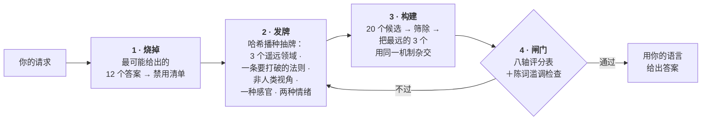

<div align="center">

# Imagination Engine

**用减法造出陌生。**

一个让 AI 产出真正陌生想法的智能体技能——做法不是命令它"更有想象力"，<br>而是*堵死通往常见答案的路径*。

[](https://github.com/djfksjd/imagination-engine-skill/actions/workflows/tests.yml)
[](#安装)
[](#安装)
[](#内部构造)
[](LICENSE)

[English](README.md) · [한국어](README.ko.md) · [日本語](README.ja.md) · **简体中文** · [Español](README.es.md) · [Français](README.fr.md) · [Deutsch](README.de.md) · [Português](README.pt-BR.md)

</div>

---

> 让模型"发挥创造力"，它只会去采样"创造力"这个词后面最可能出现的句子。这就是结果趋同的原因：又是菌丝网络，又是雨夜霓虹的城市，又是最后发现自己有感情的机器。
>
> **加重语气不会改变分布，删掉选项才会。**

## 工作方式



|  | 做什么 | 为什么有效 |
|---|---|---|
| **1** | **先烧掉第一直觉。** 在生成任何东西之前，让模型写下它最可能给出的 12 个答案，并把它们变成禁用清单，最终稿会被机械比对。 | 同时点名这 12 条共享的*骨架*（示例中是"装置＋操作者＋被储存的物质"）。真正的靶子是骨架，任何换皮的变体都会随原型一起出局。 |
| **2** | **发一手模型没得挑的牌。** 哈希播种的抽牌交出三个来自互不相交顶层类别的概念领域、一条要打破的现实法则、一个非人类视角、一种待发明的感官，以及两种必须同时成立的情绪。 | 放任不管，模型只会联想到自己的老相好。抽牌来自外部、可复现，重抽给的是*新牌*。 |
| **3** | **打破的法则必须被替换。** 每一次删除都要立一条新法则，且这条法则必须禁止普通世界里允许的某件事。 | 规则只是消失的世界不是陌生，而是空的。有约束，发明才可读。 |
| **4** | **给输出上闸。** 八轴评分表和词句检查器在用户看到任何东西之前先跑。 | 闸门不过意味着**重新生成**，而不是把分数抹高再交一次。 |

## 安装

支持 **Claude Code** 与 **Codex**。仅用 Python 3 标准库——无需额外依赖、无需 API 密钥、无需联网。

```bash
curl -fsSL https://raw.githubusercontent.com/djfksjd/imagination-engine-skill/main/install.sh | bash
```

<details>
<summary><b>手动安装</b></summary>

```bash
# Claude Code
claude plugin marketplace add djfksjd/imagination-engine-skill
claude plugin install imagination-engine@djfksjd

# Codex
codex plugin marketplace add djfksjd/imagination-engine-skill
codex plugin add imagination-engine@djfksjd
```

同一套目录服务两个宿主：技能本体位于 `skills/imagination-engine/`，`AGENTS.md` 会作为共享上下文加载。
</details>

## 用法

直接说你要什么。当你要求陌生的东西，或抱怨目前的点子太平庸时，技能就会触发。任何语言的提示都可以，回答会用同一语言。

```text
用想象引擎设计"把情感从声音里分离出来的机器"。
婴儿模式、非人类模式、感官模式。禁止脑波扫描，禁止把情绪表现为颜色。
```

```text
给我的游戏设计一个生物，跟这个品类里的任何东西都不像。
极端模式，锚点 2 —— 我得真能把它做出来。
```

> [!TIP]
> 你能补充的最有价值的东西是**你自己的禁用清单**。"别再来一个 X"胜过任何形容词——你不给，技能也会主动问。

### 模式 · 最多叠加三个

| 模式 | 它移除什么 |
|---|---|
| `baby` | 习得的用途、正确的名称、因果的先后。婴儿的逻辑＋成人的完成度——结果可爱就是失败。 |
| `nonhuman` | 对人的有用性。这里没有任何东西为谁而存在；若结果是一件产品，直接判负。 |
| `alien-physics` | 把新奇寄托在外形上。改变的是物理、时间或自我的规则。 |
| `affect` | 五感与已命名的情绪。必须发明一种感官并写满四个字段——包括它造成的新的不公。 |
| `extremal` | 所有安全候选。阈值升到均分 9.0，且任一轴不低于 8。 |
| `grounded` | 不移除任何东西。在不修改原理的前提下，补上一条通往现实的路径。 |

### 锚点 · 结果必须保持多大的可及性

| | 级别 | 要求 |
|---|---|---|
| `0` | **无约束** | 只需内部自洽 |
| `1` | **可说明** | 不借助任何已知作品的类比，用三句话讲清 |
| `2` | **可呈现** | 团队能制作或拍摄的具体场景或实物 |
| `3` | **可操作** | 给出一条通往真实原型的路径，并写明该转译损失了什么 |

## 产出什么

八个固定小节，用你的语言写成：名称 · 不依赖类比的一句话定义 · 它赖以存在的法则 · 初次遭遇的场景 · 最陌生的性质 · 它引发的相互冲突的感受 · 世界因它而发生的改变 · 以及必填项：**丢弃了哪些熟悉版本，以及最接近哪部既有作品**。

<details open>
<summary>完整示例 —— 题目：<i>"把情感从声音里分离出来的机器"</i></summary>

> ### Flatting（磨平）
>
> 凡是同一句话被说过不止一次的地方，就会形成一道坡：它把此前每一次言说中的"电荷"抽走，留在房间的表面上。
>
> ［…］因为抽取是向后进行的，它编辑的是已经发生的事：某个星期二重复的承诺会回溯清空此前做出该承诺的每一个场合，包括真正重要的那一次。在这里，靠反复述说来给人安心是不可能的。
>
> ［…］葬礼因此颠倒了——被诵读的是死者只说过一次的句子，通常琐碎，多半关于天气，因为只有那些还承载着什么。

</details>

请注意缺席的东西：没有装置，没有发光的机器，没有任何外形古怪之物。**陌生感在于什么变得不可能了。** 含隐藏阶段的完整过程见 [`worked-example.md`](skills/imagination-engine/references/worked-example.md)。

## 它不会做的事

> [!IMPORTANT]
> - **宣称"从没有人想到过"。** 这无法验证，因此技能被禁止这样写。它改为点名最接近的既有作品并说明差别——每一次，都写在输出里。
> - **用刺激来充数。** 残酷、血腥、性暴力、贬损真实群体是制造不适最廉价的捷径，作为捷径一律禁止。不适必须来自前提本身。
> - **假装通过检查就等于点子好。** 检查器只能证明特定的熟套路*不在*，无法证明什么东西在。评分表是自评，技能会如实说明。两道闸真正强制的是：该做的工作没有被跳过。
> - **悄悄缩小你的请求。** 需要能落地，就抬高锚点，而不是软化前提。当常规答案才是正确答案时，技能应当直说，并正常作答。

## 内部构造

| 脚本 | 作用 | 非零退出码 |
|---|---|---|
| `draw.py` | 从七副牌堆里发出这一手约束 | `1` 用法或牌堆错误 |
| `banlist.py` | 直觉清单＋陈词滥调牌堆 → 可机械核对的禁用清单 | `2` 清单太短 |
| `cliche_lint.py` | 按行号标出禁用词、空洞形容词与"推销句式" | `3` 存在禁用内容 |
| `score_gate.py` | 按评分表校验候选（失败即拦） | `2` 未通过闸门 |

**一切可复现。** 抽牌以主题的哈希播种，同样的请求得到同样的一手牌，任何结果都能重放与审计。重新生成用 `--run 2`，会拿到依然互不相交的新牌；`--salt` 则把同一 run 重洗一遍。

```text
skills/imagination-engine/
├── SKILL.md                    # 权威工作流
├── references/
│   ├── output-template.md      # 交付小节的契约
│   ├── worked-example.md       # 一次完整运行，含隐藏阶段
│   ├── rubric.json             # 八个轴 · 阈值 · 小节最小篇幅
│   ├── candidate.schema.json   # score_gate.py 校验的结构
│   ├── example-candidate.json  # 通过两道闸的候选（同时是测试夹具）
│   └── decks/                  # 领域 · 约束 · 感官 · 视角
│                               # 情绪 · 模式 · 陈词滥调
└── scripts/                    # draw · banlist · cliche_lint · score_gate
```

## 测试

```bash
python3 -m pytest tests/ -q
```

完全离线：牌堆完整性、抽牌的确定性与不重复、两道闸门，以及随附示例能否通过它自己的检查。

## 参与贡献

最容易入手的是牌堆——一个真正远离其他条目的领域，一条值得打破的现实法则，一种值得发明的感官。每一条都必须是可回答的：领域必须带一个结果必须回答的探问，约束必须带一条替换法则的要求。提 PR 前请先跑测试。

<div align="center">
<sub>MIT 许可 · 为 <a href="https://claude.com/claude-code">Claude Code</a> 与 Codex 打造</sub>
</div>
